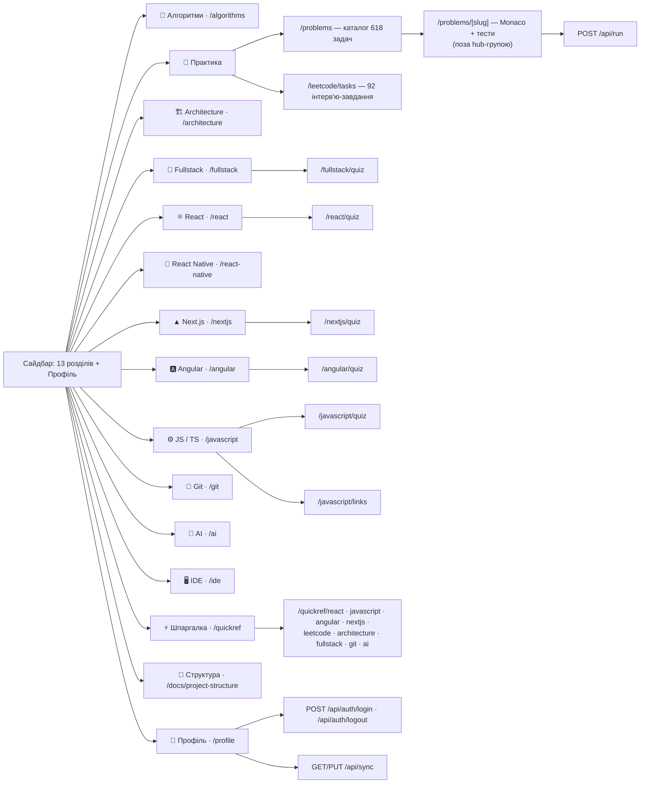

# Cheat Hub — схема розділів проєкту

**Дата:** 2026-09-14 · **Для кого:** розробник або агент, якому треба швидко зорієнтуватися,
з яких розділів складається застосунок і де лежить код/дані кожного з них.
Стек і пайплайни описані в [README.md](../README.md) та [CLAUDE.md](../CLAUDE.md); тут — карта розділів.

**Як оновлювати.** Список розділів і їхній порядок у сайдбарі задає `TOPICS` у
`src/lib/cheatsheet/registry.ts`, список шпаргалок — `QUICKREF_TOPICS` у `quickref.ts`.
Після додавання/перейменування розділу, формату або секції оновіть відповідну таблицю нижче.

---

## 1. Схема навігації

Усі сторінки в групі `src/app/(hub)/` рендеряться всередині `HubShell` (постійний сайдбар
`CheatSidebar`). Сторінка задачі `/problems/[slug]` живе поза групою і рендериться на весь
екран з власною навігацією `ProblemNavShell`.



Службові маршрути: `robots.ts`, `sitemap.ts`, `manifest.ts`, `opengraph-image.tsx`
(глобальний і per-problem), `not-found.tsx`. Документація в застосунку:
`/docs/project-structure` рендерить цей файл (читає `Docs/project-structure.md` на білді,
кнопка «Скопіювати MD» кладе весь markdown у буфер; noindex). Старі URL `/<slug>/cheatsheet` для
nextjs/leetcode/architecture/fullstack/git/ai 308-редіректять на `/quickref/<slug>`
(`next.config.ts`).

---

## 2. Розділи хабу

Порядок = `TOPICS` у `registry.ts` = порядок у сайдбарі та на головній `/`.
URL формату: `practice` → `/problems`, `extended` → `/<slug>`, решта → `/<slug>/<format>`
(`formatHref()`). Перший формат у списку — основний маршрут розділу (`topicHref()`).
Файли даних — у `src/lib/cheatsheet/`, якщо не вказано інше.

| # | Розділ | slug | Формати → URL | Дані | Обсяг |
|---|---|---|---|---|---|
| 1 | 🧠 Алгоритми | `algorithms` | extended `/algorithms` | `algorithms.ts` | 4 секції |
| 2 | 🧩 Практика | `leetcode` | practice `/problems` · tasks `/leetcode/tasks` | `src/data/problems.ts`, `practiceTasks.ts`, `leetcode.ts` | 618 задач · 92 завдання · 18 груп каталогу |
| 3 | 🏗️ Architecture | `architecture` | extended `/architecture` | `architecture.ts` | 19 секцій |
| 4 | 🚀 Fullstack | `fullstack` | extended `/fullstack` · quiz `/fullstack/quiz` | `fullstack.ts`, `fullstack-quiz.ts` | 21 секція · 24 питання |
| 5 | ⚛️ React | `react` | extended `/react` · quiz `/react/quiz` | `react.ts`, `react-quiz.ts` | 43 секції · 78 питань |
| 6 | 📱 React Native | `react-native` | extended `/react-native` | `react-native.ts` | 26 секцій |
| 7 | ▲ Next.js | `nextjs` | extended `/nextjs` · quiz `/nextjs/quiz` | `nextjs.ts`, `nextjs-quiz.ts` | 9 секцій · 18 питань |
| 8 | 🅰️ Angular | `angular` | extended `/angular` · quiz `/angular/quiz` | `angular.ts`, `angular-quiz.ts` | 32 секції · 57 питань |
| 9 | ⚙️ JS / TS | `javascript` | extended `/javascript` · links `/javascript/links` · quiz `/javascript/quiz` | `javascript.ts`, `javascript-quiz.ts` | 26 секцій · 66 питань |
| 10 | 🔀 Git | `git` | extended `/git` | `git.ts` | 15 секцій |
| 11 | 🤖 AI | `ai` | extended `/ai` | `ai.ts` | 14 секцій |
| 12 | 🖥️ IDE | `ide` | extended `/ide` | `ide.ts` | 6 секцій |
| 13 | ⚡ Шпаргалка | `quickref` | `/quickref` → redirect на `/quickref/react` | `quickref.ts` + `quickref-<slug>.ts` | 9 дошок |

Рендер за форматом: `extended`/`links` → `ProseTopicView`, `quiz` → `Quiz`,
`tasks` → `PracticeTasksView`, quickref → `QuickRefTopicView`, `/problems` → `ProblemsView`.

---

## 3. ⚡ Шпаргалки — `/quickref/<slug>`

Один розділ у сайдбарі, підпосилання = `CHEATSHEET_ENTRIES` (по одній дошці на тему).
Порядок табів = `QUICKREF_TOPICS`. Кожна дошка — масив `QuickRefBlock[]` (групи термінів,
рядки чіпів, lifecycle-діаграма, каталог хуків), масонрі-сітка без бокової навігації.

| Таб | Файл | Блоків | Блоки (лейбли) |
|---|---|---|---|
| React | `quickref-react.ts` | 13 | Основи · Virtual DOM & дерева · Lifecycle: Mount → Update → Unmount · Повний каталог хуків · useEffect: масив залежностей · Race condition · Що тригерить re-render · Мемоізація · Правила хуків · Патерни · Controlled vs Uncontrolled · Екосистема · Продуктивність |
| JS / TS | `quickref-javascript.ts` | 30 | Спец-типи · Utility types · Generics · Core · this · Prototype chain · Modules · Проміс P→F/R · Проміс-методи · debounce vs throttle · Патерни проєктування · Event Loop · Порядок виконання · RxJS *Map · Map · Array (push/pop, splice/slice, map/filter/reduce, find/includes, sort/reverse, concat/join, forEach/for-of, from/of/fill, патерни) · String (length/match, slice/trim/pad, split/join) · Number ↔ String · MUT vs NEW · Big-O |
| Angular | `quickref-angular.ts` | 18 | Change Detection · DI & Services · Lifecycle hooks · Lifecycle: Create → Update → Destroy · Signals & RxJS · Hot vs Cold, Subjects · Flattening (switchMap & Co) · Standalone · Control flow · *ngIf → @if · @defer · @defer тригери · Injector tree · Forms · Testing · Performance: 7 важелів · Bundle optimization · Memory leaks |
| Next.js | `quickref-nextjs.ts` | 9 | Server vs Client · Routing · Генерація · Рендеринг + кеш · Data fetching · Server Actions · Next.js 15 зміни · Навігація · Gotchas |
| LeetCode | `quickref-leetcode.ts` | 5 | Рядки · Масиви · Об'єкти, Map, Set · Числа · Шаблони |
| Architecture | `quickref-architecture.ts` | 20 | SOLID · Patterns · State: який інструмент · Optimistic update · Component design · Core Web Vitals · Performance · Security · Micro-frontends · System Design співбесіда · High-level блоки · Рендеринг · API та дані · Real-time · Кеш і консистентність · Стійкість · Observability · Типові задачі · Staff-level · Швидкі відповіді |
| Fullstack | `quickref-fullstack.ts` | 11 | HTTP методи · HTTP коди · Бази даних · Продуктивність БД · Auth · Кеш · Черги · Безпека (OWASP) · DevOps · System Design — каркас · Головне правило |
| Git | `quickref-git.ts` | 17 | Старт · Staging & Commit · Історія · Гілки · Merge & Rebase · Remote · Stash · Cherry-pick · Скасування · Recovery · Теги · Bisect · Просунуте · Config & aliases · .gitignore/.gitattributes · Hooks (Husky) · Best practices |
| AI | `quickref-ai.ts` | 11 | Claude Code команди · Prompt structure · CLAUDE.md · .claude/settings.json · Hooks · Loops & Scheduling · Security · Anthropic SDK · Agent Skills — рівні · Skills — діагностика · Співбесіда |

Теми без дошки (algorithms, react-native, ide) мають лише «Теорію».

---

## 4. Теорія (extended) — секції по розділах

Кожна секція — `TopicSection` з `id` (якір), блоками контенту та попапом «Питання на
співбесіді» (`interviewQuestions`). Посилання на секцію: `/<topic>#<section-id>`
(той самий формат, що в [react-course-coverage.md](react-course-coverage.md)).
Секції несуть 3-станий маркер new/unread/read (`StatusMarker`, `useContentStatus`);
дата першої появи фіксується в `contentManifest.generated.json` через `npm run stamp:new`.

<details>
<summary><b>🧠 Алгоритми</b> — <code>/algorithms</code> · 4 секції</summary>

- 🗂️ Структури даних — `#data-structures`
- ⚙️ Алгоритми та патерни — `#patterns`
- 🔢 Сортування — `#sorting`
- 🔍 Алгоритми пошуку — `#searching`

</details>

<details>
<summary><b>🏗️ Architecture</b> — <code>/architecture</code> · 19 секцій</summary>

- 🧱 SOLID Principles — `#solid-principles`
- 🎨 Design Patterns у Frontend — `#design-patterns-у-frontend`
- 📊 State Management — Decision Matrix — `#state-management-decision-matrix`
- 🧩 Component Design — `#component-design`
- ⚡ Performance Patterns — `#performance-patterns`
- 🔒 Security Basics — `#security-basics`
- 🧩 Micro-frontends — `#micro-frontends`
- 🧭 Як проходити System Design співбесіду — `#system-design-interview`
- 🏗️ High-level архітектура веб-системи — `#high-level-architecture`
- 🌐 Рендеринг і доставка — `#rendering-delivery`
- 🔌 API та шар даних для фронтенду — `#api-data-layer`
- ⚡ Real-time системи — `#realtime-systems`
- 🗃️ Кешування та консистентність — `#caching-consistency`
- 📈 Масштабування, стійкість, degradation — `#scaling-resilience`
- ⚖️ Load Balancer — `#load-balancing`
- 🔭 Observability та продуктивність у проді — `#observability`
- 🧩 Розбір типових задач — `#system-design-case-studies`
- 🏛️ Staff-level: крос-командна архітектура — `#staff-level-architecture`
- 🎯 Quick Interview Answers — `#quick-interview-answers`

</details>

<details>
<summary><b>🚀 Fullstack</b> — <code>/fullstack</code> · 21 секція</summary>

- 🧭 Напрями та ролі — `#directions`
- 🗣️ Backend-мови та рантайми — `#backend-languages`
- 🧱 Backend-фреймворки — `#backend-frameworks`
- 🌐 HTTP та REST API — `#http-rest`
- 📄 Пагінація — `#pagination`
- 🔗 GraphQL, gRPC, tRPC, Realtime — `#graphql-rpc`
- 🗄️ Реляційні бази (SQL) — `#databases-sql`
- 📦 NoSQL та CAP — `#databases-nosql`
- 🧩 ORM та доступ до даних — `#orm`
- 🔐 Автентифікація та авторизація — `#auth`
- ⚡ Кешування — `#caching`
- 📨 Черги та асинхронна обробка — `#queues`
- 🏛️ Архітектура застосунку — `#architecture`
- 🛡️ Безпека вебзастосунків — `#security`
- 🧪 Тестування — `#testing`
- 🐳 DevOps та інфраструктура — `#devops`
- ☁️ Хмари та деплой — `#cloud`
- 📈 Observability — `#observability`
- 📊 Продуктивність і масштабування — `#scaling`
- 🧠 System Design для співбесіди — `#system-design`
- 🤝 Soft Skills, STAR та поведінкові питання — `#soft-skills-star`

</details>

<details>
<summary><b>⚛️ React</b> — <code>/react</code> · 43 секції</summary>

- 📜 Історія версій React — `#history-versions`
- 📚 Бібліотека чи фреймворк? + Virtual DOM — `#library-vs-framework`
- 🧰 Vite та інструменти збірки — `#tooling-vite`
- 🖥️ React + VS Code — `#tooling-vscode`
- 🧱 Компоненти та JSX — `#fundamentals-components-jsx`
- 🧩 Анатомія компонента: шаблон, стилі, зображення — `#fundamentals-component-anatomy`
- 🎨 Styled Components та Tailwind — `#styling-approaches`
- 🎞️ Техніки анімації в React — `#animation-techniques`
- 📦 Props, State та події — `#fundamentals-props-state`
- ⚡ SyntheticEvent та делегування подій — `#jsx-synthetic-events`
- 🔁 Списки, умовний рендеринг, форми — `#fundamentals-lists-conditionals`
- 🌳 Reconciliation, Virtual DOM, Fiber — `#internals-reconciliation`
- 🎬 Render vs Commit фази — `#internals-render-commit`
- ⚡ Automatic Batching (React 18) — `#internals-rerenders-batching`
- 🪝 Хуки: навіщо і правила — `#hooks-why`
- 🔢 useState: оновлювачі та ініціалізація — `#hooks-usestate-patterns`
- 📋 Повний каталог хуків — `#hooks-catalog-full`
- 🧠 Мемоізація та референсна стабільність — `#memoization-concept`
- 🔄 Життєвий цикл і події компонента — `#hooks-deep-dive`
- 🎯 useRef — детально — `#hooks-useref`
- ⚡ useTransition / useDeferredValue — `#hooks-concurrent`
- 🧵 Custom Hooks — `#hooks-custom`
- 🏛️ Class vs Functional — `#lifecycle-class-vs-functional`
- 🚀 Performance Deep Dive — `#performance-deep-dive`
- 🔍 React DevTools як Senior — `#react-devtools`
- 🧭 Межі стану та Context — `#state-boundaries`
- 🔴 Redux — архітектура та middleware — `#state-redux`
- 🐻 Zustand — `#state-zustand`
- 🔄 TanStack Query — `#state-tanstack-query`
- 🌊 RxJS у React — `#state-rxjs`
- 🧩 Patterns — `#patterns`
- 📝 Controlled vs Uncontrolled Inputs — `#forms-controlled-uncontrolled`
- 📋 Форми: збір даних, валідація, бібліотеки — `#forms-formdata-native`
- 🧭 React Router — `#react-router`
- 🌐 Fetch, axios та автентифікація на клієнті — `#server-communication-auth`
- 🖥️ Next.js: рендер-моделі — `#nextjs-render-models`
- ▲ Next.js App Router — `#nextjs-app-router`
- ✨ React 19 / майбутнє — `#react-19-future`
- 🎬 View Transitions API — `#view-transitions`
- 🧪 Тестування React-компонентів — `#testing-react-components`
- 🌐 Локалізація (i18n) React-застосунку — `#i18n-localization`
- 📱 React Native та поза-браузерні рендерери — `#react-native-ecosystem`
- 🧭 Після основ: кар'єрний шлях React-розробника — `#career-growth`

</details>

<details>
<summary><b>📱 React Native</b> — <code>/react-native</code> · 26 секцій</summary>

- 🔄 Що переноситься з React 1:1, а що інше — `#rn-carryover-vs-different`
- 🚀 Expo vs Bare workflow — `#rn-setup-expo-vs-bare`
- 📁 Структура проєкту та Metro-бандлер — `#rn-project-structure-metro`
- 🧱 View & Text — базові будівельні блоки — `#rn-core-view-text`
- 👆 TextInput, Pressable/Touchable, Button, Switch — `#rn-core-input-pressable`
- 📜 ScrollView vs FlatList/SectionList — `#rn-core-scrollview-lists`
- 🖼️ Image, ActivityIndicator, Modal — `#rn-core-image-media`
- 🤖🍎 Платформо-специфічні компоненти — `#rn-core-platform-widgets`
- 🎨 StyleSheet — чому це не CSS — `#rn-styling-model`
- 📐 Flexbox — інша модель за замовчуванням — `#rn-flexbox-layout`
- 🎞️ Animated API vs Reanimated — `#rn-animation`
- 🧭 React Navigation — Stack/Tabs/Drawer — `#rn-navigation-react-navigation`
- 🗂️ Expo Router — файлова навігація — `#rn-navigation-expo-router`
- 🌐 Fetch на мобільному — без CORS, без cookies — `#rn-networking-fetch-auth`
- 🗃️ Redux/Zustand/TanStack Query — переносяться як є — `#rn-state-management-carryover`
- 📝 Форми на мобільному — `#rn-forms`
- 🎛️ Platform.OS, Platform.select, .ios/.android файли — `#rn-platform-specific-code`
- 🔐 Дозволи та нативні API пристрою — `#rn-device-apis-permissions`
- 🔧 Коли писати нативний модуль — `#rn-native-modules-turbomodules`
- ⚙️ Hermes, JS-потік vs UI-потік — `#rn-performance-hermes-threads`
- 📊 Продуктивність FlatList — virtualization на практиці — `#rn-performance-lists`
- 🔍 React Native DevTools, Fast Refresh, крашрепортинг — `#rn-debugging-devtools`
- 🧪 Jest + React Native Testing Library — `#rn-testing-unit`
- 🤖 E2E: Detox та Maestro — `#rn-testing-e2e`
- 🚢 EAS Build/Submit та OTA-оновлення — `#rn-deployment-eas`
- 🔮 New Architecture, майбутнє RN — `#rn-future-new-architecture`

</details>

<details>
<summary><b>▲ Next.js</b> — <code>/nextjs</code> · 9 секцій</summary>

- 🧭 Next.js поверх React — `#nextjs-overview`
- 🧩 Server vs Client Components — `#server-client-components`
- 🗂️ App Router — роутинг — `#routing`
- 🎨 Рендеринг і кешування — `#rendering-caching`
- 📡 Завантаження даних — `#data-fetching`
- ⚡ Server Actions і мутації — `#server-actions`
- 🔗 Навігація та хуки — `#navigation-hooks`
- 🚀 Перформанс і прод — `#performance-prod`
- ⚠️ Підводні камені та питання співбесіди — `#gotchas-interview`

</details>

<details>
<summary><b>🅰️ Angular</b> — <code>/angular</code> · 32 секції</summary>

- 🚀 Апдейти: v15 → v22 — `#апдейти-angular`
- 🅰️ Що таке Angular? — `#що-таке-angular`
- 🏗️ Architecture & Bootstrap — `#architecture-bootstrap`
- 🎛️ Шаблони — @if / @for / @switch — `#templates-control-flow`
- 🔄 Change Detection — `#change-detection-expanded`
- ⚡ Signals & Computed — `#signals-computed-expanded`
- 💉 Dependency Injection — `#dependency-injection-expanded`
- 🌊 RxJS — Основи та оператори — `#rxjs-core-operators-expanded`
- 🔀 RxJS — Subjects, Hot vs Cold, Multicasting — `#rxjs-subjects-hot-cold`
- 🧩 RxJS — Патерни, витоки та Signals — `#rxjs-patterns-leaks-signals`
- 🗺️ Routing — Lazy Loading & Guards — `#routing-lazy-loading-guards-expanded`
- 🌐 HTTP & Functional Interceptors — `#http-functional-interceptors-expanded`
- 🔌 API Communication Patterns — `#api-communication-patterns`
- 📝 Forms — Reactive, Template-driven & Custom — `#reactive-forms-advanced-expanded`
- 🔧 Pipes — Transform Data in Templates — `#pipes-transform-data-in-templates`
- 🌐 Translations / i18n — `#translations-i18n-багатомовність`
- 🔁 Lifecycle Hooks — Execution Order — `#lifecycle-hooks-execution-order`
- 🎭 Content Projection & ViewChild — `#content-projection-viewchild`
- ⚡ Performance Optimization & Memory Leaks — `#performance-optimization-memory-leaks`
- ⏳ @defer — Deferrable Views — `#defer-deferrable-views`
- 📦 Tree-shaking & Bundle Optimization — `#tree-shaking-bundle-optimization`
- 🧵 Web Workers — `#web-workers`
- 🐞 Debugging & Browser DevTools — `#debugging-browser-devtools`
- 🗄️ State Management — NgRx, SignalStore, Browser APIs — `#state-management-ngrx-signalstore-browser-apis`
- 🧪 Testing — Unit, Integration, E2E — `#testing-unit-integration-e2e`
- 🔒 Security — XSS, CSRF, Audits — `#security-xss-csrf-audits`
- 🌍 SSR & Hydration — `#ssr-hydration-server-side-rendering-deep-dive`
- 🚀 CI/CD & Environments — `#cicd-environments-deploy-pipeline`
- 🔍 Linters & Formatters — `#linters-formatters-якість-і-стиль-коду`
- 📦 Monorepo (Nx) — `#monorepo-nx-масштабування-кодової-бази`
- 🧩 Microfrontends — `#microfrontends-незалежні-команди-та-деплої`
- 🛠️ Refactoring — Як Senior лідить процес — `#refactoring-як-senior-лідить-процес`

</details>

<details>
<summary><b>⚙️ JS / TS</b> — <code>/javascript</code> · 26 секцій (+ <code>/javascript/links</code>)</summary>

- 🧩 Type System & Interfaces — `#type-system-interfaces`
- 🔧 Functions, Closures & Scope — `#functions-closures-scope`
- 🔒 Closures — глибокий розбір — `#closures-deep-dive`
- 🎯 This Binding & call/apply/bind — `#this-binding-callapplybind`
- ⚡ Async, Promises & Event Loop — `#async-promises-event-loop`
- 🏛️ Prototypes & Classes — `#prototypes-classes`
- 📦 Modules (ESM vs CJS) — `#modules-esm-vs-cjs`
- 🔬 Generics (TypeScript) — `#generics-typescript-expanded`
- 🛠️ Utility Types (TypeScript) — `#utility-types-typescript-expanded`
- ⚠️ Error Handling — `#error-handling-trycatchfinally-custom-errors`
- 🔄 Iterators & Generators — `#iterators-generators-yield-async-generators`
- 📦 Destructuring — `#destructuring-array-object-patterns`
- 🏗️ Design Patterns — Observer, Factory, Singleton, Proxy — `#design-patterns-observer-factory-singleton-proxy`
- ⚙️ Built-in Objects — Map, Set, Array, Object — `#built-in-objects-map-set-array-object-methods`
- 🗂️ Структури даних (CS) у JS/TS — `#core-data-structures`
- 🏗️ SPA vs MPA vs PWA — `#web-app-architectures`
- ⚙️ Service Worker — `#service-worker`
- 🌳 DOM — навігація, події, делегування — `#dom-events-traversal`
- 🪟 BOM — window, storage, History API — `#bom-storage-history`
- 🌐 Browser APIs — Fetch, AbortController, IntersectionObserver — `#browser-apis-fetch-abortcontroller-intersectionobserver`
- ✅ Testing — Jest, Vitest — `#testing-jest-vitest-describetestexpect`
- ⚡ Performance — V8 Pipeline, JIT, Hidden Classes — `#performance-v8-pipeline-jit-hidden-classes-devtools`
- 🧠 Heap та управління пам'яттю — `#heap-memory-management`
- 🔑 Symbols & Custom Iterables — `#symbols-custom-iterables-well-known-symbols`
- 🔍 Regular Expressions — `#regular-expressions-flags-lookahead-named-groups-matchall`
- 🚀 Advanced Async Patterns — `#advanced-async-patterns-debounce-throttle-taskqueue-promisewithresolvers`

</details>

<details>
<summary><b>🔀 Git</b> — <code>/git</code> · 15 секцій</summary>

- 🔍 Git Internals — `#git-internals`
- 🌳 Three Trees Model — `#three-trees-model-key`
- 🌿 Branching Strategies — `#branching-strategies`
- 🐙 GitHub — платформа поверх Git — `#github-platform`
- 🔀 Merge Strategies — `#merge-strategies-key`
- ♻️ Rebase — `#rebase-key`
- 🕐 History Rewriting — `#history-rewriting-advanced`
- 🍒 Cherry-pick & Stash — `#cherry-pick-stash`
- 🌐 Remote Operations — `#remote-operations`
- 🪝 Git Hooks — `#git-hooks`
- 📦 Submodules & Subtrees — `#submodules-subtrees`
- 🔬 Bisect & Debugging — `#bisect-debugging-key`
- 🏷️ Tags & Releases — `#tags-releases`
- 🚀 Large Repos & Performance — `#large-repos-performance-advanced`
- ⚙️ Advanced Config & Aliases — `#advanced-config-aliases`

</details>

<details>
<summary><b>🤖 AI</b> — <code>/ai</code> · 14 секцій</summary>

- 🗺️ AI Tools Landscape — `#ai-tools-landscape`
- ✍️ Prompt Engineering — `#prompt-engineering`
- 🤖 Claude Code — Basics — `#claude-code-basics`
- 🎓 Agent Skills — 7 рівнів зрілості — `#agent-skills-maturity-levels`
- 📄 Context & CLAUDE.md — `#context-claudemd`
- 🗂️ Plan Mode & Task Decomposition — `#plan-mode-task-decomposition`
- 🕸️ Multi-Agent & Workflows — `#multi-agent-workflows`
- 🔌 MCP Servers — `#mcp-servers`
- 🪝 Hooks & Automation — `#hooks-automation`
- 🔁 Loops — Повторювані завдання — `#loops-recurring-tasks`
- 🔍 Code Review with AI — `#code-review-with-ai`
- 🔒 Security & Privacy — `#security-privacy`
- ⚛️ AI у Frontend-проектах — `#ai-у-frontend-проектах`
- 🎯 Interview: Як говорити про AI — `#interview-як-говорити-про-ai`

</details>

<details>
<summary><b>🖥️ IDE</b> — <code>/ide</code> · 6 секцій</summary>

- 🟦 Visual Studio Code — `#vs-code`
- 🟣 Cursor — `#cursor`
- 🟠 WebStorm / JetBrains — `#webstorm-jetbrains`
- 🔍 Лінтери, форматери та якість коду — `#linters-formatters`
- 🟢 Node.js — рантайм для JS поза браузером — `#nodejs-runtime`
- 🔧 Chrome DevTools — огляд панелей — `#chrome-devtools-tour`

</details>

---

## 5. 🧩 Практика

### LeetCode-редактор — `/problems` → `/problems/[slug]`

- **Каталог** `/problems` (`ProblemsView`): 618 задач зі статичного `src/data/problems.ts`
  (складність, теги, короткий опис). Без бази даних у проді.
- **Сторінка задачі** `/problems/[slug]` (поза `(hub)`, обгортка `ProblemNavShell`):
  split-layout `ProblemDescription` (умова, підказка, попап Solution) + `CodeEditor`
  (Monaco, JS за замовчуванням, TS опційно) + `TestResults`. Кнопки Run/Submit
  ховаються, якщо `testCases` порожній (`hasRealTestCases`).
- **Виконання** — `POST /api/run` → `src/lib/runner.ts` (sucrase + Node `vm`, 5 с таймаут,
  виклик `fn(...JSON.parse(input))`, порівняння JSON-рядків).
- **Каталог NeetCode-250** (`leetcode.ts`, 18 груп, `Section[]` з `TaskCard[]`):

| # | Група | id | Задач |
|---|---|---|---|
| 1 | Arrays & Hashing | `arrays-hashing` | 15 |
| 2 | Two Pointers | `two-pointers` | 6 |
| 3 | Sliding Window | `sliding-window` | 7 |
| 4 | Stack | `stack` | 9 |
| 5 | Binary Search | `binary-search` | 9 |
| 6 | Linked List | `linked-list` | 12 |
| 7 | Trees | `trees` | 18 |
| 8 | Tries | `tries` | 3 |
| 9 | Heap / Priority Queue | `heap` | 8 |
| 10 | Backtracking | `backtracking` | 10 |
| 11 | Graphs | `graphs` | 14 |
| 12 | Advanced Graphs | `advanced-graphs` | 7 |
| 13 | 1-D DP | `dp-1d` | 14 |
| 14 | 2-D DP | `dp-2d` | 12 |
| 15 | Greedy | `greedy` | 8 |
| 16 | Intervals | `intervals` | 6 |
| 17 | Math & Geometry | `math-geometry` | 9 |
| 18 | Bit Manipulation | `bit-manipulation` | 8 |

### Практичні завдання — `/leetcode/tasks`

Інтерв'ю-задачі рівня Middle/Senior (`PracticeTask[]`, `PracticeTasksView`): виправити або
дописати код і звірити з рішенням; формат `discussion` — без редактора (system-design).
92 завдання за 11 темами, дані у `src/lib/cheatsheet/practice/*.ts` (агрегатор `practiceTasks.ts`):

| Тема | Файл | Завдань |
|---|---|---|
| JS Utilities | `practice/jsUtilities.ts` | 13 |
| Arrays & Strings | `practice/arraysStrings.ts` | 11 |
| Async | `practice/async.ts` | 10 |
| React Components | `practice/reactComponents.ts` | 16 |
| React Hooks | `practice/reactHooks.ts` | 8 |
| React Debugging | `practice/reactDebugging.ts` | 7 |
| DOM | `practice/dom.ts` | 4 |
| System Design | `practice/systemDesign.ts` | 12 |
| RxJS | `practice/rxjs.ts` | 4 |
| Angular | `practice/angular.ts` | 4 |
| React Native | `practice/reactNative.ts` | 3 |

---

## 6. 👤 Профіль і стан користувача

- **`/profile`** (`ProfilePanel`): ім'я користувача, вхід/реєстрація одним кроком
  (акаунт створюється при першому логіні), Export JSON / Import JSON / скидання прогресу.
- **`UserData`** (`src/lib/userData.ts`): `progress` (solved/attempted по slug задачі),
  `submissions`, `quizzes` (відповіді по quizId), `readState` (прочитані секції,
  ключ `topic:sectionId`), `seenNew` (закриті маркери «нове»), `updatedAt`.
- **Сховище** (`src/lib/userStore.ts`): localStorage + `useSyncExternalStore`;
  при логіні — pull з `GET /api/sync`, далі push із дебаунсом у `PUT /api/sync`
  (last-write-wins). Сесія — HMAC-cookie `cheatHubSession` (`src/lib/auth.ts`),
  користувачі — таблиця `User` (Prisma; SQLite локально, Turso в проді).
- **Маркери контенту**: 🔴 new → ○ unread → ✓ read на кожній секції, задачі, блоці
  шпаргалки (`StatusMarker`, `useContentStatus`, `useReadTracking`).

---

## 7. Карта коду

```
src/
├── app/
│   ├── layout.tsx · globals.css · not-found.tsx        # root layout, Liquid Glass стилі
│   ├── robots.ts · sitemap.ts · manifest.ts             # SEO / PWA
│   ├── icon.svg · apple-icon.tsx · opengraph-image.tsx
│   ├── (hub)/                                           # усе з сайдбаром (HubShell)
│   │   ├── layout.tsx · page.tsx                        # головна: картки TOPICS
│   │   ├── <topic>/page.tsx                             # теорія (ProseTopicView) ×11
│   │   ├── <topic>/quiz/page.tsx                        # квіз ×5 (react, angular, javascript, nextjs, fullstack)
│   │   ├── javascript/links/page.tsx                    # добірка посилань
│   │   ├── leetcode/tasks/page.tsx                      # практичні завдання
│   │   ├── problems/page.tsx                            # каталог задач
│   │   ├── quickref/page.tsx · quickref/[topic]/page.tsx# шпаргалки
│   │   ├── docs/project-structure/page.tsx              # ця сторінка (рендер Docs/*.md)
│   │   └── profile/page.tsx
│   ├── problems/layout.tsx · problems/[slug]/page.tsx   # редактор (без сайдбара) + OG image
│   └── api/
│       ├── run/route.ts                                 # виконання коду
│       ├── sync/route.ts                                # GET/PUT UserData
│       └── auth/login · auth/logout                     # сесія
├── components/
│   ├── cheatsheet/   # HubShell, CheatSidebar, TopicHubCard, ProseTopicView, QuickRefTopicView,
│   │                 # Quiz, PracticeTasksView, ContentBlocks, CodeBlock, MermaidBlock,
│   │                 # FlashcardsBlock, InterviewQuestionsBlock, LinksBlock, StatusMarker, …
│   ├── editor/       # CodeEditor (Monaco), TestResults
│   ├── problems/     # ProblemsView, ProblemList, ProblemDescription, ProblemNavShell
│   ├── profile/      # ProfilePanel
│   ├── docs/         # CopyMarkdownButton
│   ├── glass/        # GlassCard, GlassPanel, GlassNavbar (дизайн-система)
│   ├── ui/           # Button, Badge, dialog (Radix)
│   └── JsonLd.tsx
├── lib/
│   ├── cheatsheet/
│   │   ├── registry.ts · types.ts · quickref.ts · quickrefKeys.ts   # реєстр розділів і типи
│   │   ├── <topic>.ts ×11 · <topic>-quiz.ts ×5 · quickref-<slug>.ts ×9
│   │   ├── leetcode.ts · practiceTasks.ts · practice/*.ts
│   │   ├── use*.ts      # useContentStatus, useReadTracking, useNewContent, useScrollSpy,
│   │   │                # useSectionHash, useMasonry
│   │   ├── newContent.ts · contentManifest.generated.json           # маркер «нове»
│   │   └── highlight.ts
│   ├── docs/renderMarkdown.ts   # markdown-it + Mermaid-сегменти для /docs/*
│   ├── auth.ts · db.ts · runner.ts · seo.ts · userData.ts · userStore.ts · utils.ts
│   └── leetcode-shapes.ts
└── data/
    ├── problems.ts                  # AUTO-GENERATED каталог задач (не редагувати вручну)
    ├── approaches.json              # підказки + рішення для попапу Solution
    └── testcases.generated.json     # тест-кейси
scripts/          # import-leetcode, export-problems, merge-leetcode-catalog, generate-*,
                  # normalize-solutions, verify-approaches, stamp-new-content, cheatsheet/ (одноразові парсери)
prisma/           # schema.prisma (Problem, Submission, Progress, User), migrations, seed.ts, dev.db
Tasks/            # журнал задач (task-NNN-*.md, archive/), скіл /task-manager
Docs/             # цей файл, аудити курсів, нотатки (turso-vs-supabase, jsts, …)
.claude/          # settings, hooks (auto-commit після плану), skills (cheatsheet-interview-questions, task-manager)
```

---

## 8. Пайплайни даних (коротко)

Деталі — у розділі «Development Notes» [CLAUDE.md](../CLAUDE.md).

| Крок | Команда | Результат |
|---|---|---|
| Імпорт задач з LeetCode | `npx tsx scripts/import-leetcode.ts` | `prisma/dev.db` |
| Експорт у статичний модуль | `npx tsx scripts/export-problems.ts` | `src/data/problems.ts` |
| Злиття підказок/рішень/тестів | `npm run merge:leetcode` (завжди після експорту) | `src/data/problems.ts` |
| Генерація тест-кейсів | `npm run gen:testcases` | `src/data/testcases.generated.json` |
| Генерація рішень (doocs → JS) | `npm run gen:solutions` | `src/data/approaches.json` |
| Нормалізація TS → JS | `npm run normalize:solutions` | `approaches.json` |
| Перевірка рішень прогоном тестів | `npm run verify:approaches` | non-zero exit при FAIL |
| Штамп нового контенту | `npm run stamp:new` (`--check` у білді) | `contentManifest.generated.json` |

---

## 9. Як додати

**Новий розділ (тема з теорією).**
1. Додати slug у `TopicSlug` (`types.ts`) і запис у `TOPICS` (`registry.ts`).
2. Створити `src/lib/cheatsheet/<slug>.ts` з `TopicContent` (кожна секція — з `interviewQuestions`, див. скіл `cheatsheet-interview-questions`).
3. Створити `src/app/(hub)/<slug>/page.tsx` за зразком `react/page.tsx`.
4. `npm run stamp:new`, закомітити маніфест.

**Нова шпаргалка.** `quickref-<slug>.ts` → додати у `QUICKREF_TOPICS` і `QUICKREF_BLOCKS` (`quickref.ts`) → `npm run stamp:new`. Сторінка, таби, сайдбар і sitemap підхоплять автоматично.

**Новий формат розділу (quiz/links).** Додати формат у `formats` розділу в `TOPICS`, файл даних (`<slug>-quiz.ts`) і `src/app/(hub)/<slug>/<format>/page.tsx`.
