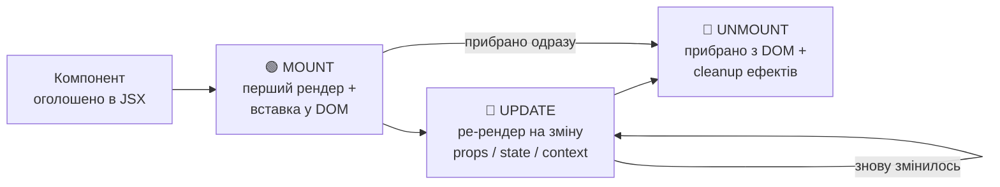
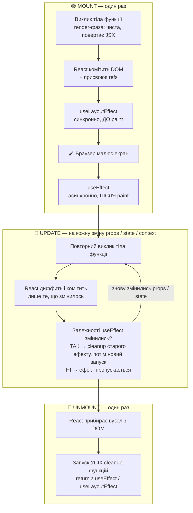
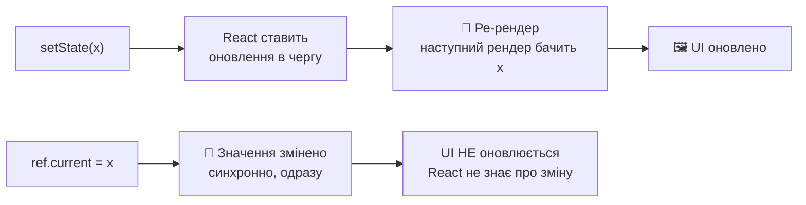

# ⚛️ React

Хуки, рендеринг, стан і патерни сучасного React — від основ до Senior.

> Cheat Hub · /react · експортовано 2026-09-26

---

Гайд побудований як шлях від "пишу перший компонент" до "поясню, чому він ре-рендерився" на Senior-співбесіді. Блоки 0–1 — фундамент, 2–5 — поглиблений React, 6–8 — Next.js та найсвіжіше. Кожен розділ має практичні приклади й блок **🎤 На співбесіді часто запитують** — саме там питання, які реально ставлять.

---

## 📜 Історія версій React

`v0.3 · 2013` · `v15 · 2016` · `v16 · 2017` · `v16.8 · 2019` · `v17 · 2020` · `v18 · 2022` · `v19 · 2024 ✦`

**🕐 Історія**

- **2013** — Open-source реліз (Facebook) — Virtual DOM як основна ідея, ще з домішками Flux
- **2015** — React Native — той самий компонентний підхід для мобільних застосунків
- **2016 · v15** — Останній реліз перед переписом реконсилера — стабільна, але синхронна модель рендерингу
- **2017 · v16** — Fiber-архітектура (повний переписаний реконсилер), Fragments, Error Boundaries, Portals
- **2019 · v16.8** — **Hooks** — useState/useEffect/... Функціональні компоненти отримують стан без класів
- **2020 · v17** — "No new features" реліз — підготовка до поступових апгрейдів, новий JSX transform (без ручного `import React`)
- **2022 · v18** — Concurrent rendering, automatic batching, `useTransition`/`useDeferredValue`, Suspense для data fetching, перші Server Components
- **2024 · v19 ✦** — **Поточна:** Actions, `use()`, `useActionState`, `useOptimistic`, React Compiler (RC)

**Головний вектор 2013 → 2024:** від "бібліотеки для рендерингу View у MVC" → до власної рантайм-моделі з конкурентним рендерингом і серверними компонентами. Найбільший зсув для щоденної роботи — **Hooks (2019)**: класи перестали бути обов'язковими для стану/lifecycle (детально — розділ "🏛️ Class vs Functional" нижче).

### 🎤 Питання на співбесіді

**1. Що змінилось у переході від React 17 до React 18, і чому це переламний реліз?**
React 18 ввів **concurrent rendering** як фундамент: `createRoot` замість `ReactDOM.render`, автоматичний **batching** усіх оновлень, нові хуки `useTransition`/`useDeferredValue`/`useId`, Suspense для SSR. До 18 усе рендерилось синхронно й блокуюче.

**2. Чим React 19 відрізняється концептуально від попередніх мажорних версій?**
Зміщує фокус з клієнтських оптимізацій на **full-stack модель**: Actions (`useActionState`/`useFormStatus`/`useOptimistic`), стабільні Server Components/Functions, `use()` для читання проміс/контексту під час рендеру, `ref` як звичайний prop (без `forwardRef`).

---

## 📚 Бібліотека чи фреймворк? + Virtual DOM

### Чому React — бібліотека, а не фреймворк **[KEY]**

Ключова відмінність — **хто кого викликає (inversion of control)**. З фреймворком (Angular) твій код вбудовується у чужий "скелет": фреймворк визначає структуру проєкту, routing, HTTP, forms, DI — і сам викликає твій код у визначених точках. З бібліотекою (React) — навпаки: **ти сам вирішуєш архітектуру** і викликаєш React там, де потрібен UI-рендеринг; router, HTTP-клієнт, state-менеджер — окремі бібліотеки, які ти підбираєш сам (Next.js/TanStack Router, TanStack Query, Zustand — усе це вибір, а не частина "коробки").

:::: grid2

::: card blue

#### Framework (Angular)

"Не дзвони нам, ми подзвонимо тобі" — DI-контейнер, модулі, lifecycle hooks викликаються фреймворком за жорсткими правилами.

:::

::: card green

#### Library (React)

Ти пишеш звичайний JS/TS-застосунок і *імпортуєш* React там, де потрібен декларативний UI. Решта архітектури — твій вибір.

:::

::::

> ✅ Практичний наслідок для співбесіди: "React-екосистема" (Next.js, React Router, TanStack) існує саме тому, що сам React навмисно не вирішує ці питання — на відміну від Angular, де вони вбудовані.

### Virtual DOM — 30-секундна версія

Робота з реальним DOM напряму — повільна (reflow/repaint на кожну зміну). React будує легкий JS-опис UI (Virtual DOM), порівнює нову версію зі старою і застосовує до справжнього DOM лише мінімальний набір змін. **Це вступ** — повний механізм (Fiber, reconciliation, diffing-правила) — у розділі "Reconciliation, Virtual DOM, Fiber" нижче.

### 🎤 Питання на співбесіді

**1. Чому React позиціонують як бібліотеку, а не фреймворк, і які практичні наслідки для команди?**
Бібліотека вирішує одну задачу — рендеринг UI за станом — і не нав'язує роутинг, data fetching чи структуру. Наслідок: команда сама обирає стек (гнучкість, але й ризик неузгоджених рішень), тому великі команди часто стандартизують на фреймворку поверх React (Next.js).

**2. Що таке Virtual DOM і чи є він причиною швидкодії React?**
Це легковагове дерево JS-об'єктів, що описує бажаний UI. Сам по собі **не джерело швидкодії** (прямі DOM-операції можуть бути швидшими) — реальна цінність у декларативній моделі («який стан → який UI») плюс можливості батчити й пріоритизувати оновлення.

---

## 🧰 Vite та інструменти збірки

### Що таке Vite **[KEY]**

Dev-сервер + білд-інструмент. У розробці Vite віддає файли як нативні ES-модулі прямо браузеру (компілює/трансформує лише файл, який реально запитав браузер, через esbuild — миттєвий старт і HMR незалежно від розміру проєкту). Для продакшн-білда використовує Rollup — трясе дерево (tree-shaking), об'єднує чанки.

### Хто був до Vite

**[LEGACY]** **Create React App (CRA)** — офіційний starter від Meta (2016–2023, **❌ deprecated**). Webpack під капотом, схований від розробника; тонкого контролю нема без `eject`. **Webpack (вручну)** — найпопулярніший бандлер 2015–2020: бандлить **увесь** граф залежностей ДО старту dev-сервера, тому холодний старт росте лінійно з проєктом. Досі в legacy-базах і Next.js Pages Router.

### ⚡ Vite — детально

**Vite — Evan You (автор Vue), 2020.** Рушій: dev — нативні ES-модулі + esbuild (Go) для pre-bundling залежностей; prod — Rollup (нові версії переходять на Rolldown — Rust-порт).

- **Dev:** сервер стартує без бандлінгу. Браузер сам запитує `import`-и, Vite трансформує лише запитаний файл (JSX/TS → JS). Залежності з `node_modules` один раз пре-бандляться esbuild у кеш `node_modules/.vite`.
- **HMR:** інвалідовується лише змінений модуль і його межа (React Fast Refresh через `@vitejs/plugin-react`) — швидкість не залежить від розміру проєкту.
- **Prod:** Rollup — tree-shaking, code-splitting за `import()`, мінифікація, хешовані імена.

**Сильні сторони:** миттєвий старт, мінімальна конфігурація, величезна екосистема плагінів (сумісна з Rollup), фундамент для Vitest, Remix/React Router v7, Astro, SvelteKit.
**Обмеження:** dev і prod — різні збірники (рідкісні «працює в dev, ламається в build»); тисячі дрібних модулів = водоспад запитів при першому завантаженні.
**Коли обирати:** новий SPA / бібліотека компонентів / клієнтський React без потреби в SSR з коробки.

```tsx
// vite.config.ts
import { defineConfig } from 'vite'
import react from '@vitejs/plugin-react'

export default defineConfig({
  plugins: [react()],
  resolve: { alias: { '@': '/src' } },
  server: { port: 5173, proxy: { '/api': 'http://localhost:3000' } },
})
```

> 💡 Env-змінні в клієнті — лише з префіксом `VITE_` і через `import.meta.env.VITE_API_URL`, а не `process.env`.

### Решта інструментів — коротко

- **▲ Next.js** (Vercel, 2016) — не бандлер, а **фреймворк** поверх React: Turbopack (дефолт з Next.js 16) + SWC. Файловий роутинг (App/Pages Router), SSR/SSG/ISR/стрімінг/Server Actions на рівні сегмента, вбудовані `next/image`/`next/font`/middleware/API routes. Деталі — розділи "Next.js" нижче. Обирати: потрібні SSR/SEO, публічні сторінки, fullstack.
- **🚀 Turbopack** (Vercel, 2022, Rust) — наступник Webpack від автора Webpack. Інкрементальність на рівні функцій (кешується результат кожної операції) + lazy bundling у dev + persistent-кеш. Stable для `next dev`/`next build`, дефолт у Next.js 16. Фактично не існує окремо від Next.js; кастомні Webpack-плагіни (не loader'и) не підтримуються.
- **🦀 Rspack** (ByteDance, 2023, Rust) — Webpack-сумісний за API (той самий `config`, більшість loader'ів/плагінів). Ядро на Rust з паралелізмом, вбудований SWC-loader; Module Federation працює. У 5–10× швидше build/HMR. Обирати: великий Webpack-конфіг, який дорого переписувати, або мікрофронтенди. Обгортка zero-config — Rsbuild.
- **📦 Parcel** (Devon Govett, 2017, v2 частково Rust/SWC) — «zero-config»: точка входу — будь-який файл, Parcel сам знаходить залежності й трансформери, ставить відсутні плагіни. Агресивний диск-кеш. Обирати: прототип/демо/навчання, без конфігу взагалі. Мінус: менша спільнота, «магія» ускладнює дебаг.

| Інструмент | Тип | Швидкість dev-старту | Коли обирати |
| --- | --- | --- | --- |
| Vite | Dev-сервер + Rollup | Дуже висока (ESM, без бандлінгу) | Новий SPA-проєкт за замовчуванням |
| Webpack | Бандлер | Низька на великих проєктах | Legacy-підтримка, специфічні плагіни без аналогів |
| CRA | Starter (Webpack) | Низька | ❌ Не обирати — deprecated |
| Next.js | Фреймворк (Turbopack всередині) | Висока | Потрібен SSR/RSC/роутинг з коробки |
| Turbopack | Бандлер (Rust) | Найвища (функція-рівнева інкрементальність) | Разом з Next.js; ще не для standalone поза ним |
| Rspack | Бандлер (Rust, Webpack-сумісний) | Висока | Міграція з великого Webpack-конфіга без переписування |
| Parcel | Бандлер (zero-config) | Середня | Малі проєкти/прототипи, де не хочеться писати конфіг |

### Створення проєкту — покроково

```bash
npm create vite@latest my-app -- --template react-ts
cd my-app
npm install
npm run dev          # dev-сервер з HMR, за замовчуванням localhost:5173

# Структура після створення:
# index.html          ← точка входу (НЕ в public/, на відміну від CRA!)
# src/main.tsx         ← createRoot(...).render(<App />)
# src/App.tsx
# vite.config.ts       ← плагіни (@vitejs/plugin-react), aliases, dev-сервер
```

### 🎤 Питання на співбесіді

**1. Чому індустрія перейшла з CRA на Vite?**
CRA (Webpack) пересобирав весь бандл при кожній зміні — dev-старт і HMR деградували з ростом проєкту. Vite в dev не бандлить взагалі (ES-модулі напряму через esbuild, у 10–100× швидший), а для prod використовує Rollup. CRA офіційно deprecated.

**2. У чому різниця між dev-сервером Vite та prod-збіркою з точки зору браузера?**
У dev браузер отримує нативні ESM «як є», трансформація on-demand через esbuild лише для запитаних файлів — миттєвий холодний старт. У prod Vite перемикається на Rollup (tree-shaking, chunking, мінифікація) — тобто dev і prod використовують **різні збірники**.

---

## 🖥️ React + VS Code

### Обов'язкові розширення **[KEY]**

| Розширення | Навіщо |
| --- | --- |
| **ES7+ React/Redux/React-Native Snippets** | Сніпети `rfc`/`rafce` — функціональний компонент за секунду (`rcc` — класовий, лише для легасі) |
| **Prettier** | Автоформатування — прибирає суперечки про стиль коду в команді |
| **ESLint** | Лінтинг у реальному часі (`eslint-plugin-react-hooks` ловить порушення Rules of Hooks до рантайму) |
| **Auto Rename Tag** | Перейменування відкриваючого JSX-тега автоматично перейменовує закриваючий |
| **Tailwind CSS IntelliSense** | Автодоповнення utility-класів + підсвітка кольорів (якщо проєкт на Tailwind) |

### Що таке сніпет і абревіатури **[KEY]**

VS Code **сніпет** — текстовий префікс, що після `Tab`/`Enter` розгортається у заготовку коду з tab-stops. Розширення ES7+ додає React-сніпети:

| Префікс | Розшифровка | Що генерує |
| --- | --- | --- |
| `rfc` | React Functional Component | Функціональний компонент, `export default function` |
| `rafce` | React Arrow Function Component Export | Те саме, але стрілкова функція з `export default` зверху |

```tsx
// rfc / rafce → генерує:
export default function ComponentName() {
  return <div>ComponentName</div>;
}
```

### Корисні налаштування `settings.json`

```json
{
  "editor.formatOnSave": true,
  "editor.defaultFormatter": "esbenp.prettier-vscode",
  "editor.codeActionsOnSave": { "source.fixAll.eslint": "explicit" },
  "editor.quickSuggestions": { "strings": true } // автодоповнення в className/JSX-атрибутах
}
```

### 🎤 Питання на співбесіді

**1. Які VS Code розширення/налаштування ти вважаєш обов'язковими для React і чому?**
ESLint + Prettier (з `eslint-plugin-react-hooks` — ловить порушення правил хуків до рантайму), TypeScript-плагін, snippet/IntelliSense для JSX. Плагін хуків критичний, бо умовний виклик хука — баг, що проявляється як плутанина у стані, а не одразу.

---

## 🧱 Компоненти та JSX

### Компонент — це просто функція **[KEY]**

React-компонент — звичайна JS-функція, що приймає об'єкт `props` і повертає опис UI (JSX). Ім'я компонента **завжди з великої літери** — так React відрізняє компонент (`<Button/>`) від HTML-тега (`<button/>`).

```tsx
function Greeting({ name }: { name: string }) {
  return <h1>Привіт, {name}!</h1>;
}
// Використання:
<Greeting name="Роман" />
```

```tsx
// JSX — це НЕ HTML. Це синтаксичний цукор над:
React.createElement(
  'h1',
  null,
  'Привіт, ', name, '!'
);
// createElement повертає плейн-обʼєкт (React element),
// не DOM-вузол. React будує з них дерево і сам малює DOM.
```

### JSX — правила **[PITFALL]**

| Правило | Приклад |
| --- | --- |
| Один кореневий елемент | `<>...</>` (Fragment) якщо треба обгорнути кілька без зайвого `div` |
| `{'{ }'}` — вихід у JS-вираз | `{'{'}user.name{'}'}`, `{'{'}items.map(...){'}'}` — тільки *вирази*, не `if`/`for` (statements) |
| Атрибути — camelCase | `className` замість `class`, `onClick` замість `onclick` |
| Кожен тег закритий | ``, `<br />` — самозакривні теги обов'язково з `/` |
| Стилі — обʼєкт | `style={{'{{'} color: 'red' {'}}'}}` — подвійні дужки: зовнішні JSX, внутрішні — обʼєкт |

> ⚠️ **Умова "if" не працює в JSX напряму** — `if` це statement, а всередині `{'{ }'}` можна лише вираз. Тому умовний рендеринг робиться через тернарник/`&&`/винесену змінну (детально — наступний розділ).

### Навіщо взагалі JSX **[KEY]**

JSX створили, бо розмітка й логіка, що її генерує, нерозривно пов'язані — React обрав тримати їх **разом в одному файлі**, а не змушувати писати `React.createElement` вручну. Компілятор (Babel/SWC) перетворює JSX на виклики функції ще до рантайму — сам React ніколи "не бачить" JSX, лише результат.

### Три дерева: Element tree → Fiber tree → DOM tree **[KEY]**

Це часто плутають, кажучи "Virtual DOM" про все одразу — насправді це **три різні дерева** з різним часом життя й призначенням.

:::: grid3

::: card blue

#### 1. Element tree

Результат `createElement` (з JSX). Легкий плейн-обʼєкт. **Перестворюється щорендеру заново** — "Virtual DOM" у побутовому сенсі.

:::

::: card yellow

#### 2. Fiber tree

Внутрішня структура React. **Персистентна** — живе між рендерами, саме її React diff'ить і зберігає в ній стан хуків.

:::

::: card green

#### 3. DOM tree

Реальні браузерні вузли. Оновлюється мінімально, точково — лише те, що показав diff Fiber-дерева.

:::

::::

**Element tree** — плейн-обʼєкт `{'{'} type, props, key, ref {'}'}` (точна форма — розділ "Virtual DOM" нижче). Без методів/підписок; щойно React його звірив з Fiber-деревом — збирається GC.
**Fiber tree** — персистентна структура з полями (`type`, `key`, `child`/`sibling`/`return`, `alternate`, `memoizedState`) — повна таблиця в розділі "Reconciliation, Virtual DOM, Fiber" нижче; тут головне: це **єдине** дерево з трьох, що памʼятає щось між рендерами.
**DOM tree** — застосування diff'у до реальних `Node` (`appendChild`/`setAttribute`/…). Сеньйорський нюанс: `react-reconciler` **не знає нічого про DOM** — він рендерить у Fiber-дерево й викликає абстрактний "host config". `react-dom` — лише одна реалізація (браузер); той самий reconciler з іншим host дає `react-native` чи `react-three-fiber`. DOM tree — лише один з можливих host'ів.

> ✅ Element tree відкидається й будується заново щорендеру (дешево — плейн-обʼєкти). Fiber tree — довгоживуча структура, яку React звіряє зі свіжим element tree, щоб порахувати мінімальний патч для конкретного host.

### Fragment — варіанти **[KEY]**

Компонент повинен повернути один кореневий вузол. Fragment групує кілька елементів **без зайвого DOM-вузла**.

```tsx
// Коротка форма — найчастіша
return (
  <>
    <dt>{term}</dt>
    <dd>{description}</dd>
  </>
);
// ⚠️ коротка форма НЕ приймає key — потрібна повна
```

```tsx
// Повна форма — коли потрібен key (у .map())
{items.map(item => (
  <React.Fragment key={item.id}>
    <dt>{item.term}</dt>
    <dd>{item.description}</dd>
  </React.Fragment>
))}
```

### 🎤 Питання на співбесіді

**1. JSX компілюється у виклики функцій — які саме, і чим це відрізняється у класичному та новому трансформі?**
Класичний трансформ компілює `<div />` у `React.createElement('div', null)` (файл мусив імпортувати `React`). Новий automatic runtime (React 17+) компілює у `jsx`/`jsxs` з `react/jsx-runtime`, що імпортується автоматично — звідси зникла потреба в `import React` заради JSX.

**2. Чому не можна повертати два JSX-елементи без обгортки, і які обгортки найдешевші?**
JSX-вираз має резолвитись в одне значення, тому сусідні елементи без кореня — синтаксична помилка. Найдешевше — `<>...</>` (Fragment): не створює зайвого DOM-вузла й не впливає на `:nth-child`, на відміну від `<div>`.

**3. Чим element tree відрізняється від Fiber tree?**
element tree перестворюється щорендеру (дешеві плейн-обʼєкти), Fiber tree персистентна і зберігає стан між рендерами — саме її React diff'ить.

**4. Чому `<>...</>` іноді не підходить у `.map()`?**
Коротка форма не приймає `key`, а список без key ламає reconciliation — потрібен повний `<React.Fragment key={...}>`.

---

## 🧩 Анатомія компонента: шаблон, стилі, зображення

### Мінімальний компонент end-to-end **[KEY]**

Реальний файл компонента містить: імпорти (React — не обов'язково з новим JSX transform, типи, стилі, картинки), функцію-компонент, `export`. Конвенція іменування файлу — збігається з іменем компонента.

```tsx
// UserCard.tsx
import type { FC } from 'react';
import styles from './UserCard.module.css';   // CSS Modules — класи скоуплені локально
import avatarFallback from './avatar-fallback.png'; // бандлер повертає URL, не бінарник

interface UserCardProps {
  name: string;
  avatarUrl?: string;
}

export const UserCard: FC<UserCardProps> = ({ name, avatarUrl }) => {
  return (
    <div className={styles.card}>
      
      <span className={styles.name}>{name}</span>
    </div>
  );
};
```

### Що тут важливо **[PITFALL]**

| Що | Чому саме так |
| --- | --- |
| Компонент повертає **один** JSX-вираз | JSX-вираз — плейн-обʼєкт |
| Імпорт картинки `import img from './x.png'` | Бандлер підміняє імпорт на URL до файлу в білді (з хешем) — рядковий шлях без імпорту працює лише з `public/` |
| `CSS Modules` (`*.module.css`) | Класи локально скоуплені — `styles.card` компілюється в унікальний хеш, без конфліктів імен |
| `alt` на `` | Доступність — вимога a11y-лінтерів, не забаганка |

> ✅ Файли в `public/` (Vite) копіюються as-is, доступні по кореневому шляху (`/logo.png`) БЕЗ імпорту. Файли поруч з компонентом — завжди через `import`, щоб бандлер їх обробив (оптимізація, хешування, tree-shaking).

### Робота з картинками — повні правила **[KEY]**

| Спосіб | Синтаксис | Що отримуєш |
| --- | --- | --- |
| Статичний import | `import img from './x.png'` | Рядок-URL (з хешем у prod) |
| `public/` | `` | URL напряму, без обробки бандлером |
| SVG як URL | `import icon from './icon.svg'` | Рядок-URL — як PNG/JPG |
| SVG як компонент (SVGR) | `import { ReactComponent as Icon } from './icon.svg'` | JSX-компонент — стилізується `fill`/`stroke` через CSS/props |

Бандлер автоматично інлайнить **дрібні** файли (типово <4KB) у base64 data-URI — без окремого запиту. Більші лишаються окремими файлами з власним URL і кешем.

#### ⚠️ Динамічний шлях — пастка **[PITFALL]**

```tsx
// ❌ НЕ працює — бандлер аналізує imports
// статично, рядок з name невідомий на build-time
import img from `./images/${name}.png`;

// ✅ new URL — бандлер розуміє цей патерн
const src = new URL(
  `./images/${name}.png`, import.meta.url
).href;
```

> ✅ У Next.js для оптимізації зображень (lazy-loading, responsive `srcset`, WebP/AVIF) є `<Image>` з `next/image` (згадувався в "Performance Deep Dive") — заміна ``, а не альтернатива способам імпорту вище.

### 🎤 Питання на співбесіді

**1. Як організувати файлову структуру React-компонента, щоб вона масштабувалась?**
Колокація: `ComponentName/index.tsx` + `ComponentName.module.css` + асети поруч, а не в глобальних `/styles`/`/assets`. Знижує когнітивне навантаження і спрощує видалення фічі — видаляєш папку без пошуку «осиротілих» файлів.

---

## 🎨 Styled Components та Tailwind

### styled-components — CSS-in-JS **[KEY]**

Стилі описуються прямо в JS через tagged template literals — компонент і стилі в одному файлі, стилі можуть залежати від `props`.

```tsx
import styled from 'styled-components';

const Button = styled.button<{ variant?: 'primary' | 'danger' }>`
  padding: 8px 16px;
  border-radius: 6px;
  background: ${p => (p.variant === 'danger' ? '#ef4444' : '#6366f1')};
  color: white;

  &:hover { opacity: 0.9; }
`;

// <Button variant="danger" onClick={onDelete}>Delete</Button>
// Клас генерується на льоту, унікальний — конфліктів немає,
// але це runtime-вартість: парсинг шаблонів + вставка <style> при mount
```

### Tailwind CSS — утилітарний підхід

Замість написання CSS-правил — готові utility-класи прямо в `className`. Немає runtime-вартості (звичайний CSS, згенерований на build-time) і немає проблеми іменування класів.

```bash
npm install tailwindcss @tailwindcss/vite
```

```ts
// vite.config.ts
import { defineConfig } from 'vite';
import react from '@vitejs/plugin-react';
import tailwindcss from '@tailwindcss/vite';

export default defineConfig({
  plugins: [react(), tailwindcss()],
});
```

```css
/* src/index.css — один рядок замість окремого tailwind.config.js для базового кейсу */
@import "tailwindcss";
```

```tsx
export function Button({ children }: { children: React.ReactNode }) {
  return (
    <button className="rounded-md bg-indigo-600 px-4 py-2 text-white hover:opacity-90">
      {children}
    </button>
  );
}
```

### Коли що обрати

|  | styled-components | Tailwind |
| --- | --- | --- |
| Runtime вартість | Так — генерація стилів у браузері | Ні — звичайний CSS, згенерований на білді |
| Стилі, залежні від props | Природно (`${p => ...}`) | Через умовну конкатенацію класів (`clsx`/`cn`) |
| Крива навчання | Звичайний CSS-синтаксис | Треба вивчити назви утиліт |
| Розмір бандла | Бібліотека + рантайм | Лише використані класи (purge на білді) |

### 🎤 Питання на співбесіді

**1. Які trade-off'и між CSS-in-JS та Tailwind у продакшн-застосунку?**
Styled Components дає повну ізоляцію стилів і динаміку на props, але додає рантайм-вартість (генерація класів під рендер, більший bundle, повільніший SSR). Tailwind — статичний CSS без рантайму: клас відомий на збірці, purge прибирає невикористане; продуктивність вища, але HTML «зашумлений» довгими класами.

**2. Чому у 2024–2026 переходять від CSS-in-JS до zero-runtime (Tailwind, vanilla-extract, CSS Modules)?**
Рантайм-вартість CSS-in-JS помітна на великих сторінках з динамічними стилями (кожен рендер може перегенеровувати класи/style-теги), плюс гірша сумісність із RSC, де компонент не завжди виконується в браузері й не може покладатись на рантайм-генерацію стилів.

---

## 🎞️ Техніки анімації в React

### CSS transition / @keyframes — базовий рівень **[KEY]**

Найдешевший спосіб анімувати: декларативно, без JS-рантайму. `transition` — для переходу між двома станами (hover); `@keyframes` + `animation` — для послідовності кроків або нескінченних циклів (спінер, пульсація).

```tsx
// Тільки transform/opacity — щоб анімація йшла на compositor-шарі, повз layout/paint
function FadeInButton() {
  const [hovered, setHovered] = useState(false);
  return (
    <button
      onMouseEnter={() => setHovered(true)}
      onMouseLeave={() => setHovered(false)}
      style={{
        transform: hovered ? 'scale(1.05)' : 'scale(1)',
        transition: 'transform 150ms ease-out',
      }}
    >
      Hover me
    </button>
  );
}

/* @keyframes у CSS-файлі — для нескінченних/багатокрокових анімацій */
/* .spinner { animation: spin 1s linear infinite; }
   @keyframes spin { from { transform: rotate(0deg); } to { transform: rotate(360deg); } } */
```

### Framer Motion — коли CSS не вистачає

Декларативний API поверх Web Animations: `<motion.div>` замість тега, пропи `initial`/`animate`/`exit`. Головна перевага над CSS — **анімація виходу** (компонент доанімовується перед реальним видаленням з DOM) і **layout-анімації** (зміна позиції/розміру анімується автоматично через FLIP).

```tsx
import { motion, AnimatePresence } from 'framer-motion';

function Toast({ message, onClose }: { message: string; onClose(): void }) {
  return (
    <AnimatePresence>
      {message && (
        <motion.div
          initial={{ opacity: 0, y: -20 }}
          animate={{ opacity: 1, y: 0 }}
          exit={{ opacity: 0, y: -20 }}       // AnimatePresence чекає завершення exit
          transition={{ duration: 0.2 }}       // перш ніж React реально видалить елемент
        >
          {message}
        </motion.div>
      )}
    </AnimatePresence>
  );
}

// layout-анімація "з коробки": <motion.div layout>{card}</motion.div>
```

### Коли що обрати

|  | CSS transition/keyframes | Framer Motion |
| --- | --- | --- |
| Простий hover/fade/показати-сховати | ✅ Достатньо, 0 залежностей | Надлишково |
| Анімація виходу (exit) при анмаунті | ❌ Не працює — DOM-вузол зникає миттєво | ✅ `AnimatePresence` |
| Layout-анімація (зміна позиції/розміру) | ❌ Потребує ручного FLIP | ✅ `layout` проп |
| Drag / spring-фізика / жести | ❌ | ✅ вбудовано |
| Розмір бандла | 0 KB | +30-40 KB (gzip) |

### 🎤 Питання на співбесіді

**1. Чому анімація `transform`/`opacity` «дешева», а `width`/`top`/`margin` — «дорога»?**
`width`/`top`/`margin` запускають **layout (reflow)** → **paint** → **composite** — три важкі стадії на кадр. `transform`/`opacity` обробляються лише на стадії **composite**, часто на GPU, без layout/paint — тому саме їх рекомендують для 60fps (напр. `transform: translateX()` замість `left`).

**2. Чим підхід CSS-анімації відрізняється від Framer Motion, і коли CSS вже недостатньо?**
CSS `transition`/`@keyframes` — декларативні, дешеві, ідеальні для простих переходів стану, без JS-рантайму. Але CSS не вміє анімувати анмаунт (елемент зникає миттєво), координувати кілька елементів (layout/spring/drag) чи реверсувати перехід — для цього Framer додає JS-рантайм (`AnimatePresence`, `layout` проп).

**3. Що таке FLIP-техніка і яку проблему вона вирішує?**
FLIP (First, Last, Invert, Play) анімує зміну *позиції/розміру через layout* (напр. картка переїжджає в іншу колонку), яку CSS transition не бере: зняти позицію до (First) і після (Last), інвертувати різницю через `transform` (Invert), прибрати transform і дати браузеру доанімувати дешевим `transform` (Play). На цій ідеї побудований `layout`-проп Framer Motion.

---

## 📦 Props, State та події

### Props — однонаправлений потік даних **[KEY]**

Дані рухаються **тільки згори вниз**: батько передає props дитині, дитина не може напряму змінити props батька (вони *read-only*). Щоб дитина "повідомила" щось наверх — батько передає їй callback як проп.

```tsx
function Parent() {
  const [count, setCount] = useState(0);
  return <Counter value={count}
    onIncrement={() => setCount(c => c + 1)} />;
}
```

```tsx
function Counter({ value, onIncrement }: Props) {
  // value — тільки читання, onIncrement — "канал наверх"
  return <button onClick={onIncrement}>{value}</button>;
}
```

### `children` — особливий проп

```tsx
function Card({ children }: { children: React.ReactNode }) {
  return <div className="card">{children}</div>;
}
// <Card><p>будь-який JSX</p></Card> — children = <p>...</p>
// Це основа композиції — компонент не знає, ЩО всередині, лише "де".
```

### useState — локальний стан **[KEY]**

```tsx
const [count, setCount] = useState(0);
// count — поточне значення (read-only знімок)
// setCount — єдиний спосіб його змінити
setCount(count + 1);      // "постав нове значення"
setCount(c => c + 1);  // функціональна форма — безпечна при кількох апдейтах підряд
```

```tsx
// Виклик setState планує РЕ-РЕНДЕР, не мутує змінну одразу.
function onClick() {
  setCount(count + 1);
  console.log(count); // ❗ старе значення — рендер ще не стався
}
// Це не "баг" — це модель: render функція завжди бачить
// стан ЦЬОГО рендеру (детальніше — closures)
```

### Stateful vs Stateless **[KEY]**

Компонент **stateful** — має власний `useState`/`useReducer`, "пам'ятає" щось між рендерами. **stateless** — чиста функція від `props`: однакові пропи → однаковий вивід, без внутрішньої памʼяті. До хуків такий компонент називали **"stateless functional component" (SFC)** — термін лишився в старих статтях; сьогодні "функціональний компонент" вже не означає "без стану".

```tsx
// Stateless — нічого не памʼятає між рендерами
function Avatar({ url, alt }: Props) {
  return ;
}
// Stateful — власна памʼять (чи завантажилось зображення)
function Avatar({ url, alt }: Props) {
  const [loaded, setLoaded] = useState(false);
  return  setLoaded(true)} />;
}
```

### Контрольований input

```tsx
const [text, setText] = useState('');
<input value={text} onChange={e => setText(e.target.value)} />
// value з React-стану = React "керує" полем — це "controlled".
// Без value — DOM сам тримає своє значення (uncontrolled).
```

### PropTypes — легасі перевірка типів **[LEGACY]**

До TypeScript пакет `prop-types` був стандартним способом валідувати форму props **у рантаймі**: React у dev порівнював реальні props зі "схемою" й друкував попередження при невідповідності. Сьогодні в TS-проєкті цю роль виконує компілятор — PropTypes лишається лише в легасі JS-базі без TS.

```jsx
// PropTypes (JavaScript, без TypeScript)
import PropTypes from 'prop-types';

function UserCard({ name, age, onSelect }) {
  return <div onClick={onSelect}>{name} ({age})</div>;
}

UserCard.propTypes = {
  name: PropTypes.string.isRequired,
  age: PropTypes.number,          // не required — може бути undefined
  onSelect: PropTypes.func,
};
// Невідповідність ловиться лише коли компонент РЕАЛЬНО відрендериться

// TypeScript — той самий контракт, але compile-time
interface UserCardProps {
  name: string;
  age?: number;
  onSelect?: () => void;
}
function UserCard({ name, age, onSelect }: UserCardProps) { /* ... */ }
```

### 🎤 Питання на співбесіді

**1. У чому фундаментальна різниця між props і state, і чому їх змішування — типова помилка?**
`props` — вхідні дані ззовні, які компонент **не може змінювати сам**; `state` — внутрішні дані, якими він керує через `useState`/`useReducer`, і зміна яких викликає ре-рендер. Типова помилка — копіювати prop у local state (`useState(props.value)`), що розриває синхронізацію з батьком при подальших оновленнях prop.

**2. Чому `onClick={handleClick()}` — баг, а `onClick={handleClick}` — правильно?**
`onClick={handleClick()}` викликає функцію під час рендеру й передає обробнику *результат* (часто `undefined`), а `handleClick` виконується щорендеру. Правильно — посилання: `onClick={handleClick}` або `onClick={() => handleClick(arg)}` для аргументів.

**3. Чому `console.log(count)` одразу після `setCount` показує старе значення?**
setState асинхронний відносно поточної функції — планує рендер, не мутує змінну зараз.

**4. Чим props відрізняються від state?**
props — ззовні, read-only, дитина не міняє; state — внутрішній, змінюваний через свій setter.

**5. Навіщо потрібен `children`?**
Композиція — компонент-обгортка не знає вміст, просто рендерить те, що передали.

**6. Що таке PropTypes і чому в TS-проєкті вони не потрібні?**
PropTypes — рантайм-перевірка типів props у чистому JS: у dev React виводить попередження при невідповідності. TS перевіряє **під час компіляції** (до запуску) + дає автодоповнення в IDE, тому в TS-проєкті типи оголошуються інтерфейсом, а PropTypes стає зайвим подвійним джерелом правди.

---

## ⚡ SyntheticEvent та делегування подій

### SyntheticEvent — крос-браузерна обгортка **[KEY]**

Кожен обробник у JSX (`onClick`, `onChange`, ...) отримує не нативну `Event`, а `SyntheticEvent` — обгортку з тим самим API (`target`, `preventDefault()`, `stopPropagation()`), але однаковою поведінкою в усіх браузерах. Доступ до нативної події — через `event.nativeEvent`.

```tsx
function SearchInput() {
  function handleChange(e: React.ChangeEvent<HTMLInputElement>) {
    console.log(e.target.value);      // SyntheticEvent API — однаково в кожному браузері
    console.log(e.nativeEvent);       // справжня DOM-подія, якщо потрібна
  }
  return <input onChange={handleChange} />;
}
```

### Делегування подій — один слухач замість тисячі

React не вішає окремий `addEventListener` на кожен елемент з `onClick`. Замість цього — **один** слухач на кореневому контейнері на кожен тип події; коли подія спливає туди, React через фібер-дерево визначає, який компонент мав її обробити, і викликає колбек. 1000 елементів з `onClick` = 1 нативний слухач; елементи можна вільно додавати/видаляти без ручного (де)реєстрування.

### stopPropagation — пастка на межі React/DOM **[PITFALL]**

`e.stopPropagation()` зупиняє спливання лише **всередині React**-делегування. Сторонній `addEventListener`, підключений напряму, усе одно може отримати подію — React-делегування й нативне DOM-спливання це окремі механізми.

### preventDefault() vs stopPropagation() **[KEY]**

- `preventDefault()` — скасовує **дефолтну дію браузера** (submit, перехід по `<a href>`, галочка чекбокса). **Не** впливає на спливання.
- `stopPropagation()` — зупиняє **подальше спливання** по дереву. **Не** скасовує дефолтну дію.

> ⚠️ Потрібні обидва ефекти — виклич обидва методи. У React `return false` з обробника (на відміну від jQuery) **не** робить ні того, ні іншого.

### 🎤 Питання на співбесіді

**1. Що таке SyntheticEvent і навіщо React обгортає нативні події?**
Легка крос-браузерна обгортка над DOM-подією з **однаковим API в усіх браузерах**. Причини: узгодженість API незалежно від браузера + продуктивність — усі обробники реєструються через **один** слухач на корені (делегування), який React сам маршрутизує.

**2. Як влаштоване делегування подій у React (куди вішаються нативні слухачі)?**
React (17+) реєструє **один** нативний слухач на кореневому DOM-контейнері (раніше — на `document`) на кожен тип події. При спливанні до кореня React через мапу фібер-дерева визначає потрібний колбек. Дешевше при багатьох елементах (1000 кнопок = 1 слухач) і працює з динамічно доданими елементами без пере-підписування.

**3. Чому `stopPropagation()` не завжди зупиняє нативне спливання при змішуванні з `addEventListener`?**
React обробляє свою синтетичну систему окремо від нативного DOM. `stopPropagation()` зупиняє спливання **всередині React-делегування**, але подія могла дійти до кореневого нативного слухача чи до сторонніх обробників, підписаних напряму — звідси неочевидні баги при співіснуванні React і нативного коду.

**4. Різниця між `preventDefault()` і `stopPropagation()`, і що робить `return false`?**
`preventDefault()` скасовує дефолтну дію браузера, не чіпає спливання; `stopPropagation()` навпаки. Ортогональні — потрібні обидва, викликай обидва. `return false` у React (на відміну від jQuery) не робить нічого з цього.

---

## 🔁 Списки, умовний рендеринг, форми

### Умовний рендеринг

```tsx
{isLoggedIn ? <Dashboard /> : <Login />}       // тернарник
{unreadCount > 0 && <Badge count={unreadCount} />}   // && — показати або нічого
if (loading) return <Spinner />; return <Content />; // рання early-return
```

> ⚠️ **Пастка `&&` з числом:** `{'{'}count && <Badge/>{'}'}` — якщо `count === 0`, у DOM виведеться **"0"** (falsy, але не boolean). Фікс: `count > 0 && ...` або `Boolean(count) && ...`.

### Списки та `key` **[KEY]**

```tsx
<ul>
  {users.map(user => (
    <li key={user.id}>{user.name}</li>
  ))}
</ul>
// key — стабільний ідентифікатор, за яким React зіставляє елементи
// між рендерами. Без key (або key={index}) — баги при вставці/видаленні
// посередині списку. Повне пояснення — розділ Reconciliation нижче.
```

### `key` поза списками — скидання стану **[KEY]**

Зміна `key` на компоненті каже React: це «інший» екземпляр — старий демонтується (з усім станом/ефектами), новий монтується з нуля. Найчистіший спосіб «перезапустити» піддерево при зміні сутності — без `useEffect`, що вручну скидає кожне поле.

```tsx
// Профіль перемикається — форму треба скинути під нового користувача
<ProfileForm key={userId} userId={userId} />
// userId змінився → стара форма демонтована, нова — з чистим станом
```

### Форма — базовий приклад

```tsx
function LoginForm() {
  const [email, setEmail] = useState('');

  function handleSubmit(e: React.FormEvent) {
    e.preventDefault();    // без цього — full page reload
    login(email);
  }

  return (
    <form onSubmit={handleSubmit}>
      <input value={email} onChange={e => setEmail(e.target.value)} />
      <button type="submit">Увійти</button>
    </form>
  );
}
```

### 🎤 Питання на співбесіді

**1. Чому не можна індекс масиву як `key` у динамічних списках, і коли це прийнятно?**
`key` — те, за чим React ідентифікує, який елемент відповідає якому DOM-вузлу між рендерами. Якщо список змінює порядок чи додає/видаляє елементи посередині, а `key` — індекс, стан (напр. значення `<input>`) лишається прив'язаним до позиції, а не до логічного елемента. Індекс прийнятний лише для статичних незмінних списків.

**2. Які проблеми дає рендер великих списків без віртуалізації і як їх діагностувати?**
Тисячі DOM-вузлів одразу збільшують час первинного рендеру, памʼять і вартість кожного reconciliation-проходу. Діагностика — Profiler покаже довгий commit; рішення — віртуалізація (`react-window`/`@tanstack/react-virtual`), що рендерить лише видимі елементи.

**3. Чому не можна `key={Math.random()}`?**
Новий key щорендеру = React вважає елемент новим щоразу — знищує й пересоздає DOM-вузол, втрачає стан/фокус.

**4. Що виведе `{'{'}0 && <Badge/>{'}'}`?**
"0" в DOM — типова пастка з fallback-through значеннями в JSX.

---

## 🌳 Reconciliation, Virtual DOM, Fiber

### Virtual DOM — навіщо **[KEY]**

Пряма робота з реальним DOM повільна (reflow/repaint). React будує легкий JS-опис дерева UI (**Virtual DOM** — дерево елементів з `createElement`), порівнює нову версію зі старою (**diffing**) і застосовує до DOM тільки мінімальний набір змін (**reconciliation**).

### Що це насправді за структура даних

Virtual DOM — не "тіньова копія DOM", а звичайний плейн-обʼєкт JS. Ось що повертає `createElement`:

```tsx
<div className="card">
  <span>Привіт</span>
</div>
```

```tsx
// createElement('div', {className:'card'}, ...) поверне:
{
  type: 'div',
  key: null,
  ref: null,
  props: {
    className: 'card',
    children: { type: 'span', props: { children: 'Привіт' } }
  }
}
// Просто дані. Жодного звʼязку з реальним DOM API.
```

### Diffing — евристика O(n), не оптимальний алгоритм **[KEY]**

Точний "мінімальний edit distance" між деревами — **O(n³)**, непридатний для UI. React свідомо йде на компроміс — евристичний **O(n)** на двох припущеннях:

1. **Порівняння лише на одному рівні** — React ніколи не шукає, чи "переїхало" піддерево в інше місце дерева; порівнює тільки елементи на тій самій позиції в тій самій батьківській ноді.
2. **Різний тип → повний ремаунт** — замість "адаптувати" `<div>` під `<span>`, простіше знести піддерево й побудувати заново.

> ✅ Це **не недолік**, а свідомий trade-off: рідкісні edge-кейси обмінюються на швидкість для 60 fps. Правила `key` і "різний тип = ремаунт" нижче — прямий наслідок цих двох припущень.

### Поширена помилка: "Virtual DOM = завжди швидше" **[PITFALL]**

Virtual DOM **не** швидший за прямі DOM-операції сам по собі — акуратний vanilla-JS, що точково міняє 3 вузли, обжене React у мікробенчмарку. Реальна вигода — у **батчингу**: замість "20 змін стану → 20 DOM-мутацій", React збирає їх в одну діф-фазу → один мінімальний патч, плюс декларативний код без ручного відстеження "що вже змінено".

### Правила diffing-алгоритму

- **Різний тип елемента** — було `<div>`, стало `<span>` (або компонент → інший) — React **знищує старе піддерево повністю** й будує нове (стан втрачається).
- **Однаковий тип** — той самий тег/компонент — React **перевикористовує** DOM-вузол, оновлює лише змінені атрибути. Стан зберігається.

### `key` у списках — чому саме **[PITFALL]**

Без `key` React зіставляє елементи **за позицією**. Вставка/видалення посередині зсуває наступні позиції — React думає, що змінився контент кожного елемента після точки вставки. З `index` як key — та сама проблема.

```tsx
// ❌ key={index}: інпути "стрибають"
list = [A, B, C], keys = [0,1,2]
// видалили A (з інпутом "A-text") → list = [B, C], keys = [0,1]
// React: "елемент key=0 змінив контент з A на B" → перевикористовує вузол
// значення інпуту "A-text" лишається — тепер під B!

// ✅ key={item.id}: коректно
keys = [idA, idB, idC] → видалили A → keys = [idB, idC]
// React бачить: вузла key=idA більше немає → unmount саме його; решта — як є
```

> ✅ `key={index}` прийнятний **лише** якщо список статичний (не сортується/фільтрується) і без стану в елементах.

### Fiber-архітектура **[KEY]**

Fiber (з React 16) — переписаний reconciler. Кожному елементу відповідає **Fiber-вузол** — обʼєкт з інформацією про компонент, props/state і, головне, **звʼязками** (child/sibling/return, як однозв'язний список замість рекурсивного стека). Це дозволяє React **переривати** рендеринг, віддавати керування браузеру (щоб не блокувати анімації/інпут) і продовжувати пізніше — чого не міг старий рекурсивний Stack reconciler.

- **До Fiber (React ≤15):** синхронний рекурсивний прохід усього дерева; великий апдейт блокує main thread цілком.
- **З Fiber (React 16+):** робота розбита на одиниці; React може зупинитись між ними, дати браузеру обробити подію, продовжити — основа Concurrent features.

### Fiber Tree vs DOM Tree — що несе Fiber-вузол **[KEY]**

DOM-вузол — "тупий" опис розмітки. Fiber-вузол несе **бухгалтерію React**:

| Поле Fiber-вузла | Навіщо | Є в DOM? |
| --- | --- | --- |
| `type` | Тег ('div') або посилання на функцію-компонент | Частково (tagName) |
| `key` | Ідентичність елемента в списку між рендерами | ❌ |
| `child / sibling / return` | Звʼязки дерева як однозв'язний список — обхід без рекурсії, переривний | ❌ |
| `alternate` | Посилання на Fiber попереднього рендеру — звідси diffing (current vs work-in-progress) | ❌ |
| `memoizedState` | Зв'язний список станів усіх хуків (по черзі виклику!) | ❌ |
| `pendingProps / memoizedProps` | Нові пропи vs застосовані на минулому рендері — основа diff | ❌ |

> ✅ Саме `memoizedState` — причина, чому **порядок виклику хуків має бути стабільним** (Rules of Hooks): React зіставляє хуки за позицією у зв'язному списку, а не за іменем змінної.

### 🎤 Питання на співбесіді

**1. Що таке Fiber і навіщо React відмовився від stack-реконсилятора?**
Fiber (React 16) — reconciler, де кожен елемент представлений вузлом з посиланнями на батька/дитину/сусіда, що дозволяє **перервати й відновити** узгодження по частинах замість синхронного рекурсивного проходу, який блокував main thread. Це фундамент concurrent-фіч (пріоритети рендеру).

**2. Чим diffing React відрізняється від класичного tree-diff, і чому це компроміс?**
Класичний — O(n³); React — евристичний O(n) з двома припущеннями: (1) елементи різного типу дають різні дерева, (2) `key` підказує стабільність у списку. Швидко для типових UI, але може давати неоптимальні (хоч і коректні) результати при нетиповій зміні структури.

**3. Чи Virtual DOM завжди швидший за прямий DOM?**
Ні. Для поодиноких точкових мутацій прямий DOM може бути швидшим — VDOM додає накладні на створення об'єктів і diffing. Перевага — при *множинних* оновленнях: React батчить їх в один прохід і застосовує мінімальний набір DOM-операцій.

**4. Що таке Virtual DOM насправді?**
Не технологія прискорення, а JS-структура даних, що дозволяє порахувати мінімальний diff перед тим, як чіпати повільний реальний DOM.

**5. Чому diffing — O(n), а не точний O(n³)?**
React жертвує рідкісними edge-кейсами (переїзд піддерева між рівнями) заради швидкості, порівнюючи лише в межах одного рівня.

**6. Чим небезпечний `key={index}`?**
Конкретний приклад з інпутами/чекбоксами, що "перестрибують" значення при реордері (див. вище).

---

## 🎬 Render vs Commit фази

### Дві фази роботи React **[KEY]**

- **1. Render (Reconciliation):** React викликає тіла компонентів, будує work-in-progress Fiber-дерево, рахує diff. **Можна переривати** й **відкидати** без наслідків. **Має бути чистою функцією** — без мутацій зовнішнього стану, без side-effects (fetch, підписки, ручні DOM-мутації).
- **2. Commit:** React застосовує зміни до реального DOM. **Синхронна**, не переривається. Тут: DOM-мутації, оновлення `refs`, `useLayoutEffect` (синхронно, до paint), а після paint — `useEffect` (асинхронно).

### Чому side-effects заборонені в render **[PITFALL]**

```tsx
// ❌ side-effect прямо в render
function Profile({ userId }) {
  fetch('/api/user/' + userId); // !!! render може викликатись кілька разів
  return <div>...</div>;        // (StrictMode, Concurrent-переривання) — fetch зайвий раз
}

// ✅ side-effect у commit-фазі, через useEffect
function Profile({ userId }) {
  useEffect(() => { fetch('/api/user/' + userId); }, [userId]);
  return <div>...</div>;   // гарантовано один раз на реальний commit
}
```

> ⚠️ Render-фазу React може почати, перервати й почати заново — work-in-progress рендер, що не дійшов до commit, ніколи не показується користувачу, і його side-effects не повинні бути видимими ззовні.

### 🎤 Питання на співбесіді

**1. Чим Render відрізняється від Commit, і чому це важливо для побічних ефектів?**
Render — виклик функцій компонентів і побудова Fiber-дерева; **може бути перервана** й не повинна мати side-effects (компонент може викликатись кілька разів за один логічний рендер). Commit — застосування до DOM + `useLayoutEffect`/`useEffect`; синхронна, не переривається.

**2. Чому `useEffect` безпечний для side-effects, а тіло компонента — ні?**
Тіло виконується в Render-фазі, яку React може перервати/повторити/відкинути — side-effect там міг би виконатись кілька разів або на «викинутому» результаті. `useEffect` запускається лише після Commit, рівно один раз на реально застосований рендер.

---

## ⚡ Automatic Batching (React 18)

### Automatic Batching **[React 18]**

Batching — об'єднання кількох `setState` в межах одного тику в **один** ре-рендер. React 17 батчив лише всередині обробників подій; у `setTimeout`, промісах, нативних слухачах кожен `setState` давав окремий рендер. React 18 (`createRoot`) батчить **скрізь**.

Що тригерить ре-рендер (власний state, батько, Context, `useReducer`) і як поводиться `<StrictMode>` — розділ «🔄 Життєвий цикл і події компонента» нижче.

```tsx
// React 17: батчинг тільки в React event handlers
// React 18: батчинг СКРІЗЬ (setTimeout, fetch/promise, native event listeners)
setTimeout(() => {
  setCount(c => c + 1);      // React 18: ОДИН ре-рендер на обидва апдейти
  setName('Roman');           // React 17: ДВА окремих ре-рендери
}, 0);

// Явно вимкнути батчинг (рідко) — flushSync()
import { flushSync } from 'react-dom';
flushSync(() => { setOpen(true); });  // React синхронно рендерить + комітить тут
tooltipRef.current.scrollIntoView();  // ← DOM уже оновлений
```

### Bailout — коли ре-рендеру не буде

Якщо `setState` отримує значення, рівне поточному за `Object.is`, React може «вийти» ще до рендеру дочірніх (*bailout*). Але сам компонент один раз усе одно викликається — тому `setState` у тілі рендеру без умови = нескінченний цикл, навіть якщо значення однакове.

> ⚠️ Batching стосується і React 19 Actions / `use()`: кілька `setState` у межах transition чи в async-екшені після `await` так само групуються. `flushSync` — виняток «мені потрібен DOM негайно», не інструмент за замовчуванням.

### 🎤 Питання на співбесіді

**1. Що таке batching і чим автоматичний batching у React 18 відрізняється від React 17?**
Batching — об'єднання кількох `setState` в один ре-рендер. React 17 батчив лише в обробниках подій; у `setTimeout`/промісах/нативних обробниках — окремий рендер на кожен. React 18 з `createRoot` робить batching **автоматичним усюди**.

**2. Як вимкнути batching і навіщо?**
`flushSync(() => setX(...))` з `react-dom` синхронно рендерить і комітить одразу. Потрібно рідко — коли наступний рядок має прочитати вже оновлений DOM (виміряти позицію, сфокусувати щойно показаний елемент). У 99% випадків batching бажаний.

---

## 🪝 Хуки: навіщо і правила

### Проблема до хуків (React <16.8, 2019) **[KEY]**

Класи були єдиним способом дати компоненту стан і lifecycle. Дві болі:

1. **Перевикористання stateful-логіки — лише через "wrapper hell":** переюзати логіку (підписка, debounce, auth-check) можна було лише через HOC/render-props — кожна обгортка додавала рівень у дереві й шар пропів.
2. **Логіка розкидана по методах, а не по фічах:** один lifecycle-метод містив код кількох незвʼязаних речей, а той самий "fetch"-код дублювався в методі оновлення.

**Хуки (React 16.8)** вирішили обидві: логіку можна винести у звичайну функцію (custom hook) без обгортки в дереві, і повʼязаний код (state + effect) живе поруч.

### Звідки назва "hook"

Функція "чіпляється" (hooks into) за внутрішній механізм React — стан і lifecycle — ззовні, без класової ієрархії. Буквально "гачок" у React-рантайм.

### Хук vs звичайна функція — принципова різниця **[KEY]**

У хука є доступ до **персистентного слоту памʼяті**, привʼязаного до конкретного Fiber-вузла (`memoizedState` — зв'язний список), який **переживає** кожен рендер саме цього компонента. Звичайна функція, викликана двічі, стартує "з нуля".

```tsx
function makeCounter() {
  let count = 0;         // живе, поки живе замикання, не привʼязано до Fiber
  return () => ++count;
}
// Викликана в тілі компонента — count скидається щорендеру

const [count, setCount] = useState(0);
// значення живе в memoizedState ЦЬОГО Fiber-вузла, React повертає
// його на кожному рендері — можливо ЛИШЕ у функції-компоненті/хуку
```

> ✅ Хук отримує доступ до React-рантайму (слоту в Fiber-дереві), звичайна функція — ні. Тому хуки не можна "просто викликати" будь-де — звідси **Правила хуків**.

### Два правила хуків **[KEY]**

1. **Лише на верхньому рівні** — ніколи всередині `if`/циклів/вкладених функцій/`try-catch`/після раннього `return`. Хуки викликаються в **однаковому порядку на кожному рендері**.
2. **Лише з React-функцій** — компоненти або custom hooks. Ніколи зі звичайних JS-функцій, методів класу чи колбека поза компонентом.

### Чому саме так — звʼязок з Fiber **[PITFALL]**

React зіставляє хуки між рендерами **за позицією виклику** у зв'язному списку `memoizedState` — не за іменем змінної. Умовний виклик хука зсуває позицію **усіх наступних** хуків — React підставляє їм чужі значення.

```tsx
// ❌ ЗЛАМАНО — умовний виклик хука
function Profile({ userId }: Props) {
  if (userId) {
    const [name, setName] = useState('');   // хук #1 — умовний!
  }
  const [loading, setLoading] = useState(false); // хук #2 (або #1, залежно від userId!)
  // Рендер 1 (userId є): порядок = [name, loading]
  // Рендер 2 (userId falsy): порядок = [loading] → loading бере слот name — стан "поїхав"
}

// ✅ ПРАВИЛЬНО — хук завжди викликається, умова ВСЕРЕДИНІ
function Profile({ userId }: Props) {
  const [name, setName] = useState('');       // завжди хук #1
  const [loading, setLoading] = useState(false); // завжди хук #2
  useEffect(() => {
    if (!userId) return;      // умова всередині ефекту, не навколо хука
    fetchName(userId).then(setName);
  }, [userId]);
}
```

> ✅ Ловиться до рантайму: `eslint-plugin-react-hooks` (правило `rules-of-hooks`). Друге правило того ж плагіна, `exhaustive-deps`, стежить за коректністю dependency-масивів.

> ⚠️ React Compiler автоматизує мемоізацію, але **не скасовує** ці два правила — виклик хука досі мусить бути передбачуваним і на верхньому рівні.

### 🎤 Питання на співбесіді

**1. Яку проблему класів вирішили хуки, окрім «менше boilerplate»?**
**Logic reuse:** у класах переюзати stateful-логіку можна було лише через HOC/render props → «wrapper hell» і заплутане джерело props. Хуки виносять логіку в custom hook і композують без додаткових шарів у дереві.

**2. Чим виклик custom hook відрізняється від виклику функції-утиліти?**
Custom hook має доступ до **персистентного слоту памʼяті** поточного Fiber-вузла — може всередині викликати `useState`/`useEffect`, і значення переживають рендери. Звичайна функція стартує з нуля. Тому хук викликається лише з тіла компонента/хука й на верхньому рівні — ідентичність визначається позицією виклику.

**3. Чому хуки не можна викликати в умовах/циклах/вкладених функціях?**
React відстежує хуки за **порядком виклику**, а не за іменем (внутрішньо — зв'язний список на fiber-вузлі). Умовний виклик зсуває порядок між рендерами й прив'язує стан не до того хука — це реальна десинхронізація, не варнінг.

**4. Як обійти ситуацію, коли хук «умовно» потрібен?**
Хук викликається завжди, безумовно, а *умовною* робиться логіка всередині: напр. завжди `useEffect`, але підписку/запит обгорнути в `if`; або розбити компонент на два (умовний рендер обгортки, а не умовний виклик хука).

---

## 🔢 useState: оновлювачі та ініціалізація

### State — це знімок, не «жива» змінна **[KEY]**

У межах одного рендеру значення зі `useState` заморожене. Усі замикання цього рендеру (обробники, ефекти, таймери) «бачать» саме це значення. Це модель: рендер — чиста функція від пропів і знімка стану.

```tsx
// 1. Функціональний оновлювач — обовʼязковий при кількох апдейтах / в async
function Counter() {
  const [n, setN] = useState(0);
  function addThree() {
    setN(n + 1); setN(n + 1); setN(n + 1);  // усі три читають n===0 → підсумок: 1
    // setN(v => v + 1) тричі → підсумок: 3
  }
  useEffect(() => {
    const id = setInterval(() => setN(v => v + 1), 1000); // ✅ не залежить від n
    return () => clearInterval(id);
  }, []);              // порожній масив — бо оновлювач не читає n напряму
}

// 2. Lazy initializer — важкий старт рахується один раз
const [tree, setTree] = useState(() => parseHugeJSON(raw));   // не parseHugeJSON(raw)

// 3. Обʼєкт у state — заміна, не мутація
setForm(f => ({ ...f, email: value }));   // ✅ новий обʼєкт
// form.email = value; setForm(form);     // ❌ той самий референс → рендер не спрацює
```

### Кілька `useState` vs один обʼєкт vs `useReducer`

| Ситуація | Вибір |
| --- | --- |
| Незалежні поля, що змінюються окремо | кілька `useState` — простіше |
| Поля завжди змінюються разом (напр. `{x, y}`) | один `useState`-обʼєкт |
| Наступний стан залежить від попереднього, багато переходів | `useReducer` — переходи в одному місці, легше тестувати |

> ✅ Правило: якщо в `onChange` ти читаєш поточний стан, щоб порахувати наступний — майже завжди має бути оновлювач-функція.

### 🎤 Питання на співбесіді

**1. Коли `setX(x + 1)` і `setX(v => v + 1)` дають різний результат?**
Коли за один цикл потрібно кілька оновлень поспіль або оновлення йде із замикання (таймер, проміс). `setX(x + 1)` двічі → `+1` (обидва читають той самий `x`); `setX(v => v + 1)` двічі → `+2` (React передає найсвіжіше значення з черги).

**2. Чим `useState(() => init())` відрізняється від `useState(init())`?**
`useState(init())` викликає `init()` на **кожному** рендері й одразу відкидає результат — марна робота. `useState(() => init())` (lazy) React викликає рівно раз, при монтуванні.

**3. Чому `console.log(x)` одразу після `setX` друкує старе значення?**
`x` — **знімок** стану для конкретного рендеру, незмінний до його кінця. `setX` не мутує `x`, а планує наступний рендер. Нове значення — лише як нова змінна `x` у наступному рендері.

---

## 📋 Повний каталог хуків

Мапа всіх хуків за категоріями. Ті, що мають детальний розбір в інших розділах (useEffect/useLayoutEffect/useReducer/StrictMode — «🔄 Життєвий цикл»; useMemo/useCallback — «🧠 Мемоізація»; useRef — «🎯 useRef»; useTransition/useDeferredValue — свій розділ), тут — коротким рядком з переходом.

| Хук | Категорія | З версії | Навіщо | Edge case |
| --- | --- | --- | --- | --- |
| `useState` | State | 16.8 | Локальний стан, незалежні прості значення | Lazy initializer — `useState(() => expensive())` |
| `useReducer` | State | 16.8 | Складний повʼязаний state, явні action-переходи | Детально — «🔄 Життєвий цикл» (свій lazy-init) |
| `useEffect` | Effect | 16.8 | Side-effects після paint (fetch, підписки) | Детально — «🔄 Життєвий цикл» (stale closures, cleanup) |
| `useLayoutEffect` | Effect | 16.8 | Синхронно до paint — читання layout | Детально — «🔄 Життєвий цикл» |
| `useInsertionEffect` | Effect | 18 | Вставка `<style>` ДО useLayoutEffect — для CSS-in-JS бібліотек | Не для прикладного коду — немає доступу до refs |
| `useRef` | Ref | 16.8 | DOM-ref / мутабельне значення без ре-рендеру | Детально — «🎯 useRef» |
| `useImperativeHandle` | Ref | 16.8 | Кастомізує, що батько бачить через `ref` (з `forwardRef` або React 19 `ref`-проп) | Легко зловживати — імперативний API має лишатись винятком |
| `useMemo` | Performance | 16.8 | Кешує дороге обчислення / стабільний референс | Детально — «🧠 Мемоізація» (не гарантія!) |
| `useCallback` | Performance | 16.8 | Кешує референс функції | Детально — «🧠 Мемоізація» |
| `useContext` | Context | 16.8 | Читає значення найближчого Provider | Ре-рендер на **будь-яку** зміну value провайдера (розділ "Межі стану та Context") |
| `useTransition` | Concurrent | 18 | Неурочна дія (функція-апдейт) | Детально — «useTransition / useDeferredValue» |
| `useDeferredValue` | Concurrent | 18 | Неурочне значення (ззовні) | Детально — «useTransition / useDeferredValue» |
| `useId` | Misc | 18 | Унікальний id, стабільний між сервером і клієнтом | `Math.random()`/лічильник ламається при SSR (hydration mismatch); `useId` однаковий на сервері й клієнті |
| `useSyncExternalStore` | Misc | 18 | Коректна підписка на зовнішнє джерело стану поза React | На ньому побудований Zustand; tearing-safe у concurrent, на відміну від `useEffect`+`useState` |
| `useDebugValue` | Misc | 16.8 | Мітка custom hook у React DevTools | Працює лише в custom hooks — суто DX |

### Нішеві хуки — мінімальний приклад

```tsx
// useId — стабільний id для звʼязки label ↔ input (і для aria-*)
function Field({ label }: { label: string }) {
  const id = useId();
  return <><label htmlFor={id}>{label}</label><input id={id} /></>;
  // ❌ не для ключів списку — id один на компонент, не на елемент
}

// useSyncExternalStore — підписка на джерело поза React без tearing
function useOnlineStatus() {
  return useSyncExternalStore(
    (cb) => {
      window.addEventListener('online', cb);
      window.addEventListener('offline', cb);
      return () => {
        window.removeEventListener('online', cb);
        window.removeEventListener('offline', cb);
      };
    },
    () => navigator.onLine,          // getSnapshot (клієнт)
    () => true,                      // getServerSnapshot (SSR)
  );
}

// useDebugValue — мітка custom hook у DevTools
function useUser(id: string) {
  const user = /* ... */;
  useDebugValue(user ? user.name : 'loading');
  return user;
}
```

> ⚠️ `useImperativeHandle` — приклад у «🎯 useRef». `useInsertionEffect` у прикладному коді не викликають — це API для авторів CSS-in-JS.

### 🎤 Питання на співбесіді

**1. Які хуки рідко потрібні у продуктовому коді і чому існують?**
`useImperativeHandle`, `useDebugValue`, `useId`, `useSyncExternalStore`. Перший — для контрольованого імперативного API (`.focus()` на кастомному wrapper'і); `useSyncExternalStore` — коректна підписка на поза-React сховище без tearing у concurrent (на ньому побудований Zustand).

**2. Чому підписку на зовнішнє джерело краще через `useSyncExternalStore`, а не `useEffect`+`useState`?**
Ручний `useEffect` підписується **після** paint — між рендером і ефектом видно застаріле значення, а в concurrent різні частини дерева можуть відрендеритись з різними значеннями (tearing). `useSyncExternalStore` читає `getSnapshot` синхронно під рендер (весь рендер бачить одне значення) + має `getServerSnapshot` для SSR.

---

## 🧠 Мемоізація та референсна стабільність

### Що таке мемоізація — загальна техніка **[KEY]**

Мемоізація — класична техніка з CS: **кешуй результат обчислення, ключем — його вхідні дані**. Наступного разу з тими самими вхідними даними — поверни збережений результат. Плата — памʼять; вигода — CPU. Мінімальна реалізація (класичне питання — написати самому):

```tsx
function memoize<Args extends unknown[], R>(fn: (...args: Args) => R) {
  const cache = new Map<string, R>();
  return (...args: Args): R => {
    const key = JSON.stringify(args);       // ключ кешу — вхідні дані
    if (cache.has(key)) return cache.get(key)!;
    const result = fn(...args);
    cache.set(key, result);
    return result;
  };
}
const fastSquare = memoize((n: number) => n * n);
fastSquare(5); // рахує
fastSquare(5); // з кешу, миттєво — той самий "ключ" (5)
```

### Одна ідея, три "одиниці" кешування в React **[KEY]**

`useMemo`/`useCallback`/`React.memo` — НЕ три окремі концепції, а **та сама** схема "кеш за ключем":

- **useMemo** — кешує **значення**. Ключ — deps-масив. `useMemo(fn, deps)` ≈ `memoize(fn)` з ключем `deps`.
- **useCallback** — кешує **посилання на функцію** — окремий випадок useMemo (`useCallback(fn, deps)` ≈ `useMemo(() => fn, deps)`).
- **React.memo** — кешує **результат рендеру компонента**. Ключ — props.

| Елемент схеми "кеш за ключем" | У React |
| --- | --- |
| Ключ кешу | Deps-масив (useMemo/useCallback) або props (React.memo) |
| Порівняння ключа | `Object.is` по кожному елементу (не глибоке!) |
| Інвалідація | Ключ змінився → перерахувати; не змінився → віддати кеш |

### Не плутати зі схожими словами **[PITFALL]**

`memoizedState` у Fiber-вузлі — **не** ця техніка: це слот "останнє відоме значення хука", без ключа й інвалідації. А Next.js **Request Memoization** — навпаки, справжній приклад цієї схеми (дедуплікація однакових `fetch` у межах одного рендеру, ключ — URL+опції). React Compiler автоматизує застосування цієї схеми. `useRef` — стабільний контейнер, але **не** кеш-за-ключем.

### useMemo / useCallback — коли реально треба **[PITFALL]**

`useMemo(fn, deps)` кешує **значення** `fn()`; `useCallback(fn, deps)` — саму **функцію**. Обидва не безкоштовні (порівняння `deps` + зберігання кешу коштує). Виправдані, коли: (а) обчислення справді важке, або (б) стабільність референсу критична — проп до `React.memo`-компонента чи залежність іншого хука. Інакше — складність без користі; спершу профілюй.

> ⚠️ **useMemo — підказка, не гарантія [PITFALL]:** React залишає за собою право **відкинути** закешоване значення й порахувати заново (напр. звільнити память). Код **не повинен покладатись** на useMemo для коректності — лише для продуктивності. Потрібна гарантія "рівно раз" — `useRef` з лінивою ініціалізацією або `useEffect`.

> ⚠️ **useCallback не «чинить» сам себе [PITFALL]:** референс стабільний, лише якщо стабільні ВСІ значення в dependency array. Якщо один з deps — новий обʼєкт/масив щорендеру, `useCallback` поверне нову функцію.

### React.memo — коли працює, коли ні **[KEY]**

Та сама схема "кеш за ключем", ключ — **props**. Порівнює **поверхнево** (`Object.is` по кожному ключу) і скіпає ре-рендер, якщо всі рівні. Не рятує, якщо проп — новий обʼєкт/масив/функція на кожен рендер батька. Можна передати власний компаратор — рідко потрібно і легко зламати.

```tsx
const Row = React.memo(
  function Row({ item, onSelect }: RowProps) {
    return <li onClick={() => onSelect(item.id)}>{item.title}</li>;
  },
  (prev, next) => prev.item.id === next.item.id && prev.item.title === next.item.title,
  // кастомний компаратор — true = "пропи рівні, скіпнути рендер"
  // ⚠️ забудеш порівняти якийсь проп — компонент застрягне зі старими даними
);
```

### Референсна стабільність — головна причина, чому memo "не працює" **[PITFALL]**

```tsx
// ❌ Новий референс щорендеру
function Parent() {
  const [n, setN] = useState(0);
  return <Row style={{ color: 'red' }}  // новий {} щоразу
    onSelect={(id) => doSomething(id)} // нова функція щоразу
  />;               // memo(Row) все одно ре-рендериться
}

// ✅ Стабілізовано useMemo/useCallback
function Parent() {
  const [n, setN] = useState(0);
  const style = useMemo(() => ({ color: 'red' }), []);
  const onSelect = useCallback((id) => doSomething(id), []);
  return <Row style={style} onSelect={onSelect} />;
}
```

### Як саме ре-рендериться дерево — покроковий приклад **[KEY]**

Дерево з трьох рівнів: `Parent` (тримає `useState`) → `Child` → `Grandchild`. Жоден проп не змінюється — лише `Parent` оновлює власний стан.

```tsx
function Parent() {
  const [count, setCount] = useState(0);
  return (
    <>
      <button onClick={() => setCount(c => c + 1)}>{count}</button>
      <Child label="static" />                 {/* проп НЕ змінюється */}
    </>
  );
}
function Child({ label }: { label: string }) { return <Grandchild label={label} />; }
function Grandchild({ label }: { label: string }) { return <span>{label}</span>; }
```

- **❌ Без memo:** клік → `setCount` → `Parent` ре-рендериться → **за замовчуванням React рендерить усе піддерево** → `Child` рендериться → всередині повертає `<Grandchild>` → `Grandchild` теж. Три рендери на клік, хоча `label` не змінився.
- **✅ memo(Child):** при кліку `Parent` рендериться (власний state), `Child` отримує ре-рендер-запит, але `React.memo` бачить `label="static"` не змінився → **"not rendering"**. Оскільки `Child` не виконався — `Grandchild` **взагалі не викликається**, каскад зупинився на межі.

> ✅ `memo` — **межа (boundary)**, а не глобальний перемикач: зупиняє поширення ре-рендеру в тому місці дерева, де стоїть. Досить поставити перед "важким" піддеревом, яке не залежить від того, що змінюється вище.

Як знайти зайвий ре-рендер (Profiler, "Why did this render?") — розділи "Performance Deep Dive" та "React DevTools як Senior" нижче.

### 🎤 Питання на співбесіді

**1. Поясни мемоізацію (без React), і чому useMemo/useCallback/React.memo — одна ідея.**
Мемоізація — кешування результату за ключем вхідних даних (памʼять в обмін на швидкість). У React ця схема застосована до трьох «одиниць»: `useMemo` кешує значення (ключ — deps), `useCallback` — посилання на функцію (той самий useMemo), `React.memo` — результат рендеру (ключ — props). В усіх трьох ключ порівнюється через Object.is/поверхнево.

**2. Fiber-поле memoizedState — це та сама техніка, що useMemo?**
Ні. memoizedState — "слот останнього значення" хука, без ключа й інвалідації. useMemo/useCallback/React.memo — справжній кеш-за-ключем з умовою скидання (зміна deps/props). Схожа за назвою, але окрема — як і Next.js Request Memoization, що навпаки є справжнім кешем-за-ключем.

**3. Коли `React.memo` реально допомагає, а коли лише додає витрати?**
Корисний для «важких» компонентів зі стабільними props. Якщо компонент дешевий або props (об'єкти/функції/масиви) створюються заново щоразу — `memo` лише додає витрати на поверхневе порівняння, бо воно все одно «провалиться».

**4. `memo` не допоміг — з чого почнеш дебаг?**
Спершу **виміряти**: Profiler → «Why did this render?» назве причину (`props changed`/`hooks changed`/`parent rendered`). Найчастіше — **новий референс пропу** щорендеру (інлайновий `{}`/стрілка), що провалює поверхневе порівняння. Далі — стабілізувати проп через `useMemo`/`useCallback` або підняти вище.

---

## 🔄 Життєвий цикл і події компонента

### Три фази життя компонента **[KEY]**

Кожен компонент проходить: **Mount** (перше створення й вставка в DOM) → **Update** (на кожен ре-рендер: зміна props/state/context) → **Unmount** (видалення з DOM). Класи виражали це методами (`componentDidMount` тощо); функціональні — через `useEffect` і порядок виконання тіла функції.



**Тіло функції = render-фаза (чиста, без side-effects); усе інше робить React у commit-фазі. Побічні ефекти живуть лише в useEffect.**



> 🧭 Як читати діаграму: **тіло функції викликається на кожній фазі Mount і Update** — функціональний аналог `render()`. А **коли** спрацює ефект, вирішує масив залежностей: `useEffect(fn, [])` = лише Mount + Unmount; `useEffect(fn, [dep])` = Mount + кожен Update, де змінився `dep`; `useEffect(fn)` без масиву = після кожного рендеру.

### 1. MOUNT — що відбувається за першим разом

| Крок | Що робить React |
| --- | --- |
| Виклик тіла функції | render-фаза — чиста, повертає JSX; тут **не можна** side-effects |
| Commit у DOM | React вставляє вузли, присвоює `ref.current` |
| `useLayoutEffect` | синхронно, **ДО** paint — читання layout / синхронні правки DOM без «флешу» |
| 🖌️ Paint | браузер малює екран |
| `useEffect` | асинхронно, **ПІСЛЯ** paint — fetch, підписки, аналітика (95% випадків) |

### 2. RE-RENDER — 4 тригери **[KEY]**

| Тригер | Деталь |
| --- | --- |
| Власний `state` | `setState` тим самим значенням → React **бейлить** (`Object.is`) |
| Ре-рендер батька | дитина рендериться **теж**, навіть якщо пропи не змінились — доки не стоїть `React.memo` |
| Зміна `Context` | усі споживачі провайдера ре-рендеряться на будь-яку зміну `value` |
| `useReducer` dispatch | тригерить рендер **навіть тим самим значенням** — на відміну від `useState` |

Кілька `setState` в одному тику зливаються в один ре-рендер (batching) — розділ «⚡ Automatic Batching».

### useReducer vs useState — коли який

```tsx
// useState — незалежні прості значення
const [name, setName] = useState('');
const [loading, setLoading] = useState(false);

// useReducer — повʼязаний складний state, переходи через явні action-и
const [state, dispatch] = useReducer(reducer, { data: null, loading: false, error: null });
dispatch({ type: 'FETCH_START' });
dispatch({ type: 'FETCH_SUCCESS', payload: data });
```

```tsx
// useReducer має lazy-варіант — третій аргумент "init" застосовується до initialArg раз при mount
function init(initialCount: number) {
  return { count: initialCount, history: [] };  // дороге обчислення initial-стану
}
const [state, dispatch] = useReducer(reducer, initialCount, init);
```

### 3. Зміна залежностей ефекту **[KEY]**

Коли значення в `deps` змінилось: React спершу викликає **cleanup попереднього** запуску, потім запускає ефект **наново** з актуальним замиканням. Якщо `deps` не змінились — ефект пропускається. Порівняння — `Object.is` (поверхнево): новий обʼєкт/масив/функція щорендеру «змінює» залежність — типова причина зайвих запусків і нескінченних циклів.

```tsx
// Lifecycle-аналогія:
useEffect(() => {
  // componentDidMount + componentDidUpdate
  return () => { /* componentWillUnmount */ };
}, [dep]);        // [] = mount/unmount; без масиву = кожен рендер; [dep] = при зміні dep

// Stale closure bug!
useEffect(() => {
  const id = setInterval(() => {
    setCount(count + 1);  // ❌ stale count=0 назавжди
  }, 1000);
  return () => clearInterval(id);
}, []);
// ✅ Функціональний апдейт — не залежить від closure
setCount(c => c + 1);
```

Ще один обхід stale closure — «живе» значення в `useRef` (розділ «🎯 useRef»). Лінтер `exhaustive-deps` стежить за повнотою масиву.

### useLayoutEffect vs useEffect

- **useEffect (асинхронний)** — після paint. Не блокує браузер. 95% випадків (fetch, підписки, аналітика).
- **useLayoutEffect (синхронний)** — до paint, одразу після DOM-мутацій. Для читання layout/dimensions і синхронних правок DOM — уникнути візуального «флешу».

### 4. useEffect cleanup — механізм **[KEY]**

Cleanup — функція, яку **повертає** колбек `useEffect`. React кличе її **перед кожним наступним запуском** ефекту і **при розмонтуванні** — щоб прибрати все, що ефект «відкрив».

**Коли cleanup спрацьовує:** перед повторним запуском (змінилась залежність); при unmount; у dev зі `<StrictMode>` — додатково після першого «пробного» mount.

| Setup (що ефект відкрив) | Cleanup (що повернути) |
| --- | --- |
| `setInterval` / `setTimeout` | `clearInterval` / `clearTimeout` |
| `addEventListener` | `removeEventListener` — **та сама функція!** |
| `fetch` / async-запит | `AbortController.abort()` |
| `WebSocket` / subscription | `.close()` / `unsubscribe()` |
| Observer (Intersection / Resize / Mutation) | `.disconnect()` |

```tsx
// Event listener — та сама референція в add і remove
useEffect(() => {
  const onResize = () => setWidth(window.innerWidth);
  window.addEventListener('resize', onResize);
  return () => window.removeEventListener('resize', onResize);
}, []);

// Async fetch — race-condition guard + AbortController
useEffect(() => {
  const controller = new AbortController();
  fetch(url, { signal: controller.signal })
    .then(r => r.json())
    .then(setData)
    .catch(e => { if (e.name !== 'AbortError') throw e; }); // ігнор скасування
  return () => controller.abort();  // скасувати при зміні url / unmount
}, [url]);

// Альтернатива без abort — прапорець-guard (запит усе одно доходить):
useEffect(() => {
  let active = true;
  fetchData().then(d => { if (active) setData(d); });
  return () => { active = false; };  // ігнорувати stale-відповідь
}, [url]);

// Subscription — WebSocket / RxJS / Centrifugo
useEffect(() => {
  const sub = channel.subscribe(onMessage);
  return () => sub.unsubscribe();
}, [channel]);
```

> ⚠️ **Типові помилки cleanup [PITFALL]:** порожній cleanup там, де потрібен (витік слухача/інтервалу); `useEffect(async () => …)` повертає Promise, а не cleanup (оголошуй `async` усередині, ефект лишай синхронним); різні референції в add/remove; оновлення стану після unmount (знімається `AbortController`/`active`-guard).

Повний приклад `fetch` + `AbortController` з автентифікацією — розділ «🌐 Fetch, axios...»; мапінг cleanup ↔ `componentWillUnmount` — «🏛️ Class vs Functional».

### 5. UNMOUNT

React прибирає вузол з DOM і запускає **всі** cleanup-функції з `useEffect`/`useLayoutEffect` цього компонента (і піддерева). Після цього таймери зупинені, слухачі зняті, підписки закриті, запити скасовані.

### 6. \<StrictMode> — подвійний виклик лише в dev **[KEY]**

Runtime-перемикач ЛИШЕ для dev-збірки. Навмисно ДВІЧІ викликає тіло компонента, ініціалізатори `useState`/`useMemo`/`useReducer` і (React 18+) mount-фазу ефектів — `mount → unmount → mount`. **Навіщо:** викрити нечисті компоненти й ефекти без cleanup у розробці. Це той самий сценарій, що React виконує в concurrent-режимі прода.

> ✅ **У продакшн-білді нічого не подвоюється.** Правильна реакція на подвійний `mount`/`fetch` у dev — не «прибрати `<StrictMode>`», а зробити ефект **ідемпотентним**: cleanup + `AbortController`. Забутий cleanup → після двох `mount` без `unmount` отримаєш два інтервали / дубльовані підписки.

Обгортається **один раз, навколо кореня** (у Vite/CRA — навколо `<App />`; у Next.js App Router увімкнено за замовчуванням).

> ⚠️ Подвоюється не лише ефект — будь-який `console.log` у тілі компонента/ефекті виведеться **двічі**.

### StrictMode (React) vs `'use strict'` (JavaScript) — не плутати **[PITFALL]**

|  | `<React.StrictMode>` | `'use strict'` |
| --- | --- | --- |
| Що це | React-компонент (JSX-обгортка) | Директива мови JavaScript |
| Хто виконує | React runtime | JS-рушій (V8 та ін.) |
| Діє де | Лише в dev-збірці | Завжди — dev і прод однаково |
| Що робить | Подвоює рендер/ефекти, щоб виявити нечистоту | Забороняє небезпечні конструкції, робить мовчазні помилки винятками |
| Стосунок | Жодного — випадковий збіг слова "strict". `'use strict'` і так увімкнений в ES-модулях. |  |

```tsx
function Counter() {
  console.log('render');           // dev + StrictMode: ДВІЧІ підряд
  useEffect(() => {
    console.log('mount');          // dev: mount → unmount → mount
    return () => console.log('unmount');
  }, []);
  return <div />;
}

// Виявляє ефекти БЕЗ cleanup:
useEffect(() => { const id = setInterval(tick, 1000); }, []);          // ❌ StrictMode: "2 інтервали"
useEffect(() => { const id = setInterval(tick, 1000); return () => clearInterval(id); }, []); // ✅
```

Як це виглядало в класових методах і повна мапа метод → хук — розділ «🏛️ Class vs Functional».

### 🎤 Питання на співбесіді

**1. Як зіставити `componentDidMount`/`componentDidUpdate`/`componentWillUnmount` з `useEffect`?**
Один `useEffect(fn, [])` = `componentDidMount` + `componentWillUnmount` (cleanup). `useEffect(fn, [dep])` покриває `componentDidUpdate`, але запускається і після *монтування* теж. Головна зміна мислення: не «в яку фазу», а «від яких значень залежить».

**2. Назви причини ре-рендеру.**
Чотири: (1) власний `state`; (2) ре-рендер батька (дитина рендериться теж, доки не стоїть `memo`); (3) зміна `Context`, який споживає; (4) `useReducer` dispatch навіть тим самим значенням. Зміна пропу — не окремий пункт, діє через (2).

**3. Навіщо `<StrictMode>` і чому компоненти монтуються двічі в dev?**
Навмисно подвоює виклик тіла, ініціалізаторів і mount-фазу ефектів (mount→unmount→mount) — щоб виявити неідемпотентність рендеру й ефекти без cleanup. Це те, що ламається в concurrent-режимі прода. У production подвоєння немає.

**4. Що таке stale closure у `useEffect` і як уникнути?**
Колбек «замикає» значення на момент створення. Якщо ефект запустився раз (`[]`) і всередині `setInterval` читає `count` — назавжди бачить `count` з першого рендеру. Виходи: функціональний апдейт (`setCount(c => c+1)`), додати в `deps` (перезапуск з актуальним замиканням, не забути cleanup), або «живе» значення в `useRef`.

**5. Навіщо `AbortController`, якщо є прапорець `active`?**
`active`-guard лише *ігнорує* застарілу відповідь — запит усе одно доходить до сервера. `controller.abort()` реально **рве мережевий запит**, звільняє слот у пулі й зупиняє парсинг тіла. На швидких перемиканнях (autocomplete) відчутно економить трафік.

**6. Що не так з `useEffect(async () => { … })`?**
`async`-стрілка завжди повертає **Promise**, а React очікує `undefined` або cleanup-функцію — Promise cleanup-ом не трактується (ворнінг, cleanup не спрацює). Правильно: оголосити `async`-функцію **всередині** й викликати, а колбек лишити синхронним і повернути справжній cleanup.

---

## 🎯 useRef — детально

### Що це та базова механіка **[KEY]**

`useRef` — хук, що повертає **мутабельний контейнер** `{ current: value }`, який зберігається між рендерами й **не викликає ре-рендер** при зміні. Два застосування: доступ до DOM-вузлів і зберігання значень, що мають пережити рендери, але не впливати на UI.

```tsx
const ref = useRef(initialValue);
ref.current;            // читання
ref.current = newValue; // запис — НЕ тригерить ре-рендер
```

`useRef(x)` повертає **той самий об'єкт** на кожному рендері. Змінюєш `.current` — значення живе далі, але React про це «не знає».



### useRef vs useState **[KEY]**

|  | useState | useRef |
| --- | --- | --- |
| Зміна тригерить ре-рендер | ✅ так | ❌ ні |
| Зберігається між рендерами | ✅ так | ✅ так |
| Оновлення | асинхронне (наступний рендер) | синхронне (одразу) |
| Читання в тому ж тику | старе значення | нове значення |
| Для чого | дані, що впливають на UI | дані «поза» UI, DOM-посилання |

```tsx
const [count, setCount] = useState(0);
setCount(5); console.log(count); // 0 — оновиться лише в наступному рендері

const countRef = useRef(0);
countRef.current = 5; console.log(countRef.current); // 5 — синхронно; UI не оновиться
```

**Застосування 1 — імперативний доступ до DOM**

```tsx
function Input() {
  const inputRef = useRef<HTMLInputElement>(null);
  useEffect(() => { inputRef.current?.focus(); }, []);   // імперативний доступ до DOM
  return <input ref={inputRef} />;
}
```

Типові кейси: `focus()`, `scrollIntoView()`, `getBoundingClientRect`, інтеграція з не-React бібліотеками (canvas, відеоплеєри, чарти, карти).

> ⚠️ `ref` на елементі = `null` до монтування. Звертайся до `.current` в `useEffect`/обробниках, **не під час рендеру**.

**Застосування 2 — значення, що переживають рендери**

```tsx
// id інтервалу — треба зберегти для cleanup, але UI від нього не залежить
const timerRef = useRef<ReturnType<typeof setInterval> | null>(null);
useEffect(() => {
  timerRef.current = setInterval(tick, 1000);
  return () => { if (timerRef.current) clearInterval(timerRef.current); };
}, []);

// попереднє значення prop / state
function usePrevious<T>(value: T) {
  const ref = useRef<T>();
  useEffect(() => { ref.current = value; });  // оновлюємо ПІСЛЯ рендеру
  return ref.current;                          // повертаємо старе
}
```

**Застосування 3 — обхід stale closure: ref завжди читає актуальне значення**

```tsx
function Chat() {
  const [messages, setMessages] = useState<Msg[]>([]);
  const messagesRef = useRef(messages);
  messagesRef.current = messages;   // тримаємо ref свіжим на кожному рендері
  useEffect(() => {
    socket.on('event', () => {
      console.log(messagesRef.current.length); // завжди актуальний
    });
    return () => socket.off('event');
  }, []);   // порожні deps, але через ref бачимо свіже значення
}
```

Колбек із порожнім `deps` замикається на значеннях першого рендеру (**stale closure**). `ref.current` — той самий об'єкт на всіх рендерах, тож читання дає завжди актуальне значення без перепідписки. Мінус: ref **не реактивний** — на саму зміну так не зреагуєш, лише прочитаєш свіже при наступному виклику.

### Критичні правила **[PITFALL]**

> ⚠️ **Не читай / не пиши `.current` під час рендеру.** Рендер має бути чистим. Мутація ref у тілі робить його непередбачуваним (Concurrent Mode, StrictMode). Виняток — лінива ініціалізація. Усе інше — в `useEffect`/обробниках.

> ⚠️ **Зміна ref не оновлює UI.** Якщо чекаєш перемальовування — тобі потрібен `useState`.

> ⚠️ **Не роби ref «тіньовим станом»** для даних, що впливають на рендер — UI розсинхронізується з даними до наступного ре-рендеру.

```tsx
// Лінива ініціалізація важкого значення
// ❌ useRef(new ExpensiveThing()) — аргумент обчислюється на КОЖНОМУ рендері
// ✅ ініціалізуй умовно — конструктор виконається рівно раз
const ref = useRef<ExpensiveThing | null>(null);
if (ref.current === null) {
  ref.current = new ExpensiveThing();
}
```

### forwardRef — ref на власний компонент

Не можна навісити `ref` на функціональний компонент напряму — до React 19 потрібен `forwardRef`:

```tsx
const Input = forwardRef((props, ref) => <input ref={ref} {...props} />);
// тепер <Input ref={myRef} /> працює
```

> ✅ **[React 19]** `ref` можна передавати як звичайний prop — `forwardRef` більше не обов'язковий. Кастомізація того, що батько бачить через `ref` — `useImperativeHandle`.

### useRef vs useMemo — щоб не плутати

- **useMemo(() => obj, deps)** — перераховує при зміні `deps`. Для **похідних значень**. Кеш React може відкинути — не гарантія.
- **useRef(obj)** — **ніколи** не перераховує. Чистий контейнер зі стабільним `.current` на весь час життя.

> ✅ **Ключова фраза для співбесіди:** `useRef` — мутабельний контейнер `{ current }`, стабільний між рендерами, зміна якого не тригерить ре-рендер. Два застосування: імперативний доступ до DOM і зберігання значень поза циклом рендеру (id таймерів, попередні значення, обхід stale closure). Головна відмінність від state: ref оновлюється синхронно й тихо. Не читати/писати `.current` під час рендеру (крім лінивої ініціалізації).

### 🎤 Питання на співбесіді

**1. У чому головна відмінність `useRef` від `useState`?**
`useRef` повертає мутабельний контейнер `{ current }`, зміна якого **синхронна й «тиха»** — не планує ре-рендер, нове значення видно одразу. `useState` оновлюється **асинхронно** й **тригерить ре-рендер**. Правило: значення впливає на UI — `useState`; живе «поза UI» (id таймера, попереднє значення, DOM-вузол) — `useRef`.

**2. Чому не можна читати/писати `.current` під час рендеру, і єдиний виняток?**
Рендер має бути **чистою функцією** — мутація ref у тілі ламається в Concurrent Mode/StrictMode. Читати/писати треба в `useEffect`/обробниках. Виняток — **лінива ініціалізація** (`if (ref.current === null) ref.current = createOnce()`), бо вона ідемпотентна.

**3. Що не так з `useRef(new ExpensiveThing())` і як ініціалізувати важкий об'єкт раз?**
Аргумент обчислюється на **кожному** рендері (решта результатів відкидається). Правильно: `const ref = useRef(null)` + `if (ref.current === null) ref.current = new ExpensiveThing()`.

**4. Як `useRef` рятує від stale closure при порожньому deps?**
`ref` — **той самий об'єкт** на всіх рендерах; оновлюючи `ref.current = value` щорендеру, читання всередині «застряглого» колбека дає актуальне значення без перепідписки. На відміну від функціонального апдейту чи deps, ref не перезапускає ефект і не тригерить ре-рендер — але й не реактивний.

**5. useRef чи useMemo для стабільного мутабельного значення на весь час життя?**
`useRef`. `useMemo` — для **похідних значень**, і React може відкинути його кеш будь-коли. `useRef` гарантує один `.current` назавжди й дозволяє мутувати.

**6. Чому не можна навісити `ref` на функціональний компонент і що змінилось у React 19?**
До React 19 `ref` — не звичайний prop: React перехоплює його. Щоб пробросити до DOM-вузла — `forwardRef((props, ref) => …)`. У React 19 `ref` став звичайним пропом (`props.ref`), `forwardRef` більше не обов'язковий.

---

## ⚡ useTransition / useDeferredValue

### Concurrent features **[React 18]**

Обидва хуки позначають частину оновлення як **неурочну (non-urgent)** — React рендерить її з нижчим пріоритетом і може перервати заради урочнішого оновлення (наступного натискання клавіші). Практичне застосування Fiber-переривності.

```tsx
// useTransition — для ДІЙ (функцій)
const [isPending, startTransition] = useTransition();
startTransition(() => {
  setFiltered(items.filter(i => i.includes(q)));
});
// Urgent: сам input оновлюється відразу; Non-urgent: важкий filter — deferred, isPending=true

// useDeferredValue — для ЗНАЧЕНЬ
const [query, setQuery] = useState('');
const deferredQuery = useDeferredValue(query);
// deferredQuery оновлюється, коли React має час; query — миттєво
<SearchResults query={deferredQuery} />
```

> ✅ Вибір: є функція, яку викликаєш сам (сеттер) → `useTransition`. Є готове значення (проп ззовні) → `useDeferredValue`.

```tsx
// Повний патерн: миттєвий інпут + низькопріоритетний важкий список
function Search({ allItems }: { allItems: Item[] }) {
  const [query, setQuery] = useState('');
  const [isPending, startTransition] = useTransition();
  function onChange(e: React.ChangeEvent<HTMLInputElement>) {
    setQuery(e.target.value);           // urgent
    startTransition(() => {
      setResults(filterExpensive(allItems, e.target.value)); // низькопріоритетно
    });
  }
  return (
    <>
      <input value={query} onChange={onChange} />
      <ul style={{ opacity: isPending ? 0.6 : 1 }}>{/* ... */}</ul>
    </>
  );
}

// Той самий результат без окремого state — useDeferredValue:
function Search({ allItems }: { allItems: Item[] }) {
  const [query, setQuery] = useState('');
  const deferredQuery = useDeferredValue(query);
  const results = useMemo(
    () => filterExpensive(allItems, deferredQuery),
    [allItems, deferredQuery],
  );
  const isStale = query !== deferredQuery;
  return <>{/* input керується query, список — results */}</>;
}
```

### Чому це не дебаунс **[KEY]**

Дебаунс *відкладає* роботу на фіксований таймер — чекаєш умовні 300 мс, навіть якщо процесор вільний. Transition роботу **не відкладає**: React починає рендер одразу, але з правом перервати, щойно прилетить урочніше оновлення. На швидкій машині список оновиться майже миттєво, на повільній — плавно деградує, без магічної константи.

> ⚠️ `startTransition` має містити **синхронний** `setState`. `await` усередині «розриває» transition. Для async-роботи в React 19 `useTransition` приймає async-функцію (Actions). Transition не робить `filterExpensive`/fetch швидшим — лише знижує пріоритет рендеру результату.

### 🎤 Питання на співбесіді

**1. Яку UX-проблему вирішує `useTransition` і чим відрізняється від дебаунсу?**
Позначає оновлення стану як **низькопріоритетне**: React рендерить його у фоні, не блокуючи термінові оновлення, і перериває незавершений рендер новішим. На відміну від дебаунсу (просто *відкладає* на таймер), transition дозволяє терміновим оновленням «обганяти» перерваний рендер миттєво, без штучної затримки.

**2. Коли `useDeferredValue` замість `useTransition`?**
`useTransition` — коли ти **ініціюєш** оновлення (керуєш setState). `useDeferredValue` — коли значення приходить **ззовні** (проп, контекст) і ти не керуєш моментом зміни, напр. важкий список результатів, де інпут має лишатись чутливим.

---

## 🧵 Custom Hooks

### Custom Hooks **[KEY]**

Функція, що починається з `use`, може викликати інші хуки всередині — і підпорядковується правилам хуків. Виносить **логіку** (стан, ефекти, підписки), а не UI — компонент лишається "тупим" (тонкий шар рендеру).

> ✅ **Префікс `use` — не стиль, а вимога.** Саме за ним `eslint-plugin-react-hooks` розпізнає функцію як хук. Без префікса лінтер не перевірить порядок викликів усередині.

```tsx
// useDebouncedValue
function useDebouncedValue<T>(value: T, ms = 300) {
  const [debounced, setDebounced] = useState(value);
  useEffect(() => {
    const id = setTimeout(() => setDebounced(value), ms);
    return () => clearTimeout(id);
  }, [value, ms]);
  return debounced;
}

// useObservable (RxJS у хуку)
function useObservable<T>(source$: Observable<T>, initial: T) {
  const [value, setValue] = useState(initial);
  useEffect(() => {
    const sub = source$.subscribe(setValue);
    return () => sub.unsubscribe();  // cleanup — обовʼязково!
  }, [source$]);
  return value;
}

// usePrevious
function usePrevious<T>(value: T) {
  const ref = useRef<T>();
  useEffect(() => { ref.current = value; });  // записується ПІСЛЯ рендеру
  return ref.current;   // "значення з минулого рендеру"
}

// useLocalStorage
function useLocalStorage<T>(key: string, initial: T) {
  const [value, setValue] = useState<T>(() => {
    if (typeof window === 'undefined') return initial; // SSR guard!
    const saved = localStorage.getItem(key);
    return saved ? JSON.parse(saved) : initial;
  });
  useEffect(() => { localStorage.setItem(key, JSON.stringify(value)); }, [key, value]);
  return [value, setValue] as const;
}

// useOnClickOutside
function useOnClickOutside(ref: RefObject<HTMLElement>, handler: () => void) {
  useEffect(() => {
    const listener = (e: MouseEvent) => {
      if (!ref.current?.contains(e.target as Node)) handler();
    };
    document.addEventListener('mousedown', listener);
    return () => document.removeEventListener('mousedown', listener); // без cleanup — memory leak
  }, [ref, handler]);
}

// useMediaQuery — через useSyncExternalStore (коректно під concurrent)
function useMediaQuery(query: string) {
  return useSyncExternalStore(
    onChange => {
      const mql = matchMedia(query);
      mql.addEventListener('change', onChange);
      return () => mql.removeEventListener('change', onChange);
    },
    () => matchMedia(query).matches   // getSnapshot
  );
}
```

### Плюси й мінуси

- **✅ Плюси:** перевикористання логіки без обгортки в дереві (на відміну від HOC); тестується ізольовано (`renderHook`); композиція — hook може викликати інші hooks.
- **❌ Мінуси / edge cases:** **stale closures** всередині хука (та сама проблема, захована на рівень абстракції глибше); **нестабільний референс, що повертається** — якщо хук повертає новий обʼєкт/масив/функцію щовиклику, кожен споживач отримує "змінений" проп щорендеру — ламає `memo`/dep-array.

> ⚠️ Custom hook — не про "перевикористання UI" (для цього компоненти), а про **перевикористання stateful-логіки**. Кожен виклик хука в різних компонентах створює *ізольований* стан.

### 🎤 Питання на співбесіді

**1. За яким принципом виносити логіку у custom hook?**
Коли stateful-логіка (підписка, таймер, fetch, синхронізація) **повторюється в кількох компонентах** або достатньо самодостатня, щоб тестувати й іменувати окремо. Якщо логіка одноразова й тісно повʼязана з рендером — виносити заради «чистоти» це зайва абстракція.

**2. Чи custom hook створює ізольований стан для кожного компонента?**
Так. Кожен виклик у різних компонентах (або інстансах) отримує **власну, незалежну** копію стану — хук просто викликає `useState`/`useEffect` у контексті поточного fiber-рендеру; спільного сховища немає (на відміну від синглтон-стору).

---

## 🏛️ Class vs Functional

Фази життя, події, cleanup і StrictMode — розділ «🔄 Життєвий цикл» вище. Тут лише **історична довідка**: класові компоненти сьогодні не пишуть (виняток — Error Boundary), але легасі-код з ними ще трапляється.

### Класовий lifecycle → хук **[KEY]**

| Класовий метод | Хук-еквівалент |
| --- | --- |
| `constructor` (ініціалізація state) | `useState(initial)` / `useState(() => initial)` |
| `render` | тіло функціонального компонента (так само чисте) |
| `componentDidMount` | `useEffect(fn, [])` |
| `componentDidUpdate` | `useEffect(fn, [dep])` |
| `componentWillUnmount` | return-функція з `useEffect` |
| `shouldComponentUpdate` | `React.memo` |
| `this.state` з кількох полів | кілька `useState` або один `useReducer` |
| `componentDidCatch` / `getDerivedStateFromError` | — хука немає; Error Boundary лишається класовим |

```tsx
// Те, для чого в класі були constructor + componentDidMount +
// componentDidUpdate(prevProps) з ручним звірянням prevProps.userId:
function UserProfile({ userId }: Props) {
  const [user, setUser] = useState<User | null>(null);
  useEffect(() => {
    const controller = new AbortController();
    fetchUser(userId, controller.signal).then(setUser);
    return () => controller.abort();      // <- componentWillUnmount
  }, [userId]);                            // <- mount + update на зміну userId
  return <div>{user?.name}</div>;
}
```

> ✅ Головна перевага — `componentDidMount`/`componentDidUpdate` часто дублювали той самий код (логіку «зробити X при mount і при зміні Y» писали двічі). Один `useEffect(fn, [dep])` покриває обидва випадки.

### 🎤 Питання на співбесіді

**1. Чому один `useEffect(fn, [dep])` кращий за пару lifecycle-методів?**
Логіку «зробити X при першому рендері і при зміні `dep`» в класі писали **двічі** (`componentDidMount` + `componentDidUpdate` з ручним звірянням `prevProps`). Один `useEffect(fn, [dep])` покриває обидва декларативно, без дублювання й без ризику нескінченного циклу.

**2. Що з lifecycle досі не має хук-еквівалента?**
`componentDidCatch`/`getDerivedStateFromError` — Error Boundary. Ловити помилки рендеру піддерева можна лише класом (або `react-error-boundary`); хука немає.

**3. Навіщо знати класовий API, якщо нові компоненти на ньому не пишуть?**
Щоб читати легасі-код і розуміти співрозмовника. Весь класовий lifecycle зводиться до короткої мапи на хуки; нового коду на класах не пишуть — виняток лише Error Boundary.

---

## 🚀 Performance Deep Dive

`React.memo`, референсна стабільність і покроковий каскад ре-рендеру — розділ «🧠 Мемоізація» (Block 2). Тут — **як виміряти** й окремі техніки: профілювання, code splitting, віртуалізація, Core Web Vitals.

### Профілювання — React DevTools Profiler **[KEY]**

Вкладка **Profiler**: запиши взаємодію → **Flamegraph** показує, які компоненти рендерились і скільки коштувало; **Ranked** сортує за тривалістю. Клік на компонент → **"Why did this render?"** (увімкнути в налаштуваннях) називає причину: hook changed, props changed, parent rendered.

> ⚠️ Робочий процес: спершу **профілюй**, потім оптимізуй. `useMemo`/`memo` навмання без вимірювання — передчасна оптимізація.

```tsx
// Code splitting — React.lazy + Suspense
const Settings = React.lazy(() => import('./Settings'));
function App() {
  return (
    <Suspense fallback={<Spinner />}>
      {showSettings && <Settings />}   {/* JS-чанк вантажиться лише тут */}
    </Suspense>
  );
}

// List virtualization — react-window: рендеримо тільки видимі рядки
import { FixedSizeList } from 'react-window';
function BigList({ items }: { items: Item[] }) {
  return (
    <FixedSizeList height={600} width="100%" itemCount={items.length} itemSize={40}>
      {({ index, style }) => <div style={style}>{items[index].title}</div>}
    </FixedSizeList>
  );
}
// 10 000 <div> у DOM vs ~20 видимих — критично для довгих списків/таблиць
```

### Core Web Vitals

| Метрика | Що міряє | Типовий винуватець | Що робить frontend |
| --- | --- | --- | --- |
| **LCP** | Час до відмальовки найбільшого елементу | Важке hero-зображення, повільний сервер, render-blocking JS | `next/image` priority, преконект, code splitting, SSR/SSG замість CSR |
| **CLS** | Візуальна "стрибучість" макету | Зображення/реклама без розмірів, шрифт FOUT | `width/height` на медіа, `next/font`, skeleton замість пустого блоку |
| **INP** | Затримка відгуку на взаємодію (замінив FID) | Важкі синхронні обробники, великий JS bundle, довгі рендери | `useTransition`, дебаунс, розбиття важкої роботи, memo/virtualization |

### 🎤 Питання на співбесіді

**1. Чим знайти реальну причину зайвих ре-рендерів, а не гадати?**
React DevTools Profiler з «Highlight updates» покаже, які компоненти й чому ре-рендерились (порівняння props/state/hooks); для прода — `<Profiler>` API з `onRender`. Гадати за симптомами — помилка джуна; сеньйор спершу вимірює.

**2. Коли `React.lazy` + `Suspense` дає виграш, а коли плодить waterfall?**
Виграш — коли відкладений код **важкий і не потрібен на першому екрані** (окремі маршрути, модалки, важкі залежності). Шкода — коли дробиш те, що майже завжди потрібне одразу: браузер робить окремі послідовні запити (waterfall). Межу став на кордонах навігації/взаємодії, не «на кожен компонент».

**3. Коли virtualization справді потрібна?**
Коли в DOM одночасно сотні–тисячі вузлів (довгі списки/таблиці). Для 20–50 елементів `react-window` — зайва складність (втрата пошуку по сторінці, складніший a11y, «стрибки»), що не окупається.

---

## 🔍 React DevTools як Senior

### Дві вкладки, дві мети **[KEY]**

Розширення додає дві панелі: **⚛️ Components** — інспекція дерева й даних; **⚛️ Profiler** — вимірювання продуктивності в часі. Разом покривають "що зараз у стані/пропах" і "чому щось повільне".

### Вкладка Components

| Фіча | Навіщо |
| --- | --- |
| Дерево компонентів | Клік на вузол → `props`, `state`, список хуків у порядку виклику (з поточними значеннями) |
| Inline-редагування | Змінити props/state прямо в панелі й одразу побачити результат |
| 🔍 Search | Пошук компонента за іменем |
| "Highlight updates when components render" | ⚙️ — обводить компонент рамкою на кожен ре-рендер. Найшвидший спосіб побачити зайві ре-рендери без Profiler |
| `$r` у консолі | Після кліку на компонент — `$r` у Console дає доступ до його instance |
| Іконка ⚛️ джерела | Показує файл/компонент-власник (owner) вузла |

### Сеньйорський воркфлоу: Components + Profiler разом

1. **Виявити** — "Highlight updates" → взаємодій → видно, який компонент "блимає" частіше за очікуване.
2. **Виміряти** — Profiler → Record → повтори взаємодію → Stop → Flamegraph/Ranked показують тривалість.
3. **Діагностувати** — клік на компонент у Flamegraph → "Why did this render?" — причина: `props changed`/`hooks changed`/`parent rendered`.
4. **Виправити й перевірити** — `memo`/стабілізація референсу/віртуалізація → знову Profile → порівняй до/після, а не "здається швидше".

> ✅ Interactions-трекінг у Profiler (запис конкретної взаємодії, а не всієї сесії) дає чистіший вимір.

### 🎤 Питання на співбесіді

**1. Що показує Profiler, і як відрізнити «повільний рендер» від «зайвого»?**
Profiler фіксує кожен коміт: тривалість рендеру кожного компонента + причину ре-рендеру. «Повільний рендер» — компонент рендериться довго (важкі обчислення); «зайвий» — рендериться швидко, але *занадто часто*, хоча вихід не змінюється. Різні проблеми з різними рішеннями (мемоізація обчислень vs компонента/props).

**2. Як швидко перевірити «цей компонент ре-рендериться забагато» без Profiler?**
"Highlight updates when components render" у Components — візуальна рамка на кожен рендер.

**3. Що показує "Why did this render?"**
Точну причину конкретного ре-рендеру: зміна props, зміна хука, чи просто ре-рендер батька.

---

## 🧭 Межі стану та Context

### Де живе стан **[KEY]**

| Тип стану | Приклад | Інструмент |
| --- | --- | --- |
| **Локальний** | відкрито/закрито dropdown, значення інпуту | `useState` / `useReducer` |
| **Серверний** | список юзерів, дані з API | TanStack Query (кеш, а не "стан") |
| **UI / клієнтський глобальний** | тема, стан кошика, sidebar collapsed | Zustand / Context |
| **URL** | фільтри, пагінація, вкладка | `useSearchParams` — переживає перезавантаження, шариться лінком |

Найчастіша помилка: тримати серверні дані в `useState`+`useEffect` (втрачаєш кеш/дедуплікацію/інвалідацію) або URL-стан у `useState` (втрачаєш share-by-link і back-button).

### Context API — коли достатньо, коли ні **[PITFALL]**

- **✅ Годиться:** рідкісні оновлення — тема, локаль, авторизований юзер, feature flags. Дерево споживачів не надто велике.
- **❌ Не годиться:** часті оновлення (позиція курсора, стан форми, реалтайм) — **будь-яка** зміна value ре-рендерить **УСІХ** споживачів, навіть тих, кому потрібна незмінна частина.

```tsx
// Пастка: один Context на все = зайві ре-рендери
const AppContext = createContext<{ user: User; theme: Theme } | null>(null);
// зміна theme ре-рендерить усіх, кому потрібен лише user

// Фікс: розбити на кілька контекстів за частотою зміни
const UserContext = createContext<User | null>(null);
const ThemeContext = createContext<Theme>('dark');

// + useMemo на value, інакше новий об'єкт-обгортка щорендеру "зраджує" memo:
const value = useMemo(() => ({ user, theme }), [user, theme]);
<AppContext.Provider value={value}>{children}</AppContext.Provider>
```

### Окремо значення, окремо диспетчер

Розбий не лише за частотою, а й на **state-контекст** і **dispatch-контекст**. `dispatch` зі `useReducer` стабільний назавжди — компоненти, яким потрібен лише він (кнопки-дії), не ре-рендеряться при зміні стану.

```tsx
// "Локальний Redux" — useReducer + два контексти
const CartStateContext = createContext<CartState | null>(null);
const CartDispatchContext = createContext<React.Dispatch<CartAction> | null>(null);

function CartProvider({ children }: { children: React.ReactNode }) {
  const [state, dispatch] = useReducer(cartReducer, initialCart);
  return (
    <CartStateContext value={state}>
      <CartDispatchContext value={dispatch}>{children}</CartDispatchContext>
    </CartStateContext>
  );
}

// Кнопка "додати" читає лише dispatch → не ре-рендериться на зміну кошика
function AddButton({ id }: { id: string }) {
  const dispatch = use(CartDispatchContext)!;
  return <button onClick={() => dispatch({ type: 'add', id })}>+</button>;
}
```

> ⚠️ Коли контекст перестає бути інструментом: багато шматків стану, потрібна селективна підписка на поле, часті оновлення з великим деревом споживачів — це вже стор із селекторами (розділ «🐻 Zustand»).

### 🎤 Питання на співбесіді

**1. Як визначити рівень дерева, на якому має жити стан («межі стану»)?**
Стан піднімається лише настільки високо, наскільки потрібно спільному предку компонентів, яким він реально потрібен (lifting state up), і не вище — інакше кожна зміна тригерить ре-рендер усього піддерева. Якщо стан потрібен глибоко вкладеним компонентам без проміжного використання — це кандидат на Context/зовнішній стор, а не проп-дрилінг.

**2. Чому надмірний Context для часто змінюваного стану — антипатерн?**
Кожна зміна значення в `Provider` ре-рендерить **усі** компоненти-споживачі незалежно від того, яку частину вони використовують — Context не має селективної підписки. Для частого/великого стану це каскад зайвих ре-рендерів; краще стор із селекторами (Zustand, Redux) або розбиття на дрібніші контексти.

---

## 🔴 Redux — архітектура та middleware

### Redux — три принципи **[KEY]**

1. **Single source of truth** — увесь стан застосунку в одному об'єкті (`store`). Спрощує дебаг, серіалізацію, SSR-гідратацію.
2. **State is read-only** — єдиний спосіб змінити стан — `dispatch(action)`, plain-об'єкт із полем `type`. Ніхто не мутує стан напряму.
3. **Зміни — лише через pure reducers** — `(state, action) => newState`: чиста функція, не мутує `state`, повертає новий об'єкт.

### Односторонній потік даних

`UI подія → dispatch(action) → middleware (опційно) → reducer → новий state → підписники (useSelector) ре-рендеряться`. Цей цикл — причина, чому Redux DevTools вміють time-travel debugging.

```typescript
// Vanilla Redux — reducer, actions, store (без Toolkit, щоб побачити фундамент)
type CounterAction =
  | { type: 'counter/increment' }
  | { type: 'counter/decrement' }
  | { type: 'counter/addBy'; payload: number };

function counterReducer(state = { value: 0 }, action: CounterAction) {
  switch (action.type) {
    case 'counter/increment': return { value: state.value + 1 };
    case 'counter/decrement': return { value: state.value - 1 };
    case 'counter/addBy':     return { value: state.value + action.payload };
    default: return state; // невідомий action — повернути state як є
  }
}

import { createStore } from 'redux';
const store = createStore(counterReducer);
store.subscribe(() => console.log(store.getState()));
store.dispatch({ type: 'counter/increment' }); // { value: 1 }
```

### Підключення до React — useSelector / useDispatch

Сучасний спосіб (React-Redux 7.1+) — хуки замість HOC `connect`. `useSelector` підписує компонент на зріз стану (ре-рендер лише якщо результат селектора змінився за `===`), `useDispatch` повертає `dispatch`.

```tsx
import { Provider } from 'react-redux';
<Provider store={store}><App /></Provider>

import { useSelector, useDispatch } from 'react-redux';
function Counter() {
  const value = useSelector((state: RootState) => state.counter.value);
  const dispatch = useDispatch();
  return (
    <button onClick={() => dispatch({ type: 'counter/increment' })}>{value}</button>
  );
}
// вузький селектор — ре-рендер лише при зміні value (та сама ідея, що й у Zustand)
```

### Middleware — де живе асинхронність **[PITFALL]**

Reducer синхронний і чистий — у ньому не можна викликати API. Middleware перехоплює action між `dispatch` і reducer, тому саме там виконують side-effect *перед* тим, як у reducer прийде готовий plain-object action.

- **redux-thunk** — action creator повертає **функцію** `(dispatch, getState) => {...}`. Імперативний async/await. Простий, вбудований у RTK за замовчуванням.
- **redux-saga** — окремий generator-процес, що "слухає" actions і *декларативно описує* ефекти (`call`, `put`, `takeLatest`). Складніший, але дає скасування, оркестрацію, легше тестування.

```typescript
// redux-thunk — асинхронний action creator
function fetchUser(id: number) {
  return async (dispatch: AppDispatch, getState: () => RootState) => {
    dispatch({ type: 'user/loading' });
    try {
      const res = await fetch(`/api/users/${id}`);
      dispatch({ type: 'user/loaded', payload: await res.json() });
    } catch (err) {
      dispatch({ type: 'user/error', payload: String(err) });
    }
  };
}
// dispatch(fetchUser(1)) — thunk middleware розпізнає функцію (не plain object) і викликає її

// redux-saga — той самий сценарій декларативно
import { call, put, takeLatest } from 'redux-saga/effects';
function* fetchUserSaga(action: { type: string; payload: number }) {
  try {
    yield put({ type: 'user/loading' });
    const user = yield call(fetch, `/api/users/${action.payload}`);
    yield put({ type: 'user/loaded', payload: yield call([user, 'json']) });
  } catch (err) {
    yield put({ type: 'user/error', payload: String(err) });
  }
}
function* rootSaga() {
  // takeLatest автоматично скасовує попередній fetchUserSaga — цього немає у thunk
  yield takeLatest('user/fetch', fetchUserSaga);
}
```

### Структурування проєкту — ducks vs Redux Toolkit

**Класична структура** (Redux ≤3): окремі папки `actions/`, `reducers/`, `types/` — для однієї фічі стрибаєш між файлами. **Ducks-паттерн**: типи, action creators і reducer однієї фічі — в одному файлі. **Redux Toolkit** зробив ducks стандартом: `createSlice` генерує все з одного опису.

```tsx
src/features/
  counter/
    counterSlice.ts   ← actions + reducer + types в одному файлі (ducks)
  user/
    userSlice.ts
    userSaga.ts        ← якщо фіча має складну async-оркестрацію
```

### Redux Toolkit — сучасний стандарт **[KEY]**

"Класичний" Redux зі switch-reducer'ами і ручними action creators — **застарілий стиль**. Сьогодні пишуть на **Redux Toolkit (RTK)** — офіційно рекомендований спосіб:

- **createSlice** — генерує reducer + actions автоматично з одного опису (ducks як стандарт).
- **Immer під капотом** — пишеш "мутуючий" код, виходить immutable-оновлення.
- **configureStore** — DevTools, thunk, перевірки на мутації/несеріалізовність з коробки.
- **createAsyncThunk** — формалізує thunk (генерує `pending`/`fulfilled`/`rejected`).
- **RTK Query** — вбудований data-fetching/caching (конкурент TanStack Query); здебільшого *усуває потребу* писати thunks для server state.

```typescript
// RTK — той самий counter без boilerplate
import { createSlice, configureStore } from '@reduxjs/toolkit';

const counterSlice = createSlice({
  name: 'counter',
  initialState: { value: 0 },
  reducers: {
    increment: (state) => { state.value += 1; },        // Immer → immutable
    addBy: (state, action: { payload: number }) => { state.value += action.payload; },
  },
});

export const { increment, addBy } = counterSlice.actions; // автогенеровані
const store = configureStore({ reducer: { counter: counterSlice.reducer } });
```

### Server state vs client state **[KEY]**

Сильний сигнал seniority — розрізняти два типи стану і не тримати серверний у Redux:

- **Server state** — асинхронний кеш чужих даних: refetch, інвалідація, дедуплікація, retry → **TanStack Query / RTK Query**.
- **Client / UI state** — синхронний, "власний": фільтри, візард, крос-компонентні взаємодії → **Redux/RTK / Zustand / Context**.

### Коли Redux НЕ потрібен

- Стан переважно **server state** → TanStack Query / RTK Query.
- Простий локальний стан → `useState` / `useReducer` + Context.
- Малий/середній застосунок без складних крос-компонентних взаємодій.

**Бери Redux/RTK**, коли: складний client state між багатьма несуміжними частинами UI; потрібна відстежуваність змін (time-travel, аудит); велика команда з вимогою суворої передбачуваності.

### Redux vs альтернативи

| Рішення | Тип стану | Boilerplate | Коли |
| --- | --- | --- | --- |
| Redux Toolkit | client (складний) | середній | велике SPA, аудит змін |
| Zustand | client | мінімальний | легша альтернатива, менше церемоній |
| Context + useReducer | локальний/середній | малий | без зовнішньої бібліотеки |
| TanStack Query | server | малий | fetch/cache/sync з бекендом |
| Jotai / Recoil | atomic | малий | дрібнозернистий реактивний стан |

### 🎤 Питання на співбесіді

**1. Суть трьох принципів Redux, і чому reducer має бути чистою функцією?**
Один store — єдине джерело правди для дебагу/серіалізації; стан не мутується напряму, а замінюється новим об'єктом через reducer — це вмикає time-travel і предиктивність. Reducer має бути **чистим** (без side-effects, мутацій, `Math.random()`/`Date.now()`) — інакше ламається порівняння через референс (`===`), на якому тримається memoization у `useSelector`/`React.memo`.

**2. Навіщо middleware, якщо store і так підтримує dispatch?**
Reducer має лишатись синхронним і чистим — API туди не засунеш. Middleware — прошарок між `dispatch(action)` і reducer, що перехоплює action *до* нього: там side-effects (HTTP, логування), а в reducer іде готовий plain-object. Без middleware у store можна dispatch-нути лише plain object — не функцію/Promise.

**3. Чим redux-saga відрізняється від redux-thunk?**
Thunk — action creator повертає **функцію** з `dispatch`/`getState`, імперативний async/await, кожен незалежний. Saga — **generator**-«watcher» поруч зі store: *описує* ефект декларативним об'єктом (`call`, `put`, `takeLatest`), що дає вбудоване скасування, оркестрацію (`race`/`all`) і легше тестування (перевіряєш ефект-об'єкт без моків).

**4. Коли обирають saga замість thunk?**
Коли потрібна оркестрація складних async-сценаріїв: автоскасування (`takeLatest`), debounce/throttle на action, узгодження паралельних запитів, WebSocket-підписки, retry з бекоффом. Якщо логіка «дій → запит → dispatch» — thunk простіший; ціна saga — крутіша крива входу.

**5. Що таке ducks і чим відрізняється від класичної структури?**
Класична групує файли за *роллю* (усі типи в одній папці, reducers в іншій) — для однієї фічі стрибаєш між 3+ файлами. Ducks — за *фічею*: типи, action creators і reducer однієї фічі в одному файлі. RTK зробив ducks офіційним: `createSlice` генерує все з одного опису.

**6. Чому «класичний» Redux застарілий і що дає RTK?**
RTK — **офіційно рекомендований** спосіб. Прибирає boilerplate: `createSlice` (actions + types + reducer з опису), **Immer** (пишеш "мутуючий" код → immutable), `configureStore` (DevTools/thunk/перевірки), `createAsyncThunk` (async), `RTK Query` (fetch/caching). Концепції ті самі — без ручної церемонії.

**7. Чому Redux не має тримати server state і що використовувати?**
Server state — асинхронний кеш чужих даних: потрібні refetch, інвалідація, дедуплікація, stale-while-revalidate, retry. Redux цього «з коробки» не робить — довелось би писати thunks + reducers + селектори руками. **TanStack Query**/**RTK Query** дають це декларативно. Redux/RTK лишається для складного синхронного **client/UI state**.

---

## 🐻 Zustand

### Що це **[KEY]**

**Zustand** — мінімалістичний state-manager (~1 КБ). Один store через `create()`, компоненти читають *зрізи* через хук-селектор (`useStore(s => s.x)`). Під капотом — `useSyncExternalStore`, тому store живе **поза React-деревом** і не потребує `Provider`.

За позицією — між «тільки Context» і «повний Redux»: менше boilerplate, ніж у Redux, і гранулярніші підписки, ніж у Context.

> ✅ **Коли брати:** глобальний *клієнтський* стан, який ділять далекі компоненти й для якого Context ре-рендерить забагато — тема, кошик, авторизація, крос-компонентний UI-стан. **Не** для серверного кешу — це TanStack Query.

```tsx
// Базовий store
import { create } from 'zustand';
interface BearState { bears: number; addBear: () => void; reset: () => void; }
export const useBearStore = create<BearState>()((set) => ({
  bears: 0,
  addBear: () => set(state => ({ bears: state.bears + 1 })),
  reset: () => set({ bears: 0 }),
}));
```

### Selectors — уникай зайвих ре-рендерів **[KEY]**

```tsx
// ❌ Ре-рендер при БУДЬ-ЯКІЙ зміні store
const store = useBearStore();
const bears = store.bears;

// ✅ Ре-рендер тільки при зміні bears
const bears = useBearStore(state => state.bears);

// Кілька полів — useShallow
import { useShallow } from 'zustand/react/shallow';
const { bears, fish } = useBearStore(useShallow(
  state => ({ bears: state.bears, fish: state.fish })
));
```

### Zustand vs Context **[KEY]**

- **❌ Context для часто змінних даних:** кожна зміна = ре-рендер ВСІХ споживачів.
- **✅ Zustand (або Jotai/Recoil):** гранулярні selectors поза React-деревом. Ре-рендер лише якщо вибрана частина state справді змінилась.

```tsx
// Slices pattern — великий store, розбитий на частини
export const createUserSlice = (set) => ({ user: null, setUser: (user) => set({ user }) });
export const useStore = create()((...args) => ({
  ...createUserSlice(...args),
  ...createCartSlice(...args),
}));

// Middleware
import { devtools, persist, immer } from 'zustand/middleware';
const useStore = create(
  devtools(              // Redux DevTools
    persist(              // localStorage
      immer((set) => ({   // мутабельні апдейти під капотом — immutable назовні
        items: [],
        addItem: (item) => set(state => { state.items.push(item) }),
      })),
      { name: 'my-store' }
    )
  )
);
```

### partialize — обирай, що зберігати в localStorage **[KEY]**

Мідлвар `persist` за замовчуванням серіалізує **увесь** store. `partialize` звужує до вибраних полів — не персисти токени/секрети чи ефемерний UI-стан.

```tsx
const useCartStore = create(
  persist(
    (set, get) => ({
      items: [],
      ui: { isDrawerOpen: false }, // ефемерний UI-стан — не варто персистити
      addItem: (item) => set(state => ({ items: [...state.items, item] })),
    }),
    {
      name: 'cart-storage',
      partialize: (state) => ({ items: state.items }), // тільки items у localStorage
      // ⚠️ ніколи не персисти токени/паролі/PII без явного шифрування
    }
  )
);

// getState()/setState() — доступ до store ПОЗА React-деревом
export function getCartTotal() {
  const items = useCartStore.getState().items; // без хука, без ре-рендеру
  return items.reduce((sum, i) => sum + i.price, 0);
}

// підписка поза React (напр. аналітика на кожну зміну)
useCartStore.subscribe((state) => {
  analytics.track('cart_changed', { count: state.items.length });
});
```

### Redux Toolkit — контраст **[KEY]**

RTK — офіційний, «opinionated» спосіб писати Redux (`createSlice` генерує actions+reducer, `configureStore` підключає DevTools і middleware) — повний приклад у розділі «🔴 Redux» вище. На контраст із Zustand він дає те, чого Zustand навмисно не нав'язує: сувору структуру actions/reducers і потужний time-travel debugging, а RTK Query — вбудований кеш серверного стану поверх того самого store. Zustand же виграє мінімалізмом і гранулярними селекторами без `Provider`.

### 🎤 Питання на співбесіді

**1. Чим підхід Zustand до підписки відрізняється від Context і чому вирішує зайві ре-рендери?**
Zustand використовує `useSyncExternalStore` із селекторами: компонент підписується на *конкретний зріз* (`useStore(s => s.user)`) і ре-рендериться лише коли саме він змінюється (`Object.is`), тоді як Context ре-рендерить усіх споживачів на будь-яку зміну value незалежно від того, яка частина їм потрібна.

**2. Недоліки Zustand порівняно з Redux у великому додатку?**
Менш «structured out of the box» — немає нативного DevTools time-travel, строгих конвенцій щодо actions/reducers (хоч є мідлвари). У великих командах це ризик неузгоджених патернів, тоді як Redux нав'язує єдиний передбачуваний спосіб мутації через reducers.

**3. Навіщо `partialize` у persist?**
Без нього в localStorage потрапляє весь store, включно з ефемерним UI-станом чи чутливими даними. `partialize` звужує серіалізацію до явно перелічених полів.

**4. Як звернутись до Zustand-стору поза React?**
`useBearStore.getState()`/`.setState()` читають/оновлюють без хука й підписки — корисно в утилітах чи обробниках поза компонентами, де немає render-циклу.

---

## 🔄 TanStack Query

### Філософія: Server State ≠ Client State **[KEY]**

```tsx
// ❌ Anti-pattern (useEffect + useState)
useEffect(() => {
  setLoading(true);
  fetch('/api/users').then(r => r.json()).then(setUsers).catch(setError).finally(() => setLoading(false));
}, []);
// немає кешу, дедуплікації, інвалідації, retry, refetch-on-focus

// ✅ useQuery
const { data, isLoading, error, refetch } = useQuery({
  queryKey: ['users'],
  queryFn: () => fetchUsers(),
  staleTime: 5 * 60 * 1000,  // 5 хв
  gcTime: 10 * 60 * 1000,   // раніше cacheTime
});
```

### useMutation + Optimistic Updates **[KEY]**

```tsx
const mutation = useMutation({
  mutationFn: (todo: Todo) => createTodo(todo),
  onMutate: async (newTodo) => {
    await queryClient.cancelQueries({ queryKey: ['todos'] });
    const previous = queryClient.getQueryData(['todos']);
    queryClient.setQueryData(['todos'], old => [...old, newTodo]);  // optimistic!
    return { previous };
  },
  onError: (err, newTodo, context) => {
    queryClient.setQueryData(['todos'], context.previous);  // rollback
  },
  onSettled: () => queryClient.invalidateQueries({ queryKey: ['todos'] })
});
```

### queryKey — ієрархія

```tsx
queryKey: ['users']                          // список
queryKey: ['users', userId]                   // один юзер
queryKey: ['users', userId, 'posts']          // пости юзера
queryKey: ['users', { page, filter, sort }]   // з параметрами
// Invalidate по префіксу — усі "users"-запити разом:
queryClient.invalidateQueries({ queryKey: ['users'] });
```

### Корисні опції

| Опція | Default | Що робить |
| --- | --- | --- |
| `staleTime` | 0 | Час до "застарівання". 0 = refetch при фокусі/mount |
| `gcTime` | 5 хв | Час до видалення з кешу після відписки останнього спостерігача |
| `retry` | 3 | К-сть retry при помилці |
| `refetchOnWindowFocus` | true | Refetch при поверненні на вкладку |
| `enabled` | true | false = не виконувати (залежні запити) |
| `select` | — | Трансформація data перед поверненням |
| `placeholderData` | — | Дані-заглушка (keepPreviousData — без "миготіння" при пагінації) |

### isLoading vs isFetching **[KEY]**

- **isLoading** — `true` лише під час **першого** запиту, коли в кеші немає даних — доречний повний skeleton/спінер.
- **isFetching** — `true` при **БУДЬ-ЯКОМУ** запиті, включно з тихим фоновим refetch — старі дані вже показані, доречний лише невеликий індикатор "оновлюється".

### 🎤 Питання на співбесіді

**1. Чому TanStack Query — «server state manager», а не data-fetching інструмент?**
Server state належить джерелу поза застосунком, асинхронний, може застаріти без відома клієнта, поділяється між компонентами. Query бере на себе кешування, дедуплікацію, фонове оновлення (refetch on focus/reconnect), інвалідацію, retry — проблеми, яких немає у client state (useState), де дані завжди «свіжі».

**2. Як Query вирішує waterfall і race condition при швидкій зміні параметрів?**
Кешування за `queryKey` дозволяє паралельно ініціювати незалежні запити замість послідовних `await`. Race condition вирішується автоматично: бібліотека ігнорує відповідь застарілого запиту, якщо `queryKey` вже змінився — знімає ручне відстеження «чи запит ще актуальний».

**3. Чим кеш Query відрізняється від Redux/Zustand стору?**
Це не клієнтський стан, а кеш серверних даних зі своїм життєвим циклом (stale/fresh, invalidate, refetch) — тримати серверні дані у Zustand означає вручну реалізовувати те, що Query дає з коробки.

**4. Що робить `staleTime: 0` за замовчуванням?**
Кожен новий mount/фокус вікна тригерить background refetch, навіть якщо дані в кеші є — UI показує кешовані одразу, потім оновлює.

**5. Чим `isLoading` відрізняється від `isFetching` і яку помилку робить розробник?**
`isLoading` — true лише коли для `queryKey` ще немає кешу (перший запит). `isFetching` — true при будь-якому запиті, включно з тихими фоновими. Помилка — прив'язати повноекранний спінер до `isFetching`: він блимає навіть коли дані на екрані.

---

## 🌊 RxJS у React

### Коли потоки кращі за useEffect **[KEY]**

Для одноразового fetch — `useEffect`/TanStack Query достатньо. RxJS виправдовує себе, коли є **кілька джерел подій у часі**, які треба комбінувати, дебаунсити, скасовувати, перемикати: presence-статуси, debounced search з відміною попереднього запиту, WebSocket-потоки, drag&drop.

```tsx
// Debounced search з автоматичною відміною застарілого запиту
const search$ = new Subject<string>();
const results$ = search$.pipe(
  debounceTime(300),
  distinctUntilChanged(),
  switchMap(query => query ? searchApi(query) : of([])),
  // switchMap сам скасовує попередній HTTP-запит при новому query —
  // те, що вручну довелось би робити через AbortController у useEffect
);
const results = useObservable(results$, []);   // через useObservable custom hook
<input onChange={e => search$.next(e.target.value)} />
```

### Observable vs Promise

Observable — потік подій у часі, ліниво (не починає до підписки), може видати 0+ значень. Promise — одне значення, запускається одразу.

| Feature | Observable | Promise |
| --- | --- | --- |
| Lazy/Eager | Lazy (subscribe запускає) | Eager (виконується одразу) |
| Single/Multiple | Багато значень | Одне значення |
| Cancellation | unsubscribe() | Нема нативної підтримки |
| Sync/Async | І те, і те | Завжди async |
| Оператори | Багата екосистема | then/catch — обмежено |

### Hot vs Cold + share()

Cold Observable — кожен підписник отримує власний потік (нові HTTP-запити). Hot Observable — один потік для всіх. `share()` перетворює Cold на Hot — щоб уникнути дублювання запитів.

```tsx
const cold$ = interval(1000); // кожен subscribe рестартує лічильник
cold$.subscribe(v => console.log('A', v)); // A: 0, 1, 2...
cold$.subscribe(v => console.log('B', v)); // B: 0, 1, 2... (окремо)

const hot$ = fromEvent(button, 'click');    // одне виконання, всі ділять
hot$.subscribe(() => console.log('A'));
hot$.subscribe(() => console.log('B'));

const shared$ = interval(1000).pipe(share()); // cold → hot (Multicast)
```

### Flattening Operators — Decision Matrix **[KEY]**

| Оператор | Поведінка | Use Case | Приклад |
| --- | --- | --- | --- |
| switchMap | Скасовує попередній, емітить найновіший | Пошук, автокомпліт, зміна маршруту | input → API search |
| mergeMap | Паралельні внутрішні Observable | Завантаження файлів, конкурентні запити | items → паралельні POST |
| concatMap | Черга (по одному) | Послідовні операції, важливий порядок | черга form-submit |
| exhaustMap | Ігнорує нове, поки виконується | Кнопка логіну (double-submit) | click → POST (ігнор кліків під час запиту) |

### Subject Variants

Subject — Observable+Observer одночасно. BehaviorSubject зберігає останнє значення. ReplaySubject буферизує N значень. AsyncSubject видає лише останнє при завершенні.

```tsx
const subject = new Subject<string>();
subject.next('hello');
subject.subscribe(v => console.log(v)); // пізній підписник: нічого (hot)

const behavior = new BehaviorSubject('initial');
behavior.next('new');
behavior.subscribe(v => console.log(v)); // 'new' (пізній отримує останнє)

const replay = new ReplaySubject(3);
replay.next(1); replay.next(2); replay.next(3); replay.next(4);
replay.subscribe(v => console.log(v)); // 2, 3, 4 (останні 3)

const asyncSubj = new AsyncSubject();
asyncSubj.next(1); asyncSubj.next(2); asyncSubj.complete();
asyncSubj.subscribe(v => console.log(v)); // 2
```

### Оператори — що робить кожен **[KEY]**

Довідник найуживаніших. Flattening (`switchMap`/`mergeMap`/`concatMap`/`exhaustMap`) — вище.

**Creation:** `of(a,b)` (значення по черзі, тоді complete), `from(arr|promise|iterable)`, `fromEvent(el,'click')` (hot), `interval(ms)`/`timer(delay,period)`, `EMPTY` (одразу complete), `throwError(() => err)`, `defer(fn)` (ліниво на кожну підписку).

**Transformation:** `map(fn)`, `scan(fn,seed)` (як reduce, емітить проміжний акумулятор), `reduce(fn,seed)` (ОДИН результат при complete), `toArray()`.

**Filtering:** `filter(pred)`, `take(n)`/`first()`/`last()`, `takeUntil(notifier$)` (класична відписка), `skip(n)`, `debounceTime(ms)`, `throttleTime(ms)`, `distinctUntilChanged()`.

**Combination:** `combineLatest([a$,b$])` (останні всіх на будь-яку зміну), `forkJoin([a$,b$])` (останні лише коли ВСІ complete, як Promise.all), `merge(a$,b$)` (паралельно), `concat(a$,b$)` (послідовно), `zip(a$,b$)` (парує за індексом), `withLatestFrom(b$)`, `startWith(v)`.

**Utility & Multicasting:** `tap(fn)` (side-effect/лог), `delay(ms)`, `finalize(fn)` (при complete АБО error), `timeout(ms)`, `share()`/`shareReplay(n)` (cold → hot; shareReplay кешує n останніх).

### Error Handling — catchError, retry, throwError **[KEY]**

У потоці помилка — *термінальна* подія: після `error` Observable завершується. `catchError` перехоплює й дає відновитись.

- **catchError МУСИТЬ повернути Observable** — стає продовженням потоку: `of(fallback)`, `EMPTY` (тихо завершити), `throwError(() => err)` (перекинути далі).
- **Місце важливе.** `catchError` *всередині* `switchMap` ловить помилку лише внутрішнього запиту — зовнішній потік живе далі. `catchError` *в кінці* pipe — після нього весь потік мертвий.
- **retry** перепідписується при помилці: `retry(3)` або `retry({ count, delay })` для backoff.
- **finalize** спрацьовує і на complete, і на error — для `loading = false`.

```tsx
import { of, EMPTY, throwError, timer } from 'rxjs';
import { catchError, retry, switchMap, finalize } from 'rxjs/operators';

// 1) Відновлення значенням — потік живе далі
fetchUser().pipe(catchError(err => { console.error(err); return of(GUEST_USER); }));

// 2) Тихо проковтнути → EMPTY
source$.pipe(catchError(() => EMPTY));

// 3) Перекинути далі (обгорнути помилку)
source$.pipe(catchError(err => throwError(() => new AppError('load failed', err))));

// 4) Місце catchError: ВСЕРЕДИНІ switchMap — search$ не «вмирає»
search$.pipe(switchMap(q => searchApi(q).pipe(catchError(() => of([])))));
// ❌ catchError у кінці pipe — перша помилка вбила б увесь search$

// 5) Retry з backoff + гарантований cleanup
fetchData().pipe(
  retry({ count: 3, delay: (_err, i) => timer(2 ** i * 500) }), // 0.5s, 1s, 2s
  catchError(() => of(null)),
  finalize(() => setLoading(false))
);
```

### forkJoin замість Promise.all **[KEY]**

`forkJoin({ a: a$, b: b$ })` чекає, поки *всі* джерела завершаться (`complete`), і одноразово емітить останні значення — як `Promise.all`.

- **Promise.all** — приймає масив Promise. Один reject → весь одразу reject.
- **forkJoin** — приймає масив/об'єкт Observable. Джерело, що НЕ завершується (`interval()` без `take`, `BehaviorSubject`), «підвішує» forkJoin назавжди.

> ❌ **Типова пастка:** `forkJoin` із `BehaviorSubject`/нескінченним потоком ніколи не емітить. Додай `take(1)`, або візьми `combineLatest`, якщо потрібні поточні значення без очікування complete.

```tsx
forkJoin({ profile: getProfile(), settings: getSettings(), perms: getPermissions() })
  .subscribe(({ profile, settings, perms }) => { /* усі три готові одночасно */ });

// ❌ Пастка: джерело без complete підвішує forkJoin
forkJoin({ user: userSubject /* BehaviorSubject — ніколи не complete! */, data: getData() })
  .subscribe(() => {}); // ніколи не спрацює
// ✅ Фікс — гарантувати complete
forkJoin({ user: userSubject.pipe(take(1)), data: getData() }).subscribe(() => {});
```

> ✅ Правило: один запит, залежний від пропу/id → `useEffect`/Query. Потік подій у часі з комбінуванням/скасуванням/дебаунсом → RxJS у custom hook.

### 🎤 Питання на співбесіді

**1. Навіщо RxJS у React, якщо є Promises/async-await?**
RxJS моделює **потоки подій у часі** (кліки, WebSocket, ввід), а не одноразові значення. Оператори (`debounceTime`, `switchMap`, `combineLatest`) декларативно комбінують/скасовують/трансформують послідовності — задачі, які на `async/await` вимагали б ручного керування таймерами й прапорцями.

**2. Як інтегрувати Observable з рендер-циклом без витоків підписки?**
Підписку створюють у `useEffect` і повертають `unsubscribe()` як cleanup, інакше при розмонтуванні підписка живе далі. Для конвертації в React-стан часто беруть `useSyncExternalStore` замість `useState`+`useEffect` (коректно під concurrent).

**3. Чим `switchMap` відрізняється від `mergeMap`/`concatMap` і чому це причина race condition?**
`switchMap` скасовує попередній внутрішній потік при новому значенні — ідеально для пошуку-по-вводу. `mergeMap` — всі паралельно без скасування, `concatMap` — послідовно. `mergeMap` замість `switchMap` для запитів, залежних від останнього вводу, може дати застарілу відповідь *після* свіжої.

**4. Чим Observable відрізняється від Promise?**
Observable — лінивий (не починає до підписки), 0+ значень з часом, скасовується через `unsubscribe()`. Promise — жадібний (виконується одразу), рівно одне значення, нативно не скасовується.

**5. Що має повертати `catchError` і чому місце в pipe критичне?**
МУСИТЬ повернути Observable — продовження потоку: `of(fallback)`, `EMPTY`, `throwError`. Всередині `switchMap` ловить помилку лише внутрішнього запиту (зовнішній живе), у кінці pipe — після нього весь потік мертвий.

**6. Чим Hot Observable відрізняється від Cold і як `share()` пов'язаний?**
Cold запускає власне виконання на кожну підписку (HTTP-запити) — два підписники = два виконання. Hot — одне спільне виконання (події, `fromEvent`). `share()` перетворює cold на hot, щоб уникнути дублювання роботи.

**7. Чим BehaviorSubject відрізняється від Subject?**
Subject нічого не памʼятає — пізній підписник отримує лише майбутні емісії. BehaviorSubject зберігає останнє значення (потребує початкового) і одразу видає його новому підписнику — природно для поточного стану (авторизований юзер, тема).

---

## 🧩 Patterns

### Composition over inheritance **[KEY]**

React не має класичного наслідування компонентів — і не має бути. Замість "Button extends BaseButton" — компонент приймає `children` або спеціалізовані пропи-слоти. **Compound components** — набір компонентів, що діляться неявним станом через Context.

```tsx
// Compound components — спільний стан через Context, гнучкий склад ззовні
const TabsContext = createContext<{ active: string; setActive: (id: string) => void } | null>(null);
function Tabs({ defaultTab, children }: { defaultTab: string; children: React.ReactNode }) {
  const [active, setActive] = useState(defaultTab);
  return <TabsContext.Provider value={{ active, setActive }}>{children}</TabsContext.Provider>;
}
Tabs.Tab = function Tab({ id, children }: { id: string; children: React.ReactNode }) {
  const ctx = useContext(TabsContext)!;
  return <button onClick={() => ctx.setActive(id)} data-active={ctx.active === id}>{children}</button>;
};
// <Tabs defaultTab="a"><Tabs.Tab id="a">A</Tabs.Tab><Tabs.Tab id="b">B</Tabs.Tab></Tabs>
// споживач сам вирішує порядок/кількість табів
```

### Слоти через пропи-`ReactNode` **[KEY]**

Коли компонент має кілька «дірок» (хедер, футер, панель), не тулиш усе в `children` — приймаєш кілька пропів `React.ReactNode`.

```tsx
function Page({ header, sidebar, children }: {
  header: React.ReactNode; sidebar: React.ReactNode; children: React.ReactNode;
}) {
  return (
    <div className="layout">
      <header>{header}</header>
      <aside>{sidebar}</aside>
      <main>{children}</main>
    </div>
  );
}
// <Page header={<Logo />} sidebar={<Nav />}><Article /></Page>

// ❌ Анти-патерн: React.cloneElement, щоб "доштовхнути" пропи в children — крихко.
// ✅ Замість цього — Context (compound components) або render-prop через children:
function Toggle({ children }: { children: (on: boolean, toggle: () => void) => React.ReactNode }) {
  const [on, setOn] = useState(false);
  return <>{children(on, () => setOn(v => !v))}</>;
}

// Provider-компонент — інкапсулює createContext + стан в одному місці
function ThemeProvider({ children }: { children: React.ReactNode }) {
  const [theme, setTheme] = useState<'light' | 'dark'>('light');
  const value = useMemo(() => ({ theme, setTheme }), [theme]);
  return <ThemeContext value={value}>{children}</ThemeContext>;
}
```

### Легасі-патерни — одним абзацом

**HOC** (`withAuth(Component)`) і **render props** вирішували «перевикористати логіку без наслідування» до хуків. Custom hooks замінили ~95% застосувань — та сама логіка без обгортки в дереві й без «wrapper hell». **Container / Presentational**: логіку тепер виносять у custom hook. У новому коді не пишуться — лише читаються в легасі.

**Controlled vs Uncontrolled inputs** — окремий розділ нижче.

### Error Boundary **[PITFALL]**

Єдиний випадок, де досі потрібен клас: хука-еквівалента `getDerivedStateFromError` немає. На практиці беруть `react-error-boundary`. Ловить помилки рендеру піддерева **нижче себе** — не ловить помилки в обробниках подій, асинхронному коді чи самому Error Boundary.

```tsx
import { ErrorBoundary } from 'react-error-boundary';
<ErrorBoundary fallback={<ErrorPage />} onError={(error, info) => logToSentry(error, info)}>
  <RiskyWidget />
</ErrorBoundary>
// ⚠️ НЕ ловить: помилки в onClick/onChange (try/catch там), async (fetch .catch()), SSR.
```

### Уникай boolean-prop proliferation **[PITFALL]**

Коли компонент накопичує незалежні boolean/enum-пропи (`size`, `variant`, `outlined`, `rounded`, `disabled`...), кількість комбінацій росте експоненційно — багато з них ніхто не тестував. Композиція (окремі компоненти або явний `variant`-union) звужує API до підтримуваних варіантів.

```tsx
// ❌ Стос boolean-пропів
<Button size="lg" variant="primary" outlined rounded disabled={isLoading} />
// outlined + variant="primary" + rounded — валідна комбінація? компонент мусить розрулювати всі

// ✅ Композиція / явний variant
<PrimaryButton size="lg" disabled={isLoading}>Save</PrimaryButton>
type ButtonVariant = 'primary-outlined-rounded' | 'primary-solid' | 'ghost';
<Button variant="primary-outlined-rounded" />  // неможливо скласти "битий" варіант
```

### 🎤 Питання на співбесіді

**1. Чим Compound Components відрізняються від композиції через children, і коли обрати?**
Compound Components (`<Tabs><Tabs.List><Tabs.Panel>`) діляться неявним станом через Context, зберігаючи гнучкий API без десятків props. Виправдані для UI-«сімей», де набір/порядок дітей варіюється (акордеони, таби, меню), зайві для простих самодостатніх компонентів.

**2. Чим Render Props відрізняється від custom hooks і чому хуки їх витіснили?**
Render Props передає функцію-рендерер як prop (`<DataProvider render={data => ...}>`), додаючи рівень вкладеності («wrapper hell» при комбінуванні). Custom hooks дають ту саму логіку без обгортки в дереві — просто виклик функції, тому Render Props сьогодні рідко (legacy/бібліотеки до-хукової епохи).

**3. Чому немає хука для Error Boundary?**
Потребує lifecycle-методів (`getDerivedStateFromError`), яких у функціональній моделі немає — рендер компонента не може "зловити" помилку самого себе.

**4. Чому 'boolean-prop proliferation' — антипатерн?**
Кожен новий незалежний boolean/enum-проп множить кількість комбінацій, які компонент теоретично має обробити, хоча підтримується мала підмножина. Композиція або явний `variant`-union звужують API до валідних, протестованих станів.

**5. Коли іменовані слоти-пропи замість `children`, і чому `cloneElement` поганий?**
Слоти-пропи `React.ReactNode` — коли кілька незалежних «дірок» (children довелося б розбирати за позицією/типом). `cloneElement` крихкий (залежить від форми дитини), погано типізується, ламається при обгортанні у фрагмент. Для спільного стану — Context, для параметризованого рендеру — render-prop.

---

## 📝 Controlled vs Uncontrolled Inputs

### Дві моделі — хто "володіє" значенням **[KEY]**

```tsx
// Controlled
const [value, setValue] = useState('');
<input value={value} onChange={e => setValue(e.target.value)} />

// Uncontrolled
const ref = useRef<HTMLInputElement>(null);
<input ref={ref} defaultValue="" />
// читаєш при потребі: ref.current.value
```

### React DOM vs браузерний DOM — хто насправді керує **[PITFALL]**

- **Controlled — React "перемагає" браузер щорендеру:** DOM-вузол МАЄ власну `value`, але React на кожному рендері **примусово перезаписує** її зі стану. Те, що на екрані, — завжди відображення React-стану.
- **Uncontrolled — браузер лишається джерелом правди:** React ставить `defaultValue` раз при mount і після цього **ніколи не чіпає** стан вузла. React дізнається значення лише через `ref.current.value`.

> ✅ Тому controlled input ніколи не "розсинхронізується" з React-станом, навіть при швидкому наборі — немає окремого "браузерного" значення, з яким можна розійтись.

### `ref` для uncontrolled-полів

`useRef` детально — розділ "🎯 useRef". Тут форм-специфічний патерн: або окремий ref на кожне поле, або **один ref на весь `<form>`** і читання всіх полів через `FormData` замість ref-на-кожен-інпут.

> ⚠️ `input[type="file"]` — принципово **завжди uncontrolled**. З безпеки браузер не дозволяє JS програмно встановлювати значення файлового інпуту — тільки читання через `ref`/`FormData`.

### Порівняння й вердикт **[KEY]**

|  | Controlled | Uncontrolled |
| --- | --- | --- |
| Ре-рендер на кожен keystroke | Так | Ні |
| Валідація/маска в реальному часі | Природно | Складніше (слухати input вручну) |
| Умовний UI (submit disabled, лічильник) | Тривіально | Потрібен окремий слухач |
| Продуктивність на великих формах (50+) | Погіршується | Не залежить від кількості полів |
| `input[type="file"]` | ❌ Неможливо | ✅ Єдиний варіант |
| Типова бібліотека | Ручний useState / Formik (легасі) | react-hook-form |

> ✅ **Вердикт:** маленька форма (1-5 полів) з живою валідацією/умовним UI → controlled. Велика форма, форма з файлами, або продуктивність під питанням → uncontrolled (найчастіше — react-hook-form), а не ручні refs на кожне поле.

### 🎤 Питання на співбесіді

**1. Різниця між controlled і uncontrolled input, трейд-оффи на великій формі?**
Controlled — значення керується React-станом (`value`+`onChange`), кожне натискання = ре-рендер; повний контроль (валідація/форматування на льоту), але при десятках полів впливає на продуктивність. Uncontrolled — значення в DOM, читається через `ref` за потреби; менше ре-рендерів, але складніша live-валідація.

**2. Чому React Hook Form віддає перевагу uncontrolled?**
Уникає ре-рендеру форми на кожне натискання в кожному полі — RHF підписує поля через `ref` і керує валідацією поза render-циклом, синхронізуючи в React лише за потреби (сабміт, помилка). Суттєвий виграш на великих формах.

**3. Чому controlled input ніколи не "відстає" від вводу?**
React перезаписує DOM-значення власним станом щорендеру — немає окремого браузерного значення, з яким можна розійтись.

**4. Чому `input[type="file"]` не можна зробити controlled?**
Безпека браузера: JS не може програмно підставити довільний файл у value файлового інпуту.

---

## 📋 Форми: збір даних, валідація, бібліотеки

Робота з даними форми — три рівні, кожен наступний потрібен лише коли попереднього не вистачає:

| Рівень | Інструмент | Достатньо для |
| --- | --- | --- |
| Збір значень | нативний `FormData` / `<form action>` (React 19) | будь-яка форма — заміна `useState` на кожне поле |
| Перевірка | HTML5-атрибути + Constraint Validation API + Zod | 1–10 полів, проста крос-польова логіка |
| Керування станом форми | react-hook-form / TanStack Form | десятки полів, динамічні масиви, складна умовна валідація |

Хто «володіє» значенням (controlled vs uncontrolled, `input[type=file]`) — розділ «Controlled vs Uncontrolled Inputs» вище.

### FormData — нативний збір значень **[KEY]**

`FormData` — вбудований у браузер обʼєкт, що збирає значення **усіх** названих (`name="..."`) полів за один виклик — заміна ref-на-кожен-інпут.

```tsx
function ContactForm() {
  function handleSubmit(e: React.FormEvent<HTMLFormElement>) {
    e.preventDefault();
    const data = new FormData(e.currentTarget);   // ref не потрібен — форма з події
    data.get('email');              // одне значення: string | File | null
    data.getAll('interests');       // масив — для checkbox-груп з тим самим name
    data.get('avatar') as File;     // файл із <input type="file">
    Object.fromEntries(data);       // { email: '...', name: '...' } — плейн-обʼєкт
  }
  return (
    <form onSubmit={handleSubmit}>
      <input name="email" type="email" />
      <input name="avatar" type="file" />
      <button type="submit">Submit</button>
    </form>
  );
}
```

### React 19 Actions — `<form action={'{'}fn{'}'}>`

У React 19 форма приймає **функцію** в `action` — вона отримує зібраний `FormData`, форма скидається після успіху, а робота може виконуватись на сервері (Server Action). Той самий `FormData` є в `action` React Router; деталі — розділ «React 19».

```tsx
async function updateName(formData: FormData) {
  'use server';                                  // Server Action (Next.js App Router)
  await db.user.update({ name: formData.get('name') });
}
function ProfileForm() {
  const [state, action, isPending] = useActionState(updateName, null);
  return (
    <form action={action}>
      <input name="name" />
      <SubmitButton />
    </form>
  );
}
function SubmitButton() {
  const { pending } = useFormStatus();            // стан найближчої <form> — без пропсів
  return <button disabled={pending}>{pending ? 'Збереження…' : 'Зберегти'}</button>;
}
```

### Нативна HTML5-валідація **[KEY]**

Атрибути `required`, `pattern`, `min`/`max`, `type="email"` — браузер валідує без JS. Constraint Validation API дає програмний доступ: `input.checkValidity()` (bool, без UI), `input.reportValidity()` (нативна підказка), `input.setCustomValidity('текст')` (власне повідомлення).

### Коли валідувати — три стратегії

| Момент | UX | Коли доречно |
| --- | --- | --- |
| `onChange` | Миттєвий фідбек, може дратувати посеред вводу | Індикатори сили пароля, лічильник символів |
| `onBlur` | Валідація при виході з поля — не заважає | Найпоширеніший баланс для текстових полів |
| `onSubmit` | Усе одразу в момент сабміту | Прості форми, або фінальна перевірка поверх onBlur |

### Error state і фокус на невалідному полі **[PITFALL]**

Стан помилок тримай **окремо** від значень полів (`{ fieldName: message }`) й оновлюй лише змінений запис — інакше форма «сіпається». Після невдалого сабміту — фокус на перше невалідне поле й ARIA-звʼязок помилки з інпутом.

```tsx
function useFormErrors() {
  const [errors, setErrors] = useState<Record<string, string>>({});
  const fieldRefs = useRef<Record<string, HTMLInputElement | null>>({});
  function validate(data: Record<string, string>) {
    const next: Record<string, string> = {};
    if (!data.email) next.email = 'Обовʼязкове поле';
    setErrors(next);
    const firstInvalid = Object.keys(next)[0];
    if (firstInvalid) fieldRefs.current[firstInvalid]?.focus(); // ⚠️ a11y — легко забути
    return Object.keys(next).length === 0;
  }
  return { errors, fieldRefs, validate };
}

<input name="email" ref={el => { fieldRefs.current.email = el; }}
  aria-invalid={!!errors.email}
  aria-describedby={errors.email ? 'email-error' : undefined} />
{errors.email && <span id="email-error" role="alert">{errors.email}</span>}
```

> ⚠️ Фокус на перше невалідне поле й `aria-invalid`/`aria-describedby` — не косметика, а a11y-поведінка: користувачі screen reader/клавіатури інакше не дізнаються, де помилка.

### Zod — одна схема на клієнт і сервер **[KEY]**

Ключове правило безпеки: клієнтська валідація — лише для UX, серверна — обовʼязкова завжди. Щоб не писати правила двічі — **одна Zod-схема** в окремому файлі, який імпортують і компонент, і Server Action / API-роут.

```tsx
// signupSchema.ts — імпортується І в компонент, І в API-роут / Server Action
import { z } from 'zod';
export const signupSchema = z.object({
  email: z.string().email('Невалідний email'),
  age: z.coerce.number().min(18, 'Мінімум 18 років'),  // coerce — FormData дає рядки
});
export type SignupInput = z.infer<typeof signupSchema>;  // тип зі схеми, без дублювання

// будь-де (клієнт або сервер):
const parsed = signupSchema.safeParse(Object.fromEntries(formData));
if (!parsed.success) {
  parsed.error.flatten().fieldErrors;   // { email: ['Невалідний email'], ... }
} else {
  parsed.data;                          // типізовано як SignupInput
}
```

### Бібліотеки — коли ручного вже мало

| Підхід | Модель | Статус |
| --- | --- | --- |
| Vanilla `useState` / `FormData` | Controlled по полю / нативний збір | Ок для 1–3 полів, росте боляче |
| **react-hook-form** | Uncontrolled (refs) + Zod | ✅ Актуальний стандарт для будь-чого складнішого |
| Formik | Controlled, обгортка над useState | Легасі — витіснений RHF через продуктивність |
| TanStack Form | Type-safe, framework-agnostic ядро | Новіший гравець, зростає, поки не домінує |

```tsx
import { useForm } from 'react-hook-form';
import { zodResolver } from '@hookform/resolvers/zod';
import { signupSchema } from './signupSchema';   // та сама схема, що й на сервері

function SignupForm() {
  const { register, handleSubmit, formState: { errors } } = useForm({
    resolver: zodResolver(signupSchema),  // валідація — схемою, не вручну
  });
  return (
    <form onSubmit={handleSubmit(data => submit(data))}>
      <input {...register('email')} />       {/* register = ref + name під капотом */}
      {errors.email && <span>{errors.email.message}</span>}
      <button type="submit">Submit</button>
    </form>
  );
}
// register() повертає { name, ref, onChange, onBlur } — uncontrolled, мінімум ре-рендерів
```

> ✅ **Вердикт:** проста форма (1–5 полів) → нативний `FormData` + Zod, без бібліотеки. Складніше за 2–3 поля, з файлами/динамічними полями/потребою в продуктивності → **react-hook-form + Zod**: одна схема (перевикористовна на бекенді), продуктивність не деградує, TS-типи зі схеми.

### 🎤 Питання на співбесіді

**1. Де робити валідацію — клієнт, сервер, обидва?**
Клієнтська — для UX (миттєвий фідбек), але **ніколи не джерело істини для безпеки** (клієнт можна обійти прямим запитом). Серверна обовʼязкова завжди — єдиний надійний барʼєр. Дублювати ключові правила на обох рівнях, ідеально через спільну Zod-схему.

**2. Переваги нативного `FormData` над `useState` на кожне поле?**
Збирає всі значення одним викликом без окремого `useState`/`onChange` на кожне поле — менше boilerplate і ре-рендерів. У зв'язці з React 19 Actions (`<form action={fn}>`) FormData передає дані у Server Action без ручної серіалізації.

**3. Як показати помилки, щоб форма не «сіпалась»?**
Стан помилок окремо від значень (`{ fieldName: message }`), оновлювати лише змінений запис. Бібліотеки (RHF) ізолюють ре-рендер поля через підписку по імені, тому помилка в одному інпуті не ре-рендерить усю форму й не збиває фокус.

**4. Коли нативний підхід замість бібліотеки?**
Для простих форм (1-3 поля, без складної крос-польової валідації чи динамічних масивів) — залежність бібліотеки не окупається. Для десятків полів, вкладених масивів, складної умовної валідації — бібліотека економить більше, ніж коштує.

---

## 🧭 React Router

### Що це і навіщо **[KEY]**

React сам по собі не має роутера (конкретний наслідок "бібліотека, а не фреймворк"). React Router — де-факто стандартна бібліотека для клієнтського роутингу в SPA: зіставляє URL з деревом компонентів, синхронізує адресний рядок і навігацію без повного перезавантаження.

### Який роутер обрати **[KEY]**

- **Декларативний API (легасі):** `<BrowserRouter>` + `<Routes>`/`<Route>` у JSX. Досі працює, але без вбудованого `loader`/`action` — дані тягнеш вручну через `useEffect`.
- **Data Router API — актуальний стандарт ✅:** `createBrowserRouter([...])` + `<RouterProvider>`. Конфіг маршрутів — масив обʼєктів, що розблоковує `loader`/`action`/`errorElement`. Рекомендований з v6.4+, стандарт і в v7 (після злиття з Remix).

| Функція | Коли обирати |
| --- | --- |
| `createBrowserRouter` | Стандартний вибір для браузерного SPA — HTML5 History API, чисті URL |
| `createHashRouter` | Той самий API, URL виду `/#/path` — коли сервер не налаштований на SPA-фолбек |
| `createMemoryRouter` | Без адресного рядка, історія в памʼяті. Для тестів і не-браузерних середовищ |
| `createStaticRouter` / `createStaticHandler` | Серверна пара для SSR React Router поза Next.js |

### Основні концепції

- **`<Link>` / `<NavLink>`** — клієнтська навігація без перезавантаження (перехоплює клік, оновлює History API). `NavLink` — плюс автоматичний `className`/`style` для активного маршруту.
- **`<Outlet>`** — місце в layout-роуті, куди рендериться **дочірній** зматчений маршрут — основа вкладеного роутингу (спільний layout не перемонтовується).
- **`useNavigate`** — програмна навігація (`navigate('/success')`).
- **`useParams` / `useLocation`** — динамічні сегменти (`/users/:id` → `{ id }`); поточний шлях/query/hash.

```tsx
const router = createBrowserRouter([
  {
    path: '/',
    element: <Layout />,          // спільний UI (nav, sidebar)
    children: [
      { index: true, element: <Home /> },
      { path: 'users/:id', element: <UserProfile /> }, // :id — динамічний сегмент
    ],
  },
]);

function Layout() {
  return (
    <>
      <nav><NavLink to="/">Home</NavLink></nav>
      <Outlet />   {/* сюди рендериться Home АБО UserProfile залежно від URL */}
    </>
  );
}
function UserProfile() {
  const { id } = useParams();    // '42' з /users/42
  return <div>User #{id}</div>;
}
```

### loader — дані через роутер **[KEY]**

Функція `loader` на роуті виконується **до** рендеру компонента — дані готові в момент першого рендеру, замість "змонтувався → useEffect → fetch → спінер". Читаються через `useLoaderData()`.

```tsx
const router = createBrowserRouter([
  {
    path: 'users/:id',
    element: <UserProfile />,
    loader: async ({ params }) => {
      const res = await fetch(`/api/users/${params.id}`);
      if (!res.ok) throw new Response('Not Found', { status: 404 }); // → errorElement
      return res.json();
    },
  },
]);
function UserProfile() {
  const user = useLoaderData();   // дані вже тут, без useEffect і спінера на mount
  return <div>{user.name}</div>;
}
```

> ✅ `loader` ≠ TanStack Query — `loader` вирішує "коли завантажити" (до рендеру, паралельно з code-splitting), Query — "як кешувати/інвалідувати/дедуплікувати". Часто разом: `loader` "прогріває" Query-кеш.

### action — мутації через роутер **[KEY]**

Компонент `<Form>` (з react-router) сабмітить дані на `action` роуту замість ручного `onSubmit`+`preventDefault`+`fetch`. Progressive enhancement — форма працює навіть без JS.

```tsx
const router = createBrowserRouter([
  {
    path: 'users/:id/edit',
    element: <EditUser />,
    action: async ({ request, params }) => {
      const formData = await request.formData();
      await fetch(`/api/users/${params.id}`, { method: 'PATCH', body: formData });
      return redirect(`/users/${params.id}`);  // навігація прямо з action
    },
  },
]);
function EditUser() {
  const errors = useActionData();  // результат action (напр. помилки валідації)
  return (
    <Form method="post">
      <input name="name" />
      {errors?.name && <span>{errors.name}</span>}
      <button type="submit">Save</button>
    </Form>
  );
}
```

> ⚠️ `action`/`loader` React Router — не те саме, що React 19 `useActionState`/Actions. Та сама ідея (форма → серверна дія → результат), різні шари: React Router — бібліотека роутингу з власною data-моделлю; React 19 Actions — вбудовані в React core.

### React Router vs Next.js App Router — коли що

- **React Router** — чистий SPA, клієнтський роутинг, сам обираєш data-layer. Гнучкіше, але кешування/SSR/бандлінг збираєш сам.
- **Next.js App Router** — файлова маршрутизація, RSC, кешування й SSR "з коробки" — менше рішень, але й менше гнучкості поза конвенціями.

### 🎤 Питання на співбесіді

**1. Чим декларативний React Router відрізняється від File-based роутингу Next.js?**
React Router будує маршрути з JSX-дерева `<Route>` (або об'єктної конфігурації) — повний програмний контроль (умовні/вкладені маршрути), ціна — гнучкість замість конвенції. File-based Next.js виводить маршрути з файлової структури — швидше зорієнтуватись, менше boilerplate, але менш гнучко для нетипових сценаріїв.

**2. Як React Router реалізує lazy-loading маршрутів і чому це важливо?**
Через `React.lazy()` + `<Suspense>` (або вбудований `lazy`-loader у Data Router) код кожного маршруту виноситься в окремий чанк, завантажується лише при переході. Без цього весь JS усіх сторінок — в одному початковому бандлі, що збільшує TTI.

---

## 🌐 Fetch, axios та автентифікація на клієнті

### fetch — пастка з "успішними" помилками **[PITFALL]**

`fetch` потрапляє в `catch` лише при мережевому збої — HTTP 404/500 це для нього "успішна" відповідь, яку треба перевірити через `response.ok` (`true` для 200-299).

```typescript
// fetch + AbortController — скасування застарілого запиту
async function fetchJson<T>(url: string, signal?: AbortSignal): Promise<T> {
  const res = await fetch(url, { signal });
  if (!res.ok) {
    throw new Error(`HTTP ${res.status}: ${res.statusText}`); // fetch САМ не кидає на 404/500
  }
  return res.json();
}

function useSearch(query: string) {
  const [results, setResults] = useState<Item[]>([]);
  useEffect(() => {
    const controller = new AbortController();
    fetchJson<Item[]>(`/api/search?q=${query}`, controller.signal)
      .then(setResults)
      .catch((err) => { if (err.name !== 'AbortError') console.error(err); });
    return () => controller.abort(); // cleanup: новий query → скасувати попередній
  }, [query]);
  return results;
}
```

### axios — навіщо поверх fetch **[KEY]**

- **fetch (нативний):** 0 залежностей; не кидає на 4xx/5xx (треба `response.ok`); ручна серіалізація JSON; скасування через `AbortController`.
- **axios:** reject на будь-якому статусі поза 2xx (простий `try/catch`); автоматична серіалізація JSON; **interceptors** (централізовані request/response хуки); вбудоване скасування, таймаути.

```typescript
// axios interceptors — підстановка токена й обробка 401 в одному місці
import axios from 'axios';
const api = axios.create({ baseURL: '/api' });

api.interceptors.request.use((config) => {
  const token = getAccessToken();
  if (token) config.headers.Authorization = `Bearer ${token}`;
  return config;
});

api.interceptors.response.use(
  (res) => res,
  async (error) => {
    if (error.response?.status === 401) {
      await refreshAccessToken();      // одна спроба оновити токен...
      return api.request(error.config); // ...і повторити оригінальний запит
    }
    return Promise.reject(error);
  },
);
```

### Автентифікація на клієнті — де зберігати токен **[PITFALL]**

- **⚠️ localStorage** — доступний з будь-якого JS → вразливий до **XSS** (вкрадений скрипт читає токен). Простий, але для чутливих токенів — ризик.
- **✅ HttpOnly cookie** — недоступний з JS (XSS не прочитає). Але автоматично летить із кожним запитом на домен → вразливий до **CSRF**, тому потрібні `SameSite=Strict/Lax` + CSRF-токен.

Практичний компроміс: короткоживучий **access token** у пам'яті (React-стан/модуль-змінна) + довгоживучий **refresh token** у HttpOnly-cookie для тихого оновлення.

```tsx
// Protected route — редірект ДО рендеру приватного контенту, без "спалаху"
function RequireAuth({ children }: { children: React.ReactNode }) {
  const { user, isLoading } = useAuth();
  const location = useLocation();
  if (isLoading) return <Spinner />; // ще не знаємо статус — нічого не рендеримо
  if (!user) {
    return <Navigate to="/login" state={{ from: location }} replace />; // replace: без зайвого history
  }
  return children;
}
// Приватний <Dashboard> взагалі НЕ монтується, поки перевірка не пройшла —
// на відміну від "відрендерити й редіректнути в useEffect", де контент промайне
```

### 🎤 Питання на співбесіді

**1. Чому "fetch не кидає на 404/500" — пастка, і чим axios інакше?**
`fetch` резолвить проміс для **будь-якої** відповіді сервера (навіть 404/500); помилкою вважає лише мережевий збій. Перевіряти через `response.ok`. axios автоматично кидає (reject) для статусу поза 2xx, тобто `try/catch` навколо axios ловить HTTP-помилки без ручної перевірки.

**2. Навіщо AbortController з fetch і типова помилка?**
Дозволяє скасувати in-flight запит (`abort()`) — критично в `useEffect` з частими залежностями (пошук, зміна параметра), інакше застарілі відповіді приходять *після* свіжих і перезаписують стан. Типова помилка — не повертати cleanup з `abort()`, через що компонент після демонтажу викликає `setState` на неактуальний результат.

**3. Чим interceptor axios відрізняється від ручної обгортки fetch?**
Реєструється **один раз** глобально й застосовується до **кожного** запиту/відповіді — зручно централізувати токен, логування, 401. З голим `fetch` немає перехоплення — доводиться писати обгортку (`apiFetch`) навколо кожного виклику або патчити глобальний `fetch`.

**4. Чому JWT у localStorage ризиковано і як HttpOnly-cookie вирішує (і яку проблему створює)?**
localStorage доступний з будь-якого JS — XSS може прочитати токен. HttpOnly-cookie **недоступний з JS** (лише браузер додає його). Натомість cookie летить із **кожним** запитом на домен, включно з ініційованими сторонньою сторінкою — це CSRF, від якого захищаються `SameSite=Strict/Lax` + CSRF-токен.

**5. Як реалізувати protected route без "спалаху" приватного контенту?**
Обгортковий компонент (`RequireAuth`) перевіряє автентифікацію *до* рендеру дочірнього маршруту через `<Navigate to="/login" />` замість умовного рендеру всередині сторінки — React Router не монтує приватний компонент, поки перевірка не завершена. Помилка — відрендерити приватну сторінку й лише в `useEffect` редіректнути (контент промайне в DOM).

---

## 🖥️ Next.js: рендер-моделі

### CSR / SSR / SSG / ISR **[KEY]**

| Mode | Коли рендериться HTML | Коли доречно |
| --- | --- | --- |
| **CSR** | У браузері, після завантаження JS | Дашборди, інтерактивні частини за автентифікацією |
| **SSR** | На сервері, на кожен запит | Персоналізовані сторінки, дані, що часто міняються |
| **SSG** | На сервері, під час білда, один раз | Blog posts, marketing pages — контент майже не міняється |
| **ISR** | Як SSG, але перегенерується у фоні через `revalidate` | Новини, каталог товарів — часто, але не real-time |

### RSC — не те саме, що SSR **[PITFALL]**

SSR — **коли** рендериться HTML (сервер vs браузер) — про час і місце. RSC (React Server Components) — **де живе компонент**: Server Component ніколи не потрапляє в JS-бандл клієнта, його код і залежності виконуються лише на сервері й не гідруються. SSR-компонент — звичайний Client Component, просто його *перший* рендер відбувся на сервері для HTML, а потім він гідрується.

### Serialization через "use client" межу **[KEY]**

Пропи із Server Component у Client Component серіалізуються (як JSON) — **не можна** передати функції, класи, `Date`, Symbol. Виняток: сам `children` (JSX-дерево) можна — Server Component може лишатись "невидимим" деревом усередині Client Component через children.

```tsx
// app/page.tsx — Server Component
export default function Page() {
  return (
    <>
      <Header />                                    {/* Відразу */}
      <Suspense fallback={<DashboardSkeleton />}>
        <SlowDashboard />                          {/* Стрімиться окремо */}
      </Suspense>
    </>
  );
}
```

> ⚠️ **Hydration mismatch:** якщо серверний і клієнтський рендер відрізняються (`Date.now()`, `window`, `Math.random()` у рендері) — React лається. Фікс: `suppressHydrationWarning` на вузлі або перенести browser-only контент у `useEffect`.

> ⚠️ **Bundle leak:** `"use client"` на "корені" фічі тягне у клієнтський бандл усі дочірні модулі-імпорти. Client Component отримує Server Component лише через `children`-проп, ніколи через прямий `import`.

### 🎤 Питання на співбесіді

**1. Різниця між SSR, SSG, ISR, CSR — коли кожну?**
CSR — рендеринг у браузері, найгірший для SEO/першого фарбування, для приватних дашбордів. SSR — HTML на сервері на кожен запит, для персоналізованого/часто змінного. SSG — HTML раз під час білду, макс швидкість, для майже незмінного (маркетинг). ISR — SSG з фоновим ревалідейшном (`revalidate`), компроміс швидкості й свіжості.

**2. Що таке RSC і чим принципово відрізняються від SSR?**
SSR виконує рендер на сервері для *початкового* HTML, але код все одно потрапляє в клієнтський бандл для гідратації. RSC — компоненти, які виконуються **виключно на сервері** й ніколи не потрапляють у клієнтський JS: їхній код і залежності не завантажуються браузером — суттєве зменшення бандла для неінтерактивних частин.

**3. SSR і RSC — одне й те саме?**
Ні: SSR — коли рендериться HTML; RSC — де взагалі виконується компонент (сервер, ніколи не в бандлі клієнта).

**4. Чому не можна передати onClick з Server у Client Component?**
Пропи серіалізуються, функції не серіалізуються — сервер не може отримати посилання на клієнтську функцію.

---

## ▲ Next.js App Router

### Server vs Client Components **[KEY]**

|  | Server Component | Client Component |
| --- | --- | --- |
| **Default** | ✅ Так | ❌ Потрібен 'use client' |
| **async/await у тілі** | ✅ | ❌ |
| **useState/useEffect** | ❌ | ✅ |
| **Event handlers** | ❌ | ✅ |
| **DB/FS доступ напряму** | ✅ | ❌ |
| **Йде в JS bundle** | ❌ (не йде!) | ✅ |
| **Browser APIs** | ❌ | ✅ |

### File conventions

```tsx
app/
  layout.tsx        ← спільний layout (persistent)
  page.tsx          ← UI роуту
  loading.tsx       ← Suspense fallback
  error.tsx         ← error boundary ('use client'!)
  not-found.tsx     ← 404
  route.ts          ← API Route Handler
  template.tsx      ← ре-маунт при навігації (vs layout)
```

```tsx
// Server Actions
'use server';
export async function deletePost(id: string) {
  const session = await getSession();
  if (!session) throw new Error('Unauthorized');
  await db.post.delete({ where: { id } });
  revalidatePath('/posts');
}
// ⚠️ ЗАВЖДИ перевіряй права всередині Server Action — це публічний HTTP-ендпоінт.
```

### Динамічні сегменти **[KEY]**

| Папка | URL, що матчить | `params` |
| --- | --- | --- |
| `app/users/[id]/page.tsx` | `/users/42` | `{'{'} id: '42' {'}'}` |
| `app/docs/[...slug]/page.tsx` | `/docs/a/b/c` (1+) | `{'{'} slug: ['a','b','c'] {'}'}` |
| `app/docs/[[...slug]]/page.tsx` | `/docs` теж (0+) | `{'{'} slug: undefined {'}'}` для `/docs` |
| `app/(marketing)/about/page.tsx` | `/about` — `(marketing)` НЕ в URL | Route group — лише для організації файлів/layout |

### Навігація: `next/link` і клієнтські хуки

```tsx
import Link from 'next/link';
<Link href="/users/42">Профіль</Link>
// клієнтська навігація без full reload + автоматичний prefetch у viewport

'use client';
import { useRouter, usePathname, useSearchParams } from 'next/navigation';
const router = useRouter();       // router.push('/x'), router.refresh()
const pathname = usePathname();    // '/users/42'
const params = useSearchParams();  // ?tab=posts → params.get('tab')
```

> ✅ У Server Component (`page.tsx` за замовчуванням) `params`/`searchParams` приходять як **пропи** — `useRouter`/`usePathname` непотрібні й недоступні. Клієнтські хуки — лише для Client Components.

Просунуті/рідкісні конвенції — parallel routes (`@slot`) та intercepting routes (`(.)folder`, модалка з власним URL) — за межами типового Senior-інтерв'ю, знати про існування достатньо.

### Route Handlers

`route.ts` у будь-якій папці `app/` — повноцінний API-ендпоінт (`GET`/`POST`/... іменовані експорти), співіснує з `page.tsx` у тій самій папці лише якщо різні сегменти шляху.

### Caching layers — найзаплутаніша тема Next **[PITFALL]**

| Кеш | Де | Що кешує | Як інвалідувати |
| --- | --- | --- | --- |
| **Request Memoization** | Сервер, час одного рендеру | Дедуплікація однакових `fetch` у дереві | Сам минає після рендеру |
| **Data Cache** | Сервер, персистентний | Результат `fetch` між запитами/деплоями | `revalidatePath/Tag`, `fetch(..., { next: { revalidate } })` |
| **Full Route Cache** | Сервер, persist | HTML+RSC payload статичних роутів | Ребілд, або динамічний роут (opt-out) |
| **Router Cache** | Клієнт, in-memory | RSC payload відвіданих роутів для back/forward | Хард-рефреш, `router.refresh()` |

### React.cache() та Next.js after() **[Next.js 15]**

- **React.cache()** — Next.js автоматично дедуплікує однакові `fetch` у межах рендеру (Request Memoization). Але довільна async-робота (прямий запит до БД, ORM) такого не отримує. `cache()` обгортає функцію так, щоб повторні виклики з тими самими аргументами в межах рендеру поверталися з одного результату.
- **after()** — планує роботу, що виконається **після** відправлення відповіді (логування, аналітика, інвалідація) — не затримує відповідь.

```tsx
import { cache } from 'react';
import { after } from 'next/server';

const getUser = cache(async (id: string) => db.user.findUnique({ where: { id } }));
// getUser('42') викликаний 5 разів у дереві за один рендер → запит до БД лише раз

export async function updateProfileAction(formData: FormData) {
  'use server';
  await db.profile.update(/* ... */);
  after(() => {                        // ПІСЛЯ того, як відповідь пішла користувачу
    logAnalyticsEvent('profile_updated');
    revalidateSearchIndex();
  });
}
```

### Уникнення waterfall-запитів **[PITFALL]**

У Server Component послідовний `await` легко стає прихованою проблемою: кожен наступний запит стартує лише після попереднього, хоча вони незалежні.

```tsx
// ❌ Waterfall — послідовно (~400ms)
async function Page() {
  const user = await getUser();     // 200ms
  const posts = await getPosts();    // +200ms, хоча не залежить від user
}

// ✅ Паралельно — Promise.all (~200ms)
async function Page() {
  const [user, posts] = await Promise.all([getUser(), getPosts()]);
}

// Частина залежить, частина ні — "start early, await late":
async function Page() {
  const postsPromise = getPosts();     // стартував одразу, ще НЕ await
  const user = await getUser();       // паралельно з postsPromise
  const posts = await postsPromise;    // вже майже готовий
}
```

### 🎤 Питання на співбесіді

**1. Чим App Router відрізняється від Pages Router окрім файлової структури?**
App Router — на RSC за замовчуванням (серверні, доки не `'use client'`), вкладені layouts зі збереженням стану, паралельні/перехоплюючі маршрути, стрімінг через Suspense на рівні сегментів. Pages Router — усі компоненти клієнтські за замовчуванням, рендер-модель на рівні сторінки (`getServerSideProps`/`getStaticProps`), без гранулярного стрімінгу.

**2. Що означає `'use client'` — чи весь піддерево більше не рендериться на сервері?**
Позначає межу — усе, що *імпортується* з файлу, стає частиною клієнтського бандла й гідратується. Але це не відмова від SSR: клієнтський компонент усе одно рендериться на сервері раз для початкового HTML, потім гідрується. «Client» стосується бандлінгу й інтерактивності, а не відсутності серверного рендеру.

**3. Що заважає забути перевірити авторизацію в Server Action?**
Нічого, це відповідальність розробника — Action виглядає як звичайна функція, але викликається з клієнта як ендпоінт.

**4. 4 рівні кешування Next.js.**
Request Memoization / Data Cache / Full Route Cache / Router Cache — сервер vs клієнт, per-request vs persistent.

**5. Навіщо React.cache(), якщо Next.js вже дедуплікує fetch?**
`fetch` дедуплікується завдяки внутрішньому патчу Next.js. Будь-яка інша async-робота (прямий запит до БД через ORM, сторонній SDK) патчу не має. `React.cache()` дає той самий per-request дедуп *вручну* для довільної async-функції.

**6. Чим Promise.all рятує від waterfall у Server Component і коли незастосовна?**
Послідовні `await` для незалежних джерел змушують кожен запит чекати попередній. `Promise.all` стартує обидва одразу. Незастосовно, якщо другий запит реально залежить від значення першого — тоді waterfall неминучий за дизайном.

---

## ✨ React 19 / майбутнє

### React 19 — нове **[React 19]**

### `use()` — читання Promise / Context під час рендеру

Не хук: можна викликати умовно, в циклі, після early return. Читає `Promise` (suspend до resolve, найближчий `<Suspense>` показує fallback, помилку ловить Error Boundary) або `Context`.

```tsx
function Comments({ commentsPromise }: { commentsPromise: Promise<Comment[]> }) {
  const comments = use(commentsPromise);   // suspends до resolve — без useState для loading
  return <ul>{comments.map(c => <li key={c.id}>{c.text}</li>)}</ul>;
}
function Toolbar() {
  if (isHidden) return null;               // useContext() тут кинув би помилку
  const theme = use(ThemeContext);         // use() можна після early return
  return <div className={theme} />;
}
```

### `useActionState` — форма + pending + помилка в одному хуку

Обгортає async-функцію (Server Action чи звичайну). Форма працює навіть без JS через нативний `<form action>`.

```tsx
async function updateName(prev: State, formData: FormData): Promise<State> {
  const error = await saveName(formData.get('name'));
  return error ? { error } : { ok: true };
}
function Form() {
  const [state, formAction, isPending] = useActionState(updateName, {});
  return (
    <form action={formAction}>
      <input name="name" />
      <button disabled={isPending}>Save</button>
      {state.error && <p>{state.error}</p>}
    </form>
  );
}
```

### `useOptimistic` — миттєве UI до відповіді сервера

Показує очікуваний результат одразу; при помилці React сам відкочує до реального стану.

```tsx
function Todos({ todos }: { todos: Todo[] }) {
  const [optimistic, addOptimistic] = useOptimistic(
    todos,
    (state, newText: string) => [...state, { id: 'temp', text: newText, pending: true }],
  );
  async function action(formData: FormData) {
    const text = formData.get('text') as string;
    addOptimistic(text);               // UI оновлюється негайно
    await saveTodo(text);              // помилка → optimistic відкотиться
  }
  return <form action={action}>{/* рендер optimistic */}</form>;
}
```

### `useFormStatus` — статус батьківської `<form>` без props-drilling

```tsx
function SubmitButton() {
  const { pending } = useFormStatus();  // стан <form>, всередині якої відрендерений
  return <button disabled={pending}>{pending ? 'Збереження…' : 'Зберегти'}</button>;
}
// <form action={action}><SubmitButton /></form>
```

### `ref` як звичайний проп + `<Context>` як провайдер

```tsx
// React 19: forwardRef більше не потрібен — ref просто проп
function Input({ ref, ...props }: React.ComponentProps<'input'>) {
  return <input ref={ref} {...props} />;
}
// <Context> сам є провайдером — <Context.Provider> тепер зайве
const ThemeContext = createContext<Theme>('light');
<ThemeContext value="dark">{children}</ThemeContext>   // не <ThemeContext.Provider>
```

### React Compiler

Build-time інструмент, що автоматично вставляє мемоізацію (еквівалент `useMemo`/`useCallback`/`React.memo`) там, де компілятор бачить сенс — без ручного розставляння. Опційний, поступово стабілізується. **Для співбесіди все одно треба розуміти ручну оптимізацію** — Compiler не замінює розуміння referential stability, лише автоматизує рутину.

### Next.js 15 — зміни

```tsx
// Async Request APIs
// Next 14: const { id } = params;
// Next 15: асинхронні (готують до стрімінгової моделі)
const { id } = await params;
const cookieStore = await cookies();
```

**Дефолт кешування змінився:** `fetch` та GET Route Handlers **більше не кешуються за замовчуванням** (раніше — force-cache). Явно вмикай через `cache: 'force-cache'`.

### 🎤 Питання на співбесіді

**1. Що таке `use()` і чим відрізняється від `useEffect` для проміс-подібних значень?**
`use()` — не хук (можна умовно, в циклах) — примітив, що читає значення проміса/контексту **синхронно під час рендеру**, інтегруючись із Suspense: якщо проміс не резолвнувся, компонент «підвішується», найближчий `<Suspense>` показує fallback. На відміну від `useEffect`, не потрібен окремий стан для loading/error.

**2. Чим React 19 Actions спрощують форми порівняно з `useState`+`try/catch`?**
`useActionState` об'єднує стан форми, pending і помилки в один хук навколо async-функції, автоматично керуючи progressive enhancement (форма працює без JS). `useOptimistic` показує очікуваний результат до підтвердження й автоматично відкочує при помилці — без ручного «оптимістичний vs підтверджений».

**3. Чим use() відрізняється від await у Server Component?**
use() можна викликати умовно і в Client Components (для Context/переданого Promise); await у Server Component — ні для Client.

**4. React Compiler означає "більше не треба знати useMemo"?**
Ні — для співбесіди й дебагу edge-case'ів розуміння ручної мемоізації лишається обов'язковим.

**5. Навіщо `useFormStatus`, якщо `useActionState` вже повертає `isPending`?**
`useActionState` дає `isPending` у компоненті, що **оголошує** екшен. `useFormStatus` читає стан найближчої батьківської `<form>` зсередини будь-якого дочірнього компонента — кнопка/спінер дізнається про pending без props-drilling. Обмеження: хук має бути в компоненті *всередині* `<form>`.

**6. Що змінилось з `forwardRef` у React 19?**
`ref` став звичайним пропом (`function Input({ ref }) {…}` замість `forwardRef`). `forwardRef` ще працює для сумісності, але не потрібен. Так само `<Context>` рендериться напряму як провайдер, без `<Context.Provider>`.

---

## 🎬 View Transitions API

### Компонент \<ViewTransition> **[React 19.2+]**

Раніше плавні переходи вимагали ручного `document.startViewTransition()` і синхронізації з React-рендером. Компонент `<ViewTransition>` з `react` робить це декларативно: обгортаєш вміст, React сам призначає `view-transition-name` і викликає браузерний API — **ти ніколи не звертаєшся до `startViewTransition()` напряму**.

> ⚠️ **Правило розміщення:** `<ViewTransition>` має бути *найзовнішнішою* обгорткою — з'являтися в DOM раніше за будь-який інший вузол свого піддерева, — щоб enter/exit спрацювали.

### 4 тригери анімації **[KEY]**

| Тригер | Коли | Приклад |
| --- | --- | --- |
| `enter` | Вузол вперше вставлено в DOM | Новий елемент списку |
| `exit` | Вузол вперше видалено з DOM | Toast закрився |
| `update` | Мутація всередині або зсув сусідів (reflow) | Розмір/позиція картки змінились |
| `share` | Іменований VT демонтується, і VT з тим самим `name` монтується в тому самому переході | Мініатюра → фото (морфінг) |

> ✅ Активують перехід лише `startTransition`, `useDeferredValue` та розкриття `<Suspense>`-межі. Звичайний `setState` оновлює DOM миттєво, без анімації.

### Чек-лист розпізнавання патерна **[KEY]**

| Патерн | Сигнал |
| --- | --- |
| **Shared element** | "Той самий об'єкт іде глибше" — однаковий `name` на елементі, що демонтується, і на тому, що монтується |
| **Suspense reveal** | "Дані завантажились" — контент виходить із fallback |
| **List identity** | "Ті самі елементи переставились" — стабільний `key` на кожному айтемі |
| **State change** | "Щось з'явилось/зникло" — прості enter/exit без спільного `name` |
| **Route change** | Перехід на рівні цілої сторінки |

### Стилізація через CSS pseudo-elements

Браузер робить знімки "до" і "після" і монтує їх як псевдоелементи, які стилізуються звичайним CSS/`@keyframes`:

- `::view-transition-old(name)` — знімок "до"
- `::view-transition-new(name)` — знімок "після"
- `::view-transition-group(name)` — контейнер, що анімує позицію/розмір
- `::view-transition-image-pair(name)` — пара old+new разом (crossfade)

### Next.js та доступність

У Next.js потрібен прапорець `experimental.viewTransition`; проп `transitionTypes` на `next/link`/`useRouter().push()` дозволяє позначити тип переходу (`"forward"` vs `"back"`).

> ⚠️ Завжди супроводжуй анімації `@media (prefers-reduced-motion: reduce)` — для частини користувачів анімації переходів мають бути вимкнені чи спрощені.

```tsx
import { unstable_ViewTransition as ViewTransition } from 'react';

function PhotoGrid({ photos }: { photos: Photo[] }) {
  return (
    <div className="grid">
      {photos.map(photo => (
        // спільний name → морфінг у деталі при переході на /photo/[id]
        <ViewTransition key={photo.id} name={`photo-${photo.id}`}>
          <Link href={`/photo/${photo.id}`}>
            
          </Link>
        </ViewTransition>
      ))}
    </div>
  );
}
function PhotoDetail({ photo }: { photo: Photo }) {
  return (
    <ViewTransition name={`photo-${photo.id}`}>  {/* той самий name — "той самий об'єкт" */}
      
    </ViewTransition>
  );
}
```

### 🎤 Питання на співбесіді

**1. Що робить `<ViewTransition>` і чим відрізняється від ручного `startViewTransition()`?**
Декларативна обгортка: React сам призначає `view-transition-name` і викликає `startViewTransition()` під капотом у потрібний момент, синхронізуючи анімацію зі станом. Ручний виклик — імперативний API, який треба координувати самому (легко розсинхронізувати знімок "до" з оновленням DOM).

**2. Чому `<ViewTransition>`, вкладений у звичайний `<div>`, може не анімуватися?**
Правило розміщення: має бути найзовнішнішою обгорткою, щоб зафіксувати enter/exit. Якщо вкладений у `<div>`, яка сама не входить/виходить із DOM, React не бачить структурної зміни на потрібному рівні.

**3. Які тригери (enter/exit/update/share) активуються звичайним setState?**
Жоден — потрібні `startTransition`, `useDeferredValue` або розкриття Suspense-межі. Лише тоді React обгортає DOM-мутацію у `startViewTransition()`.

**4. Що таке "shared element transition" і як React визначає "один і той самий" елемент?**
Спільне ім'я (`name`) на двох `<ViewTransition>`, з яких один демонтується, а інший монтується в одному переході — React трактує це як морфінг "того самого об'єкта" (мініатюра → фото), а не окремі enter+exit.

---

## 🧪 Тестування React-компонентів

### Тестуй поведінку, а не імплементацію **[KEY]**

Філософія сучасного тестування (Kent C. Dodds): *«чим більше твої тести нагадують те, як софтом користуються насправді, тим більше впевненості вони дають»*. Тестуй **behavior** — що бачить і робить користувач, — а не **implementation details** (внутрішній стан, назви методів, кількість ре-рендерів).

- **❌ Implementation details** — ламається при рефакторингу без зміни поведінки. Enzyme заохочував саме це (`.state()`, `.instance()`, `shallow`).
- **✅ Behavior** — переживає рефакторинг (клас → хуки). Знайти по ролі/тексту, клікнути, перевірити, що на екрані.

```tsx
// ❌ Implementation details — ламається при рефакторингу
expect(wrapper.state('isOpen')).toBe(true);
// ✅ Behavior — виживає рефакторинг
await user.click(screen.getByRole('button', { name: /open menu/i }));
expect(screen.getByRole('menu')).toBeVisible();
```

### Testing Trophy — не піраміда

| Шар | Обсяг | Чим |
| --- | --- | --- |
| Static | база | TypeScript, ESLint |
| Unit | помірно | утиліти, хуки, reducer'и |
| **Integration** | **більшість** | рендер компонента з реальними дітьми, взаємодія, перевірка результату (RTL) |
| E2E | мало | Playwright — критичні flow у реальному браузері |

> ✅ Найбільше впевненості на одиницю зусиль дають **integration-тести** — основна маса тестів фронту.

### Стек (2026)

| Інструмент | Роль |
| --- | --- |
| **Vitest** | Test runner — швидший за Jest, нативний ESM, ділить конфіг з Vite |
| **Jest** | Test runner — досі поширений (Next legacy, CRA) |
| **React Testing Library** | Рендер + запити до DOM |
| `@testing-library/user-event` | Симуляція взаємодії (краще за `fireEvent`) |
| `@testing-library/jest-dom` | Matchers: `toBeInTheDocument`, `toBeVisible` |
| **MSW** | Мокання мережі на рівні network |
| **Playwright** | E2E у реальному браузері |

> ⚠️ **Enzyme мертвий** — немає підтримки React 18+. Behavior-testing через RTL — стандарт.

### Queries: getBy / queryBy / findBy **[KEY]**

| Варіант | Якщо елемента нема | Async | Use case |
| --- | --- | --- | --- |
| `getBy…` | кидає error | ні | елемент має бути зараз |
| `queryBy…` | повертає `null` | ні | перевірка **відсутності** |
| `findBy…` | кидає error (після таймауту) | так | елемент з'явиться async |

**Порядок пріоритету** (сигнал seniority): `getByRole` → `getByLabelText` → `getByPlaceholderText` → `getByText` → … → `getByTestId` (останній resort).

```tsx
const btn = screen.getByRole('button', { name: /submit/i });   // є зараз
expect(screen.queryByText('Error')).not.toBeInTheDocument();    // відсутність
const item = await screen.findByText('Loaded');                 // async поява
```

### userEvent > fireEvent

`fireEvent.change(input, …)` диспатчить *одну* синтетичну подію. `userEvent` імітує реальну послідовність (`focus → keydown → input → keyup`, pointer-події на клік) — ловить баги, яких одна подія не покаже. `userEvent` v14+ асинхронний.

> 🧭 **AAA-патерн:** Arrange (`render` + `userEvent.setup()`) → Act (взаємодія) → Assert (перевірка DOM).

```tsx
import { render, screen } from '@testing-library/react';
import userEvent from '@testing-library/user-event';

test('показує помилку при невалідному email', async () => {
  const user = userEvent.setup();            // Arrange
  render(<SignupForm />);
  await user.type(screen.getByLabelText(/email/i), 'not-an-email');  // Act
  await user.click(screen.getByRole('button', { name: /submit/i }));
  // Assert: findBy — асинхронний, чекає появи помилки
  expect(await screen.findByText(/невалідний email/i)).toBeInTheDocument();
  expect(screen.queryByText(/успішно/i)).not.toBeInTheDocument();  // queryBy — відсутність
});
```

### Async + мережа через MSW

Не мокай `fetch` вручну — перехоплюй на рівні мережі. Компонент виконує **справжній** запит, підміняється лише транспорт, тому тестується весь шлях. Той самий mock працює в тестах, Storybook і dev — на відміну від `jest.mock('axios')`.

> ⚠️ `afterEach(() => server.resetHandlers())` — обов'язково: скидає per-test оверайди, інакше тести течуть один в одного.

```tsx
import { http, HttpResponse } from 'msw';
import { setupServer } from 'msw/node';

const server = setupServer(
  http.get('/api/users/:id', ({ params }) => HttpResponse.json({ id: params.id, name: 'Ada' })),
);
beforeAll(() => server.listen());
afterEach(() => server.resetHandlers());   // ізоляція тестів!
afterAll(() => server.close());

test('рендерить користувача після завантаження', async () => {
  render(<UserProfile userId="1" />);
  expect(await screen.findByText('Ada')).toBeInTheDocument();
});
test('показує помилку при 500', async () => {
  server.use(http.get('/api/users/:id', () => new HttpResponse(null, { status: 500 })));
  render(<UserProfile userId="1" />);
  expect(await screen.findByText(/щось пішло не так/i)).toBeInTheDocument();
});
```

### waitFor / findBy / act

- `await screen.findByText('Done')` — чекаєш появу елемента
- `await waitFor(() => expect(mockFn).toHaveBeenCalled())` — довільна умова
- `await waitForElementToBeRemoved(() => screen.queryByText(/loading/i))` — зникнення

> ⚠️ Warning `"not wrapped in act(...)"` майже завжди = **забув `await`** на async-оновленні стану. RTL авто-обгортає `render` і `userEvent`.

```tsx
import { renderHook, act, waitFor } from '@testing-library/react';

test('useCounter збільшує значення', () => {
  const { result } = renderHook(() => useCounter(0));
  act(() => result.current.increment());  // act потрібен явно поза event-handler
  expect(result.current.count).toBe(1);
});
test('useFetch завантажує дані', async () => {
  const { result } = renderHook(() => useFetch('/api/data'));
  expect(result.current.status).toBe('loading');
  await waitFor(() => expect(result.current.status).toBe('success'));
});
```

### Провайдери: custom render wrapper

Реальні компоненти залежать від context/router/store. Senior-патерн — власний `render`, що загортає UI в провайдери з тестовими налаштуваннями (`retry: false` у QueryClient, `MemoryRouter`).

```tsx
// test-utils.tsx
function customRender(ui: React.ReactElement, { route = '/', ...options } = {}) {
  const queryClient = new QueryClient({
    defaultOptions: { queries: { retry: false } },  // не ретраїти в тестах!
  });
  const Wrapper = ({ children }: { children: React.ReactNode }) => (
    <QueryClientProvider client={queryClient}>
      <MemoryRouter initialEntries={[route]}>{children}</MemoryRouter>
    </QueryClientProvider>
  );
  return render(ui, { wrapper: Wrapper, ...options });
}
export * from '@testing-library/react';
export { customRender as render };  // тести імпортують render звідси
```

### Антипатерни — що НЕ тестувати

- **Implementation details** — state, назви функцій, кількість ре-рендерів
- **Сторонні бібліотеки** — не тестуй, що React Router навігує; тестуй, що *твій* код реагує
- **Дитячі компоненти** — зазвичай не мокай (це integration); мокай лише важке/зовнішнє (карти, чарти, платіжні iframe) через `vi.mock()`
- **Великі snapshot-тести** — нічого не ловлять; точково для малих виводів
- `container.querySelector('.class')` — прив'язка до CSS крихка, юзай role/text
- **Coverage-driven** — 100% coverage ≠ якість

> ✅ **a11y:** `getByRole` вже змушує писати доступний markup; додатково — `jest-axe`: `expect(await axe(container)).toHaveNoViolations()`.

> ⏱️ **Debounce/throttle:** `vi.useFakeTimers()` + `vi.advanceTimersByTime(300)`; з `userEvent` v14 — `setup({ advanceTimers: vi.advanceTimersByTime })`, наприкінці `vi.useRealTimers()`.

```tsx
import { axe } from 'jest-axe';

test('немає порушень доступності', async () => {
  const { container } = render(<SignupForm />);
  expect(await axe(container)).toHaveNoViolations();
});
test('debounce: запит іде один раз після паузи', async () => {
  vi.useFakeTimers();
  const user = userEvent.setup({ advanceTimers: vi.advanceTimersByTime });
  render(<Search />);
  await user.type(screen.getByRole('searchbox'), 'react');
  vi.advanceTimersByTime(300);
  expect(fetchSpy).toHaveBeenCalledTimes(1);
  vi.useRealTimers();
});
```

### 🎤 Питання на співбесіді

**1. Чому RTL свідомо не дає доступу до внутрішнього стану (на відміну від Enzyme)?**
Філософія: "чим більше тести нагадують реальне використання, тим більше впевненості". Тест, що читає `state` чи викликає приватний метод, лишається зеленим навіть при повному переписуванні реалізації — це тест *деталей реалізації*, а не поведінки. RTL надає лише API, доступний користувачу.

**2. Різниця між `getBy`, `queryBy`, `findBy`?**
`getBy*` — синхронний, кидає помилку одразу (елемент має бути зараз). `queryBy*` — синхронний, повертає `null` (єдиний спосіб перевірити **відсутність**). `findBy*` — асинхронний, ретраїть до таймауту (елемент з'явиться після async-дії).

**3. Чому `userEvent` кращий за `fireEvent`?**
`fireEvent` диспатчить *одну* сиру подію. `userEvent` імітує **повний ланцюг** реальної взаємодії (`keydown→keypress→input→keyup` на ввід; `pointerdown→mousedown→focus→mouseup→click`), плюс перевіряє видимість/disabled — ловить баги, які `fireEvent` пропускає. v14+ асинхронний (`await`).

**4. Як тестувати кастомний хук без JSX?**
Через `renderHook` — монтує хук у мінімальному тестовому компоненті й повертає `result.current` + `rerender`/`act`. Зміни стану всередині хука треба обгортати в `act()`, інакше React попереджає й DOM може не синхронізуватись.

**5. Чим MSW відрізняється від `jest.mock('./api')`?**
`jest.mock` підміняє JS-модуль — компонент викликає мок-функцію; тест перевіряє лише виклик з правильними аргументами. MSW перехоплює запит на мережевому рівні — компонент виконує **реальний** `fetch`, підміняється лише мережа, тому тестується весь шлях (URL, заголовки, статус) як у проді.

---

## 🌐 Локалізація (i18n) React-застосунку

### i18n · l10n · locale — три різні речі **[KEY]**

- **i18n (internationalization)** — *підготовка* коду: винесення рядків, плюрал-правила, формати дат/чисел, RTL. Раз, розробником.
- **l10n (localization)** — *власне переклад* під locale (uk-UA, en-US). Робота перекладачів.
- **locale** — мова + регіон: `en-US` ≠ `en-GB` (формат дати, валюта, розділювачі тисяч).

> 💡 Сигнал seniority — розуміти, що i18n це **не просто словник рядків**, а плюрал-правила, формати, напрямок тексту, SEO і code-splitting перекладів.

### Вибір бібліотеки

| Бібліотека | Коли обирати |
| --- | --- |
| **react-i18next** (+ i18next) | Дефолт для SPA/CSR. Найбагатша екосистема: detection, backend-loading, namespaces |
| **react-intl** (FormatJS) | Суворі ICU-повідомлення, enterprise |
| **next-intl** / **next-i18next** | Next.js: App Router → `next-intl`, Pages Router → `next-i18next` |
| **Lingui** | Компіляція повідомлень, менший рантайм, DX з макросами |
| Нативний `Intl` API | Форматування дат/чисел/множини *без* бібліотеки |

> ✅ Дефолт: **react-i18next** для SPA, **next-intl** для Next.js App Router.

### Структура перекладів + namespaces

**Namespaces** (`common`, `auth`, `checkout`) — розбивка словника на модулі: логічна структура + можливість вантажити лише потрібний файл. Прямий аналог feature-based модулів.

```json
// src/locales/en/common.json — вкладені ключі та плюрал-форми
{
  "greeting": "Hello, {{name}}!",
  "cart": {
    "empty": "Your cart is empty",
    "items_one": "{{count}} item",
    "items_other": "{{count}} items"
  }
}
```

```js
// i18n.js — ініціалізація react-i18next
import i18n from 'i18next';
import { initReactI18next } from 'react-i18next';
import LanguageDetector from 'i18next-browser-languagedetector';
import HttpBackend from 'i18next-http-backend';

i18n
  .use(HttpBackend)        // lazy-load JSON по мережі
  .use(LanguageDetector)   // визначити мову: localStorage -> navigator -> ...
  .use(initReactI18next)
  .init({
    fallbackLng: 'en',
    supportedLngs: ['en', 'uk'],
    ns: ['common', 'auth'],
    defaultNS: 'common',
    interpolation: { escapeValue: false }, // React вже екранує XSS
    backend: { loadPath: '/locales/{{lng}}/{{ns}}.json' },
  });
export default i18n;
```

```tsx
// Використання в компоненті + перемикання мови
import { useTranslation } from 'react-i18next';
function Header() {
  const { t, i18n } = useTranslation('common');
  return (
    <header>
      <h1>{t('greeting', { name: 'Roman' })}</h1>
      <button onClick={() => i18n.changeLanguage('uk')}>UA</button>
      <button onClick={() => i18n.changeLanguage('en')}>EN</button>
    </header>
  );
}
```

### Плюралізація — не пиши власну логіку **[KEY]**

> ⚠️ `count === 1 ? 'item' : 'items'` ламається для мов зі складними правилами: українська/польська/російська мають **3 форми**, арабська — 6.

i18next обирає форму за **CLDR plural rules** через нативний `Intl.PluralRules` — за суфіксами ключів `_one`/`_few`/`_many`/`_other`.

```json
{
  "en": { "items_one": "{{count}} item", "items_other": "{{count}} items" },
  "uk": {
    "items_one": "{{count}} товар",
    "items_few": "{{count}} товари",
    "items_many": "{{count}} товарів"
  }
}
```

```tsx
t('items', { count: 1 }); // "1 товар"
t('items', { count: 3 }); // "3 товари"
t('items', { count: 5 }); // "5 товарів"
```

### \<Trans> — JSX усередині перекладу

Як перекласти `"Click <a>here</a> to continue"` не розриваючи рядок (що ламає порядок слів)? `<Trans>` лишає розмітку в JSX, а переклад містить лише **індекси** дочірніх елементів.

```tsx
// JSX
<Trans i18nKey="terms">
  I accept the <a href="/terms">terms and conditions</a>
</Trans>
// uk/common.json → { "terms": "Я приймаю <1>умови та положення</1>" }
```

### Формати дат, чисел, валют — через `Intl`, не хардкод

```js
new Intl.NumberFormat('uk-UA', { style: 'currency', currency: 'EUR' }).format(1234.5); // "1 234,50 €"
new Intl.DateTimeFormat('en-US', { dateStyle: 'long' }).format(new Date());            // "August 30, 2026"
new Intl.RelativeTimeFormat('uk', { numeric: 'auto' }).format(-1, 'day');              // "вчора"

// i18next прокидує ці опції через formatParams:
t('price', { val: 1234.5, formatParams: { val: { style: 'currency', currency: 'EUR' } } });
```

### RTL — арабська, іврит

Два кроки: (1) виставити напрямок на `<html>` при зміні мови, (2) писати CSS через **logical properties** — тоді layout дзеркалиться сам.

> 🧭 `margin-inline-start` замість `margin-left`, `padding-inline-end` замість `padding-right`, `text-align: start` замість `left`.

```tsx
useEffect(() => {
  document.dir = i18n.dir(); // 'ltr' | 'rtl' — i18next знає напрямок locale
}, [i18n.language]);
```

### Продуктивність: lazy-load перекладів

- **HttpBackend** вантажить JSON по потребі (`loadPath`)
- **Namespace on demand:** `useTranslation('checkout')` завантажить `checkout.json` лише коли компонент відрендериться
- **Code splitting:** у головний бандл не потрапляє жоден переклад, лише активна locale

```tsx
const { t, ready } = useTranslation('checkout');
if (!ready) return <Spinner />;  // namespace ще вантажиться
```

### Next.js специфіка + SEO **[KEY]**

**App Router (`next-intl`):** locale у сегменті шляху (`/uk/about`), `middleware.ts` для detection/редіректу, переклади резолвляться на сервері в Server Components → у HTML *до* гідрації.

| SEO must-have | Навіщо |
| --- | --- |
| `<html lang={locale}>` | Пошуковик і screen reader знають мову сторінки |
| `hreflang` alternate-теги | Google показує правильну мовну версію |
| Локалізовані URL (`/uk/...`) | Кожна мова — окремий індексований URL; **не** query-параметр |

```tsx
// app/[locale]/page.tsx — переклад на сервері
import { useTranslations } from 'next-intl';
export default function Page() {
  const t = useTranslations('common');
  return <h1>{t('greeting', { name: 'Roman' })}</h1>;
}
```

### TypeScript: типобезпечні ключі

```ts
// i18next.d.ts — t('wrong.key') дає помилку компіляції + автокомпліт
import 'i18next';
import common from './locales/en/common.json';
declare module 'i18next' {
  interface CustomTypeOptions {
    defaultNS: 'common';
    resources: { common: typeof common };
  }
}
```

### Процес і тулінг

- **Не редагуй переклади вручну в проді** — TMS: Lokalise, Crowdin, Phrase
- **Структуровані ключі** (`cart.empty`), а не англійський текст як ID
- `i18next-parser` витягує ключі з коду → знаходить пропущені й невикористані (lint)
- **Fallback chain:** `uk → en → ключ`. Ніколи не показуй сирий ключ у проді

> ⚠️ У тестах **не мокай `t` як `key => key`** — це ховає баги інтерполяції та плюралів. Використовуй реальний instance з мінімальним тестовим словником.

```tsx
import { I18nextProvider } from 'react-i18next';
import i18n from './test-i18n';
i18n.init({ lng: 'en', resources: { en: { common: { greeting: 'Hi {{name}}' } } } });

test('вітає користувача на активній мові', () => {
  render(<I18nextProvider i18n={i18n}><Header /></I18nextProvider>);
  expect(screen.getByText('Hi Roman')).toBeInTheDocument();
});
```

### 🎤 Питання на співбесіді

**1. Різниця між i18n, l10n і locale, і чому `en-US ≠ en-GB`?**
**i18n** — підготовка коду (винесення рядків, плюрали, формати, RTL), раз розробником. **l10n** — власне переклад під locale, робота перекладачів. **locale** — мова + регіон: `en-US`/`en-GB` мають різний формат дати, валюту, розділювачі. Форматувати треба за повною locale.

**2. Чому `count === 1 ? "item" : "items"` — баг і як правильно?**
Припускає 2 форми, але українська/польська/російська мають **3** (one/few/many), арабська — 6. Правильно — CLDR plural rules через `Intl.PluralRules`: i18next обирає форму за суфіксом ключа (`_one`/`_few`/`_many`/`_other`) за `count` і locale.

**3. Як вставити посилання всередину перекладеного речення, не розриваючи рядок?**
Компонент `<Trans>`: розмітка лишається в JSX, переклад містить лише **індекси** дочірніх елементів (`<1>текст</1>`). Перекладач редагує суцільний рядок з плейсхолдерами, розробник не конкатенує (що ламає порядок слів).

**4. Чому не можна заімпортувати всі словники всіх мов і як це вирішують?**
Кожна мова + namespace = кілобайти в бандлі; 10 мов × 5 модулів роздують first load. Рішення: **lazy-load** — `i18next-http-backend` вантажить по потребі; `useTranslation("checkout")` підтягує лише при рендері; у головний бандл — лише активна locale.

**5. Чому для Next.js локалізовані URL + переклад на сервері кращі за client-side?**
Переклад у Server Components у **HTML до гідрації** — пошуковик і користувач без JS бачать перекладене одразу (client-only i18n віддає порожні ключі в SSR-HTML). Локалізований URL — окрема індексована сторінка на мову (на відміну від `?lang=uk`, який Google ігнорує). Плюс `<html lang>` і `hreflang`.

---

## 📱 React Native та поза-браузерні рендерери

### React Native — той самий React, інший рендерер **[KEY]**

Компонентна модель, JSX, хуки, реконсиляція — ідентичні React DOM. Відмінність — **куди** React рендерить дерево: замість DOM-вузлів React Native промальовує справжні нативні UI-компоненти iOS/Android через власний рендерер.

|  | React DOM | React Native |
| --- | --- | --- |
| Що рендериться | DOM-вузли (`div`, `span`) | Нативні UI-компоненти (`UIView`/`android.view`) |
| Розмітка | `<div>`, `<p>`, `<button>` | `<View>`, `<Text>`, `<Pressable>` |
| Стилі | CSS / CSS-in-JS / Tailwind | `StyleSheet` — підмножина Flexbox, без CSS-каскаду |
| Навігація | React Router / Next.js | React Navigation (свій стек екранів, не History API) |

```tsx
// Той самий компонентний код — інші теги замість DOM-елементів
import { View, Text, Pressable, StyleSheet } from 'react-native';
function Counter() {
  const [count, setCount] = useState(0); // useState — той самий хук
  return (
    <View style={styles.container}>
      <Text style={styles.label}>{count}</Text>
      <Pressable onPress={() => setCount(c => c + 1)}>
        <Text>+1</Text>
      </Pressable>
    </View>
  );
}
const styles = StyleSheet.create({
  container: { flexDirection: 'row', alignItems: 'center', gap: 8 },
  label: { fontSize: 18, fontWeight: 'bold' },
});
```

### Expo — стандартний старт для React Native

**Expo** — набір інструментів над React Native (CLI, готові нативні модулі, OTA-оновлення без ре-білду, збірка в хмарі), що прибирає потребу одразу возитись з Xcode/Android Studio. Типова відправна точка для нового RN-проєкту; "eject" у голий RN CLI лишається опцією, коли потрібен нативний модуль поза екосистемою Expo.

> 📜 **Історична довідка — React VR:** експериментальний фреймворк Meta (2017) для WebVR/3D — офіційно припинено (поглинений React 360, який теж не розвивається). Сьогодні для VR/3D у вебі — `react-three-fiber` (React-рендерер поверх Three.js). Питання про React VR зазвичай перевіряє знання, що технологія застаріла.

- [📱 React Native — повний курс](/react-native) — Expo vs bare workflow, Flexbox-стилі, навігація, нативні API та дозволи, Hermes і продуктивність списків, тестування (Detox/Maestro) та деплой через EAS.

### 🎤 Питання на співбесіді

**1. Що React Native "перевикористовує" від React, а що інше?**
Перевикористовується **модель компонентів** — JSX, `props`/`state`, хуки, реконсиляція/Fiber — ідентично. Інше — **рендерер**: замість DOM-вузлів рендерить нативні UI-компоненти (`<View>` → `UIView`/`android.view.View`), замість CSS — Flexbox через `StyleSheet`. React — "мова опису дерева UI й моделі оновлень", а куди воно промальовується — питання рендерера.

**2. Що таке "New Architecture" (Fabric + TurboModules) і яку проблему моста вона вирішує?**
Стара архітектура спілкувалась між JS і нативним UI через асинхронний **bridge** (JSON-серіалізація) — затримка й "бутилкове горлечко" для UI високої частоти (жести, анімації, скрол). Fabric і TurboModules переходять на **JSI (JavaScript Interface)** — прямі синхронні виклики без серіалізації, що прибирає затримку й дозволяє JS напряму тримати посилання на нативні об'єкти.

---

## 🧭 Після основ: кар'єрний шлях React-розробника

Знання React — лише половина. Друга — вміти **показати** це знання й розвивати системно.

### Дорожня карта навичок **[KEY]**

- **Junior → Middle:** TypeScript без `any`, хуки й кастомні хуки, форми + валідація (RHF + Zod), роутинг, робота з API (TanStack Query), базові тести (RTL), Git-флоу з PR і code review.
- **Middle → Senior:** внутрішня модель рендеру й продуктивність (Profiler, мемоізація за вимірами), архітектура стану, Next.js App Router і RSC, a11y, безпека (XSS, зберігання токенів), CI/CD, System Design фронтенду, менторинг.

### Портфоліо, яке читають

- **1–2 доведені до кінця проєкти** замість десяти туторіальних клонів: задеплоєні, з README (що, навіщо, стек, як запустити, скриншот) і осмисленою історією комітів.
- Показуй **рішення**, а не лише UI: чому обрано такий state-менеджер, як оброблено помилки/завантаження, які тести.
- Внесок в open source (навіть документація/баг) і технічні нотатки/статті — сигнал, що ти вмієш пояснювати.

### Підготовка до співбесіди

| Етап | Що перевіряють | Як готуватись |
| --- | --- | --- |
| Теорія JS/React | Closures, event loop, реконсиляція, хуки, стан | Розділи «Теорія» + попапи «Питання на співбесіді» |
| Live coding | Компонент або кастомний хук за 30–45 хв, алгоритми | Практичні задачі та LeetCode; проговорюй міркування вголос |
| System Design | Архітектура фронтенду: стан, кешування, рендер-модель, API | Розділ «Архітектура», починай з вимог і обмежень |
| Behavioral | Командна робота, конфлікти, помилки, відповідальність | 3–5 історій у форматі STAR заздалегідь |

> ✅ **Порада:** після кожної співбесіди записуй питання, на яких «плавав», і закривай їх до наступної — найшвидший цикл зворотного зв'язку.

### 🎤 Питання на співбесіді

**1. Чим middle React-розробник відрізняється від senior, окрім років?**
Middle **впевнено реалізує фічу** в існуючій архітектурі (хуки, стан, роутинг, тести). Senior **відповідає за рішення**: обирає межі стану (server vs client, що в URL), бачить ціну абстракції наперед, пояснює *чому* компонент ре-рендериться і як виміряти (Profiler), помічає ризики (race conditions, a11y, безпека) і розвантажує команду (code review, документація, менторинг). Хороша відповідь — з конкретним прикладом.

**2. Як тримаєшся в курсі змін React і що тягнеш у прод?**
Первинні джерела: `react.dev/blog`, RFC-репозиторій, changelog Next.js. Нову можливість спершу пробую в pet-проєкті/ізольованій гілці, дивлюсь на **стабільність API, підтримку екосистеми** і на те, яку *реальну* проблему вона знімає. У прод — поступово, за feature-flag, з метриками до/після. «Нове» саме по собі не аргумент.

**3. Розкажи про технічне рішення, про яке пізніше пошкодував.**
Перевіряє **рефлексію**. Структура (STAR): контекст → яке рішення і чому здавалось правильним → як проявилась проблема (метрика/баги/швидкість) → як виправив → який висновок. Погана відповідь — «таких не було» чи звинувачення інших; хороша — чесний trade-off (напр. передчасна універсальна абстракція, що обросла boolean-пропсами).
